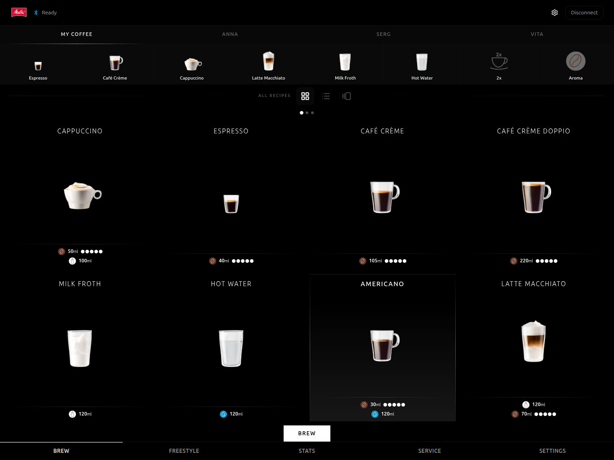
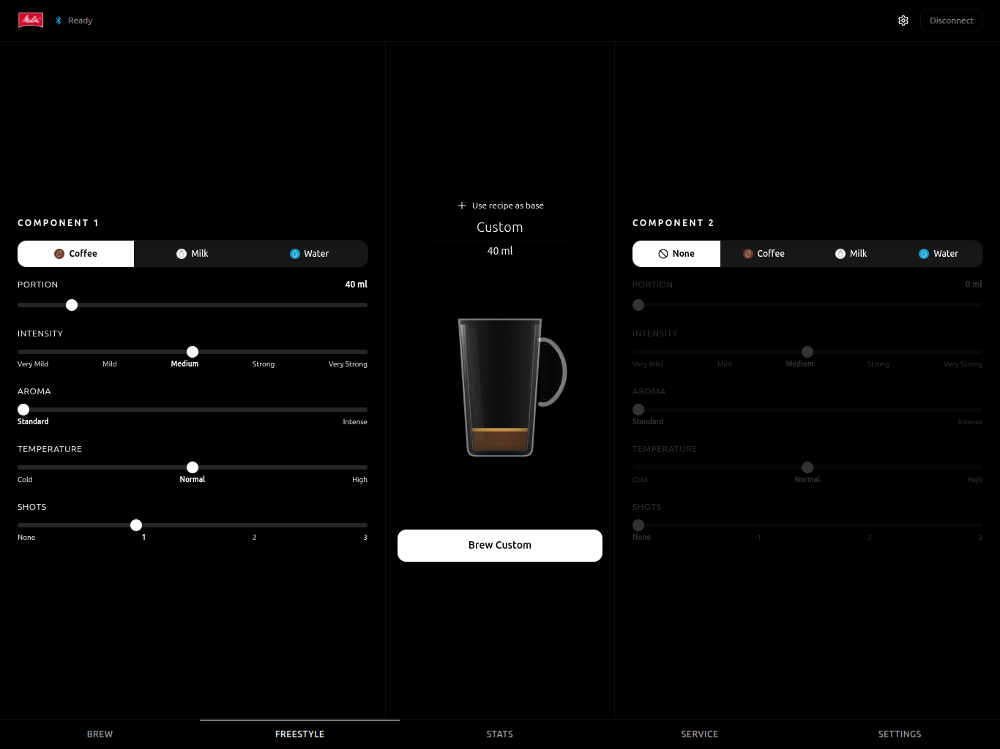
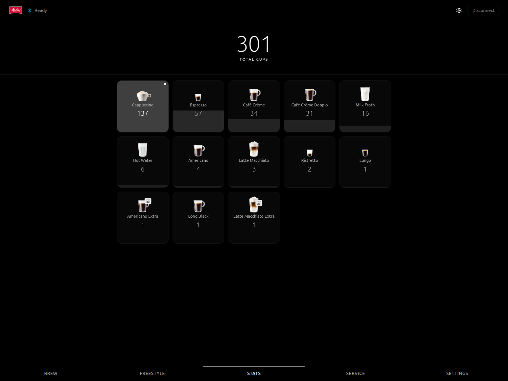
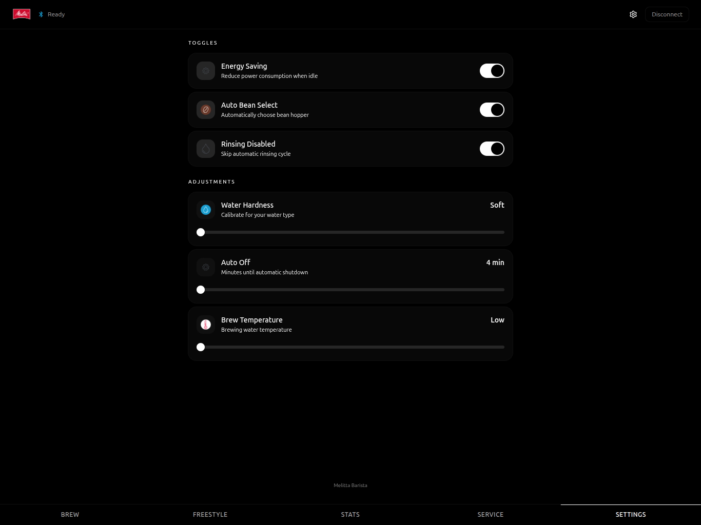

# Melitta Barista & Nivona for Home Assistant

[](https://my.home-assistant.io/redirect/hacs_repository/?owner=dzerik&repository=melitta-barista-ha&category=integration)

[](https://github.com/dzerik/melitta-barista-ha/releases)
[](https://github.com/dzerik/melitta-barista-ha/releases)
[](https://github.com/dzerik/melitta-barista-ha/actions/workflows/tests.yml)
[](https://github.com/dzerik/melitta-barista-ha/actions)
[](LICENSE)
[](https://hacs.xyz)
[](https://www.home-assistant.io/)
[](#)
[](#supported-brands-and-models)
[](#localization)

A custom Home Assistant integration for controlling **Melitta Barista T/TS Smart** and **Nivona NICR 6xx / 7xx / 79x / 9xx / 1030 / 1040** plus **NIVO 8xxx** coffee machines over Bluetooth Low Energy (BLE). Both brands are built on the shared Eugster/Frismag OEM stack, so a single integration drives either. Monitor machine status, brew recipes, adjust settings, trigger maintenance — all from your Home Assistant dashboard. (AI Coffee Sommelier groundwork is also shipped — see [its section](#ai-coffee-sommelier) for the current scope, the recipe-to-brew handoff is still in development.)

> **⚠️ Nivona testers wanted.** Nivona support (v0.41.0) is shipped as **alpha** — cryptography and handshake are validated against upstream RE vectors, but the code path has not been live-tested on real Nivona hardware by the maintainer. If you own a **NICR 6xx / 7xx / 79x / 9xx / 1030 / 1040** or **NIVO 8xxx** machine, please try this release and [open a GitHub issue](https://github.com/dzerik/melitta-barista-ha/issues/new) with your results (handshake / status / brew / prompts). See [Nivona support](#nivona-alpha-testers-wanted) below for details.

---

## Supported brands and models

### Melitta (stable)

| Model | Type ID | BLE Prefixes | Recipes | Bean Hoppers |
|-------|---------|--------------|---------|--------------|
| **Barista T Smart** | 258 | 8301, 8311, 8401 | 21 | 1 (single) |
| **Barista TS Smart** | 259 | 8501, 8601, 8604 | 24 | 2 (dual) |

### Nivona (alpha — testers wanted)

| Family | Representative models | MyCoffee | Strength | Notes |
|---|---|---|---|---|
| **600** | NICR 660 / 670 / 675 / 680 | 1 | 3 | — |
| **700** | NICR 756 / 758 / 759 / 768 / 769 / 778 / 779 / 788 / 789 | 4 | 3 | aroma balance |
| **79x** | NICR 790–797, 799 | 4 | 5 | aroma balance |
| **900** | NICR 920 / 930 | 4 | 5 | fluid ml×10 quirk |
| **900-light** | NICR 960 / 965 / 970 | 4 | 3 | — |
| **1030** / **1040** | NICR 1030 / 1040 | 4 | 5 | — |
| **8000** | NIVO 8101 / 8103 / 8107 | 4 | 5 | different brew opcode |

The brand and machine model are automatically detected from the BLE advertisement (Melitta prefixes `8xxx…` or Nivona, which advertises as either the legacy `NIVONA-NNNNNNNNNN-----` form, the bare `NNNNNNNNNN-----` form, or — on newer firmware like NICR 930 — a 15-digit serial without dashes such as `930254000000000`) and confirmed via the BLE protocol. Nivona firmware does not expose recipe-editing opcodes, so recipe/freestyle/profile entities are suppressed for Nivona entries.

## Nivona (alpha) — testers wanted

**Status**: the Nivona `BrandProfile` shipped in v0.41.0 is **code-complete and cryptographically validated** against the upstream reverse-engineering vectors from [mpapierski/esp-coffee-bridge](https://github.com/mpapierski/esp-coffee-bridge), but the maintainer does **not own a Nivona machine** and cannot verify live BLE interop. The release is marked pre-release on GitHub.

**What's validated in software**:

- HU handshake verifier against the published vector `FA 48 D1 7B → 7E 6E` (upstream NICR 756)
- RC4 runtime key `NIV_060616_V10_1*9#3!4$6+4res-?3` (recovered from `de.nivona.mobileapp` 3.8.6)
- 7 family capability entries with per-family brew opcode / strength levels / fluid scaling
- Serial-prefix tokenisation for all known model codes (4-char for NIVO 8xxx, 3-char for NICR 6xx/7xx/79x/9xx)

**What live-testing should confirm**:

- [ ] BLE pairing + D-Bus bonding completes
- [ ] `HU` session setup succeeds on real hardware
- [ ] `HX` status polling returns sensible `process`/`manipulation`/`progress` values
- [ ] `HZ` cancel-brew works on an active brew
- [ ] `HY` prompt confirmation works (flush / move cup)
- [ ] `HD` register reset returns ACK
- [ ] `HI` feature bits either return a payload or time out gracefully (both OK)

**How to help**:

1. Enable HACS **Pre-releases** (in HACS settings), install this repo, update to **v0.41.0**.
2. Pair your Nivona via the normal config-flow — it should be auto-discovered.
3. [Open an issue](https://github.com/dzerik/melitta-barista-ha/issues/new) with the model, firmware version, and a log snippet filtered on `melitta_barista`.

Crypto and handshake are identical in structure to Melitta; the risk is primarily per-firmware-family quirks in brew payload bytes and stats register IDs.

## Features

- **Multi-brand, multi-model** — Melitta Barista T/TS Smart + Nivona NICR 6xx / 7xx / 79x / 9xx / 1030 / 1040 + NIVO 8xxx (alpha, NICR 930 validated on real hardware) auto-detected from BLE advertisement; model-specific entity filtering per capability
- **Real-time status monitoring** — machine state, brewing activity, progress percentage, required user actions, and machine prompts via BLE push notifications
- **21 or 24 built-in recipes** (Melitta) — select from dropdown and brew with one tap (3 extra recipes on TS model)
- **Freestyle recipes** (Melitta) — build custom drinks with two configurable components (coffee/milk/water), adjustable intensity, aroma, temperature, shots, and portion sizes
- **Reset recipe to factory defaults** (Melitta, v0.33.0+) — HD opcode button with auto-refresh of cached recipe attributes
- **Confirm machine prompts** (v0.34.0+) — dedicated `Confirm Prompt` button + `awaiting_confirmation` binary sensor + optional **global auto-confirm** for soft prompts (move cup, flush); hardware-blocking prompts (fill water, empty trays) remain manual
- **Maintenance operations** — easy clean, intensive clean, descaling, filter insert/replace/remove, evaporating, power off
- **Cancel in-flight brew** — HZ opcode, one-click cancel during any running process
- **Machine settings control** — water hardness, brew temperature, auto-off timer, energy saving, auto-bean-select (TS)
- **Feature capability read** (HI, v0.32.0+) — diagnostic sensor exposes machine capability bits (e.g. `IMAGE_TRANSFER`), graceful on firmwares that don't answer
- **User profiles** (Melitta) — read and edit user profile names on the machine
- **Cup counters** (Melitta) — total + per-recipe statistics, refreshed after each brew completion
- **BLE auto-discovery** — integration detects your Melitta or Nivona machine automatically
- **Encrypted BLE protocol** — full Eugster EFLibrary stack (AES customer-key bootstrap + RC4 stream cipher), per-brand HU verifier tables
- **🤖 AI Coffee Sommelier** *(work in progress, no end-to-end path yet)* — backend scaffolding for personalised recipe generation from configured bean hoppers, milk types, syrups/toppings via any HA conversation agent (OpenAI, Anthropic, Google). 31 bundled European coffee presets incl. Lavazza, Melitta, Illy, Dallmayr, Tasty Coffee. **The recipe → brew handoff is not wired up yet** — you can configure beans/hoppers/milk and call the WebSocket API, but generated recipes don't currently flow into the Freestyle brew button. See [AI Coffee Sommelier](#ai-coffee-sommelier) below.
- **Custom Lovelace card** *(Melitta only — Nivona not yet supported)* — dedicated card available separately: [melitta-barista-card](https://github.com/dzerik/melitta-barista-card)
- **Standalone PWA** *(Melitta only — Nivona not yet supported)* — full-screen React app for tablets and kiosks: [melitta-barista-app](https://github.com/dzerik/melitta-barista-app)
- **29 languages** — full localization for all European and Slavic languages
- **🧪 ESP32 BLE emulator** (unique) — a bundled ESP-IDF firmware that impersonates a real Nivona machine at the BLE layer (ADV, AD00 service, encrypted frames, HU handshake, HX status, HE brew). Lets you develop, pair, and brew against Home Assistant **and** the official Nivona Android app without any physical machine. See [`esp_emulator/`](esp_emulator/).

## Supported Recipes

| # | Recipe | T | TS | # | Recipe | T | TS |
|---|--------|---|-----|---|--------|---|-----|
| 1 | Espresso | + | + | 13 | Dead Eye | -- | + |
| 2 | Ristretto | + | + | 14 | Cappuccino | + | + |
| 3 | Lungo | + | + | 15 | Espresso Macchiato | + | + |
| 4 | Espresso Doppio | + | + | 16 | Caffe Latte | + | + |
| 5 | Ristretto Doppio | + | + | 17 | Cafe au Lait | + | + |
| 6 | Cafe Creme | + | + | 18 | Flat White | + | + |
| 7 | Cafe Creme Doppio | + | + | 19 | Latte Macchiato | + | + |
| 8 | Americano | + | + | 20 | Latte Macchiato Extra | + | + |
| 9 | Americano Extra | + | + | 21 | Latte Macchiato Triple | + | + |
| 10 | Long Black | + | + | 22 | Milk | + | + |
| 11 | Red Eye | -- | + | 23 | Milk Froth | + | + |
| 12 | Black Eye | -- | + | 24 | Hot Water | + | + |

> Red Eye, Black Eye, and Dead Eye are only available on the Barista TS Smart (dual bean hopper model).

### Nivona recipes per family (alpha)

Nivona machines ship with a **fixed** set of recipes per family (no recipe editing). Selector IDs below are the machine-side byte values used in the brew command.

| Family | Recipes |
|---|---|
| **600** | Espresso, Coffee, Americano, Cappuccino, Frothy Milk, Hot Water |
| **700** | Espresso, Cream, Lungo, Americano, Cappuccino, Latte Macchiato, Milk, Hot Water |
| **79x** | Espresso, Coffee, Americano, Cappuccino, Latte Macchiato, Milk, Hot Water |
| **900** / **900-light** | Espresso, Coffee, Americano, Cappuccino, Caffè Latte, Latte Macchiato, Hot Milk, Hot Water |
| **1030** | Espresso, Coffee, Americano, Cappuccino, Caffè Latte, Latte Macchiato, Hot Water, Warm Milk, Hot Milk, Frothy Milk |
| **1040** | Espresso, Coffee, Americano, Cappuccino, Caffè Latte, Latte Macchiato, Hot Water, Warm Milk, Frothy Milk |
| **8000** | Espresso, Coffee, Americano, Cappuccino, Caffè Latte, Latte Macchiato, Milk, Hot Water |

Source: per-family recipe tables in [`brands/nivona.py`](custom_components/melitta_barista/brands/nivona.py), ported from the upstream [mpapierski/esp-coffee-bridge](https://github.com/mpapierski/esp-coffee-bridge/blob/main/src/nivona.cpp) RE effort.

## Requirements

- **Home Assistant** 2024.1 or newer
- **Bluetooth adapter** -- a BLE-capable adapter accessible to your Home Assistant host (built-in or USB dongle)
- **Supported machine** — one of:
  - **Melitta Barista T Smart** or **Melitta Barista TS Smart** (stable)
  - **Nivona NICR 6xx / 7xx / 79x / 9xx / 1030 / 1040** or **NIVO 8xxx** (alpha)
- **BLE range** -- the Home Assistant host must be within Bluetooth range of the machine (typically up to 10 meters)

## Installation

### Via HACS (recommended)

1. Open HACS in your Home Assistant instance.
2. Go to **Integrations** and select the three-dot menu in the top right corner.
3. Choose **Custom repositories**.
4. Add the repository URL: `https://github.com/dzerik/melitta-barista-ha`
5. Select category **Integration** and click **Add**.
6. Search for "Melitta Barista Smart & Nivona" in HACS and install it.
7. Restart Home Assistant.

### Manual Installation

1. Download the latest release from the [GitHub releases page](https://github.com/dzerik/melitta-barista-ha/releases).
2. Copy the `custom_components/melitta_barista` directory into your Home Assistant `config/custom_components/` directory.
3. Restart Home Assistant.

## Custom Lovelace Card

> **⚠️ Melitta only.** The card currently expects Melitta-only entities (recipe/profile/freestyle selects, named cup counters) and does not yet handle the Nivona entity layout (per-family stats sensors, Nivona recipe select, brew override numbers). Nivona support is on the roadmap for the card project — track via its issue tracker.

A dedicated Lovelace card with recipe buttons, status display, and progress bar is available as a separate repository:

**[melitta-barista-card](https://github.com/dzerik/melitta-barista-card)** -- install via HACS (Frontend > Custom repositories) or manually.

## Standalone PWA (Tablet / Kiosk)

> **⚠️ Melitta only.** Same caveat as the card — the PWA assumes Melitta-shaped entities (Brew / Freestyle / Stats / Service / Settings tabs all wired against Melitta extensions `HC` / `HJ`). Nivona machines will pair via Home Assistant and entities will appear there, but the PWA UI does not yet render them.

A standalone React PWA for controlling the coffee machine is available as a separate project:

**[melitta-barista-app](https://github.com/dzerik/melitta-barista-app)** -- a full-screen progressive web app designed for wall-mounted tablets and kiosk displays.

- Connects to Home Assistant via WebSocket API using a long-lived access token
- Auto-detects the Melitta machine from HA entities
- Five tabs: **Brew**, **Freestyle**, **Stats**, **Service**, **Settings**
- Real-time brewing progress with cancel support
- Installable as a PWA on any device (Android, iOS, desktop)
- Dark coffee-themed UI optimized for touch

### Brew

Browse all available recipes in a grid, list, or carousel view. Quick-access buttons for favorite recipes and user profiles at the top. Select a recipe and tap **Brew** to start.



### Freestyle

Build a custom drink from scratch with two configurable components. Adjust process type, portion size, intensity, aroma, temperature, and shots for each component. A live glass preview updates as you tweak the parameters.



### Stats

Cup counter dashboard showing total brewed cups and per-recipe statistics with progress bars.



### Service

Maintenance operations: easy clean, intensive clean, descaling, evaporating, water filter management, and power off.


### Settings

Machine configuration: energy saving, auto bean select, rinsing toggle, water hardness, auto-off timer, and brew temperature.



## ESP32 BLE Emulator (unique)

This repository ships a **bundled ESP-IDF firmware** ([`esp_emulator/`](esp_emulator/)) that impersonates a real Nivona coffee machine at the BLE layer — useful for developing, pairing, brewing, and stress-testing without any physical machine.

To the best of the maintainer's knowledge, no other open-source Home Assistant coffee-machine integration ships a paired emulator of the hardware it drives.

**What it emulates**

- Advertisement: byte-exact ADV + scan response (company ID `0x0319`, customer ID `0xFFFF`, Eugster manufacturer payload, DIS in SR) — discovered by HA *and* by the official **Nivona Android app** just like a real machine
- GATT: AD00 service with AD01 (write), AD02 (notify), DIS (0x180A) with manufacturer / model / serial
- Protocol: full Eugster/EFLibrary stack — frame parser, RC4 stream cipher, AES customer-key bootstrap, HU handshake with per-brand verifier, HR/HW/HX/HE/HA/HB opcodes
- State: a small FSM ramps `process`/`progress` during HE brew (3 → 4 → 3 for NIVO 8000, 8 → 11 → 8 for other Nivona families) and emits unsolicited HX notifications

**What you get**

- End-to-end pair → discover → brew flow against HA with no hardware
- Regression harness for the BLE client, config flow, and brand-aware HX parser
- Ground truth for the multi-brand architecture: because the emulator speaks Nivona on a bench next to a real Melitta, protocol differences cannot silently regress

Supported targets: **ESP32-C6** (primary) and **ESP32-S3**. Build with `idf.py -p /dev/ttyUSB0 flash monitor`. Full setup, pinouts, and troubleshooting in [`esp_emulator/README.md`](esp_emulator/README.md).

## Configuration

### Step 1: Enable Bluetooth on the machine

Make sure Bluetooth is enabled on your coffee machine (refer to the machine manual).

### Step 2: Add the integration

1. In Home Assistant, go to **Settings** > **Devices & Services** > **Add Integration**.
2. Search for **Melitta Barista Smart & Nivona**.
3. If BLE discovery has found your machine, it will appear automatically. Otherwise, you can enter the MAC address manually.

### Step 3: Pair the device

The integration requires BLE pairing (bonding) with your coffee machine. During setup, you will be prompted to enable pairing mode on the machine:

1. On the machine, open the **Settings** menu and navigate to **Bluetooth** / **Connectivity**.
2. Enable **pairing mode** — the BLE icon on the machine should start blinking.
3. Press **Submit** in the Home Assistant setup dialog.
4. The integration will connect and pair automatically. If the machine shows a confirmation prompt, accept it.

> **Note:** The machine supports only one active BLE connection at a time. Make sure any official manufacturer app (Melitta Connect / Nivona App) is disconnected before pairing with Home Assistant.

If the device is already paired (e.g., via `bluetoothctl`), the integration detects this and skips the pairing step.

### Manual pairing via bluetoothctl

If automatic pairing does not work, you can pair manually via SSH on the Home Assistant host:

```bash
bluetoothctl
remove F1:2C:72:3F:75:ED        # Replace with your machine's MAC address
scan on                          # Wait for the machine to appear
pair F1:2C:72:3F:75:ED
trust F1:2C:72:3F:75:ED
info F1:2C:72:3F:75:ED           # Verify: Paired: yes, Bonded: yes, Trusted: yes
exit
```

Then add the integration in Home Assistant as described above.

Once configured, the integration creates a device with all available entities filtered for your machine model.

## Entities Reference

### Sensors

| Entity | Description |
|--------|-------------|
| State | Current machine state: Ready, Brewing, Cleaning, Descaling, Off, etc. |
| Activity | Current sub-process: Grinding, Extracting, Steaming, Dispensing Water, Preparing |
| Progress | Brewing or cleaning progress as a percentage |
| Action Required | Required user action: Fill Water, Empty Trays, Brew Unit Removed, Move Cup to Frother, Flush Required |
| Connection | BLE connection status: Connected or Disconnected (diagnostic) |
| Firmware | Firmware version reported by the machine (diagnostic) |
| Features | Machine capability bits from HI response, plus raw byte in attributes (diagnostic, disabled by default) |
| Total Cups | Total brewed count, per-recipe breakdown in attributes (Melitta only) |

### Binary Sensors

| Entity | Description |
|--------|-------------|
| Awaiting Confirmation | `on` when the machine is showing a user-confirmable prompt (fill water, move cup, flush, etc.) — pairs with the `Confirm Prompt` button (PROBLEM device class) |

### Select

| Entity | Description |
|--------|-------------|
| Recipe | Dropdown selector for all available recipes (21 on T, 24 on TS). |
| Profile | Active user profile selector. |
| Freestyle Process 1 | Component 1 process: coffee, milk, or water. |
| Freestyle Intensity 1 | Component 1 brew intensity. |
| Freestyle Temperature 1 | Component 1 temperature level. |
| Freestyle Shots 1 | Component 1 number of shots. |
| Freestyle Process 2 | Component 2 process: none, coffee, milk, or water. |
| Freestyle Intensity 2 | Component 2 brew intensity. |
| Freestyle Temperature 2 | Component 2 temperature level. |
| Freestyle Shots 2 | Component 2 number of shots. |

### Buttons

| Entity | Brand | Description |
|--------|-------|-------------|
| Brew | Melitta | Brew the recipe selected in the Recipe dropdown. Available when machine is Ready and a recipe is selected. |
| Brew Freestyle | Melitta | Brew the custom freestyle recipe using current freestyle parameters. |
| Cancel | both | Cancel the currently running operation (HZ). |
| Confirm Prompt | both | Acknowledge an active machine prompt (move cup, flush, fill water, etc.) via HY. Available only when `awaiting_confirmation` binary sensor is on. |
| Reset Recipe | Melitta | Reset the currently selected recipe to factory defaults (HD). Available when machine is Ready and a recipe is selected. Recipe cache auto-refreshes. |
| Easy Clean | both | Start the easy clean cycle (configuration). |
| Intensive Clean | both | Start the intensive clean cycle (configuration). |
| Descaling | both | Start the descaling process (configuration). |
| Filter Insert / Replace / Remove | both | Water filter operations (configuration). |
| Evaporating | both | Steam evaporating cycle (configuration). |
| Switch Off | both | Power off the machine (configuration). |

### Numbers

| Entity | Range | Description |
|--------|-------|-------------|
| Water Hardness | 1 -- 4 | Water hardness level for descaling schedule (configuration). |
| Auto Off After | 15 -- 240 min | Idle time before automatic power off (configuration). |
| Brew Temperature | 0 -- 2 | Brew temperature level: 0 = Cold, 1 = Normal, 2 = High (configuration). |
| Freestyle Portion 1 | 5 -- 250 ml | Component 1 portion size in milliliters. |
| Freestyle Portion 2 | 0 -- 250 ml | Component 2 portion size in milliliters (0 = disabled). |

### Switches

| Entity | Model | Description |
|--------|-------|-------------|
| Energy Saving | T, TS | Enable or disable energy saving mode (configuration). |
| Auto Bean Select | TS only | Enable or disable automatic bean blend selection (configuration). |
| Rinsing Disabled | T, TS | Enable or disable the automatic rinsing cycle (configuration). |

### Text

| Entity | Model | Description |
|--------|-------|-------------|
| Profile 1-4 Name | T | User profile names (read/write, configuration). |
| Profile 1-8 Name | TS | User profile names (read/write, configuration). |
| Freestyle Name | T, TS | Custom name for the freestyle recipe. |

## Services

The integration provides five custom services.

### `melitta_barista.reset_recipe` (Melitta)

Reset a recipe to factory defaults via the HD opcode. Recipe cache is auto-refreshed so the UI / PWA show factory values immediately.

| Parameter | Type | Required | Description |
|-----------|------|:--------:|-------------|
| `entity_id` | string | Yes | Any button entity of the target machine |
| `recipe_id` | int (200–223) | No | Target recipe; defaults to currently selected |

### `melitta_barista.confirm_prompt`

Acknowledge an active machine prompt via HY (e.g. "move cup to frother", "flush required"). Fails with a `ServiceValidationError` if no prompt is active.

| Parameter | Type | Required | Description |
|-----------|------|:--------:|-------------|
| `entity_id` | string | Yes | Any button entity of the target machine |

### `melitta_barista.brew_freestyle`

Brew a custom recipe with fully configurable parameters.

| Parameter | Type | Required | Description |
|-----------|------|:--------:|-------------|
| `entity_id` | string | Yes | Any entity from the Melitta device |
| `name` | string | Yes | Display name for the recipe |
| `process1` | string | Yes | Primary process: `coffee`, `milk`, `water` |
| `intensity1` | string | No | Intensity: `very_mild`, `mild`, `medium`, `strong`, `very_strong` |
| `aroma1` | string | No | Aroma: `standard`, `intense` |
| `temperature1` | string | No | Temperature: `cold`, `normal`, `high` |
| `shots1` | string | No | Shots: `none`, `one`, `two`, `three` |
| `portion1_ml` | int | No | Portion size in ml (20-300) |
| `process2` | string | No | Secondary process (same options + `none`) |
| `two_cups` | bool | No | Brew two cups (default: false) |

### `melitta_barista.brew_directkey`

Brew from a DirectKey profile slot (uses the active profile's personalized recipe).

| Parameter | Type | Required | Description |
|-----------|------|:--------:|-------------|
| `entity_id` | string | Yes | Any entity from the Melitta device |
| `category` | string | Yes | `espresso`, `cafe_creme`, `cappuccino`, `latte_macchiato`, `milk`, `milk_froth`, `water` |
| `two_cups` | bool | No | Brew two cups (default: false) |

### `melitta_barista.save_directkey`

Save a recipe to a DirectKey profile slot.

| Parameter | Type | Required | Description |
|-----------|------|:--------:|-------------|
| `entity_id` | string | Yes | Any entity from the Melitta device |
| `category` | string | Yes | Recipe category (same as brew_directkey) |
| `profile_id` | int | No | Profile ID (default: active profile) |
| (recipe params) | — | — | Same as brew_freestyle |

## Options

Configure the integration via **Settings → Devices & Services → Melitta Barista Smart & Nivona → Configure**.

### Basic Settings

| Parameter | Default | Range | Description |
|-----------|:-------:|:-----:|-------------|
| Poll interval | 5s | 1-60s | How often to poll machine status |
| Reconnect delay | 5s | 1-60s | Initial delay before reconnect attempt |
| Reconnect max delay | 300s | 30-3600s | Maximum backoff between reconnects |
| Poll errors before disconnect | 3 | 1-20 | Consecutive errors before forcing disconnect |
| Frame timeout | 5s | 2-30s | BLE command response timeout |
| **Auto-confirm soft prompts** | off | bool | When on, the integration automatically sends HY for soft prompts (move cup, flush). Hardware prompts (fill water, empty trays) stay manual. |

### Advanced Settings

| Parameter | Default | Range | Description |
|-----------|:-------:|:-----:|-------------|
| BLE connect timeout | 15s | 5-60s | Timeout for BLE connection establishment |
| Pairing timeout | 30s | 10-120s | Timeout for BLE pairing during setup |
| Recipe retries | 3 | 1-10 | Retry attempts for recipe read/write operations |
| Initial connect delay | 3s | 0-30s | Wait before first connection after setup |

## How Data is Updated

| Data | Method | Frequency |
|------|--------|-----------|
| Machine status | BLE push notifications | Every ~5 seconds |
| Cup counters | Read after each brew completes | On brew finish |
| Profile data | Read once on connect | On connection |
| Settings | Read on entity setup | On demand |

## AI Coffee Sommelier

> **🚧 Work in progress — not yet end-to-end functional.**
>
> The data model, persistence, WebSocket API (29 commands), 31 bundled bean presets, and the conversation-agent invocation layer are all in place and covered by tests. **What's missing is the final hop**: generated recipes are not yet wired into the Freestyle brew button, so you cannot currently brew a sommelier-generated drink with one tap. The feature is shipped in this state so contributors can play with the API and the bundled bean catalog, but treat it as a preview rather than a finished workflow.

**Planned end-to-end flow** (target, not current behavior):

1. Configure your bean hoppers (bean type, roast, origin) and available milk types in the integration's WebSocket API (or via the companion [PWA](https://github.com/dzerik/melitta-barista-app) Sommelier tab).
2. Optionally add syrups, toppings, liqueurs, and machine profiles (cup size, dietary preferences).
3. The integration pipes your configuration + current HA context (weather, mood, occasion) to your chosen conversation agent.
4. The agent returns three recipes structured for the Melitta Freestyle builder — *tap to brew (not yet implemented)*.

**Currently working**:

- WebSocket API for beans / hoppers / milk / syrups / toppings / favorites / history (29 commands)
- 31 bundled European coffee bean presets (Lavazza, illy, Melitta, Dallmayr, Tasty Coffee, and more) — extendable via the API
- Conversation-agent prompt building and structured response parsing

**Not yet working**:

- Recipe → Freestyle brew button handoff (the generated structured recipe is parsed but not converted into an HE brew payload)
- UI surface inside Home Assistant (use the companion PWA)

**Requirements** (for the parts that do work): at least one `conversation` integration configured in HA (e.g. [OpenAI Conversation](https://www.home-assistant.io/integrations/openai_conversation/)).

**Tracking**: see open issues tagged `sommelier` in the [issue tracker](https://github.com/dzerik/melitta-barista-ha/issues) for progress on the missing pieces.

## Architecture

The integration is built on a **three-layer abstraction** (v0.40.0+) that cleanly separates:

1. **BLE transport** (shared) — pairing, reconnect, write/notify GATT characteristics.
2. **Eugster/EFLibrary core** (shared) — frame format `0x53…0x45`, one's-complement checksum, RC4 stream cipher, `HU/HV/HR/HW/HX/HE/HZ/HY/HD/HI/HA/HB` opcodes.
3. **Brand profile** (pluggable) — RC4 runtime key, HU verifier table, advertisement regex, supported opcode extensions (`HC`/`HJ` for Melitta only), per-family machine capabilities.

Adding a third Eugster OEM brand (e.g. if public RE emerges for Koenig, KitchenAid, etc.) is a matter of dropping a new file into `brands/`. See [`docs/adr/001-brand-profile-abstraction.md`](docs/adr/001-brand-profile-abstraction.md).

## Use Cases

- **Smart Home Dashboard** — monitor coffee machine status, cup counters, and maintenance needs on your HA dashboard
- **Morning Routine** — automated brewing at a scheduled time via HA automations
- **Family Profiles** — switch between user profiles for personalized drinks
- **Maintenance Alerts** — get notified when descaling, filter change, or other maintenance is needed
- **Kiosk Mode** *(Melitta only)* — use the [standalone PWA](https://github.com/dzerik/melitta-barista-app) on a wall-mounted tablet

## Automation Examples

### Morning Espresso

```yaml
automation:
  - alias: "Morning Espresso at 7:00"
    trigger:
      - platform: time
        at: "07:00"
    condition:
      - condition: state
        entity_id: sensor.melitta_state
        state: "ready"
    action:
      - service: button.press
        target:
          entity_id: button.melitta_brew_espresso
```

### Notify When Coffee is Ready

```yaml
automation:
  - alias: "Coffee Ready Notification"
    trigger:
      - platform: state
        entity_id: sensor.melitta_activity
        from: "extracting"
        to: "idle"
    action:
      - service: notify.mobile_app
        data:
          message: "Your coffee is ready! ☕"
```

### Maintenance Reminder

```yaml
automation:
  - alias: "Coffee Machine Maintenance Reminder"
    trigger:
      - platform: state
        entity_id: sensor.melitta_action_required
    condition:
      - condition: not
        conditions:
          - condition: state
            entity_id: sensor.melitta_action_required
            state: "none"
    action:
      - service: notify.mobile_app
        data:
          message: "Coffee machine needs attention: {{ states('sensor.melitta_action_required') }}"
```

## Removing the Integration

1. Go to **Settings → Devices & Services → Melitta Barista Smart & Nivona**
2. Click the three-dot menu (⋮) → **Delete**
3. The BLE connection will be closed and all entities removed automatically
4. If installed via HACS: go to **HACS → Integrations → Melitta Barista Smart & Nivona → Uninstall**

## Localization

The integration includes translations for 29 languages:

English, Russian, Ukrainian, German, Polish, Czech, Slovak, French, Italian, Spanish, Portuguese, Dutch, Swedish, Danish, Norwegian, Finnish, Hungarian, Romanian, Greek, Turkish, Bulgarian, Croatian, Serbian, Slovenian, Bosnian, Macedonian, Estonian, Latvian, Lithuanian.

## Known Limitations

- **BLE range**: Bluetooth Low Energy has a limited range (typically up to 10 meters). Walls and other obstacles reduce effective range. Consider placing a Bluetooth-capable device (e.g., an ESPHome BLE proxy) near the machine if your Home Assistant host is too far away.
- **Single connection**: The machine supports only one active BLE connection at a time. If the official Melitta app is connected, the integration will not be able to connect, and vice versa.
- **Single BLE client**: The integration operates as a single BLE client. User profile names can be read and edited, but per-profile recipe customizations are not yet exposed.
- **Polling interval**: Machine status is polled every 5 seconds while connected. There may be a brief delay between a physical action and the state update in Home Assistant.
- **Recipe parameters**: Built-in recipes use the machine's stored default parameters. For full customization, use the Freestyle recipe builder with adjustable process, intensity, temperature, shots, and portion for each component.

## Troubleshooting

**The machine is not discovered during setup**
- Verify that Bluetooth is enabled on the machine (check the machine display or manual).
- Ensure the Home Assistant host has a working Bluetooth adapter. Run `bluetoothctl scan on` on the host to verify BLE scanning works.
- Move the Home Assistant host closer to the machine.
- Make sure no other device (e.g., the Melitta app on your phone) is currently connected to the machine.

**Connection fails with "D-Bus connection lost"**
- The device is not paired with the Home Assistant host. Follow the pairing instructions in the Configuration section above.
- If already paired, try removing and re-pairing: `bluetoothctl remove <MAC> && bluetoothctl pair <MAC>`.

**Connection drops frequently**
- BLE connections are sensitive to distance and interference. Reduce the distance between the host and the machine.
- Consider using an ESPHome Bluetooth proxy placed near the machine.
- Check Home Assistant logs for BLE-related errors: **Settings** > **System** > **Logs**, then filter for `melitta_barista`.

**Buttons show as unavailable**
- Recipe and maintenance buttons are only available when the machine state is "Ready". Check the State sensor.
- If the State sensor shows "unavailable", the BLE connection may be lost. Check the Connection sensor.

**Settings do not update**
- Number and switch entities read values from the machine. If the machine is disconnected, the last known value is displayed. Reconnect and trigger a manual refresh if needed.

**Enable debug logging**

Add the following to your `configuration.yaml`:

```yaml
logger:
  default: info
  logs:
    melitta_barista: debug
```

Restart Home Assistant and reproduce the issue, then check the logs.

## Disclaimer

This project is an independent, open-source, non-commercial integration created for personal and home automation purposes. It is **not affiliated with, endorsed by, or connected to Melitta Group Management GmbH & Co. KG, Nivona Apparate GmbH, Eugster/Frismag AG**, or any of their subsidiaries or affiliates.

"Melitta", "Barista T Smart", "Barista TS Smart", "Caffeo", and the Melitta logo are registered trademarks of Melitta Group Management GmbH & Co. KG. "Nivona", "NICR", "NIVO", "NIVO 8000", and the Nivona logo are registered trademarks of Nivona Apparate GmbH. "Eugster", "Frismag", and associated product names are trademarks of Eugster/Frismag AG. All product names, logos, brands, and graphical assets are the property of their respective owners and are used here solely for identification and interoperability purposes.

This software is not intended for commercial use or the generation of revenue. See [NOTICE](NOTICE) for full legal details.

## Contributing

Contributions are welcome. Please open an issue or submit a pull request on [GitHub](https://github.com/dzerik/melitta-barista-ha).

1. Fork the repository.
2. Create a feature branch.
3. Make your changes and add tests where applicable.
4. Submit a pull request with a clear description of the changes.

## License

This project is licensed under the [MIT License](LICENSE).
