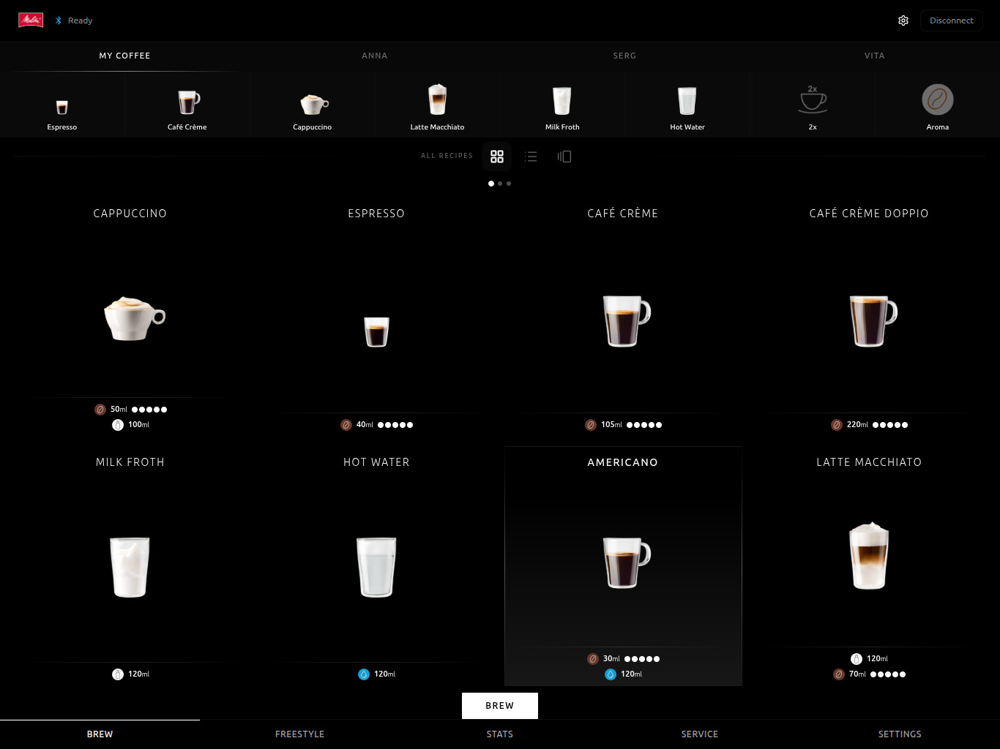
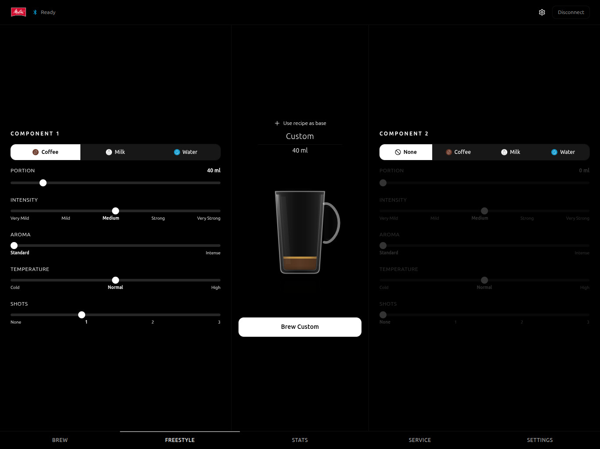
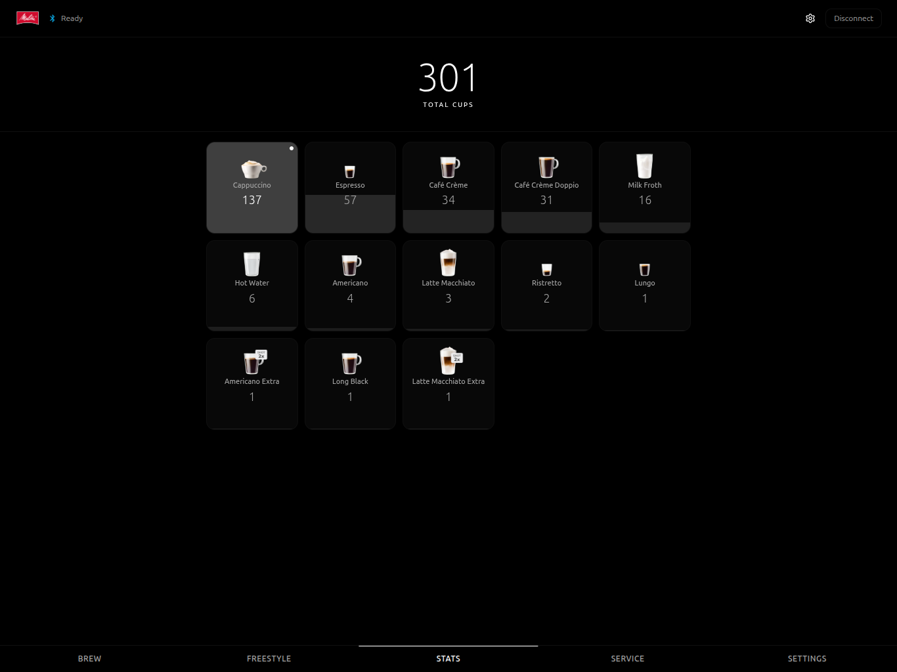
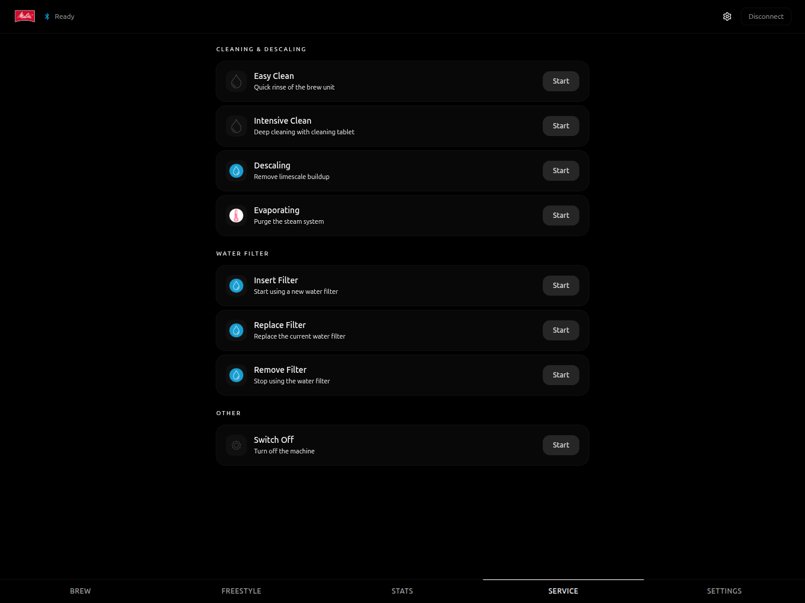
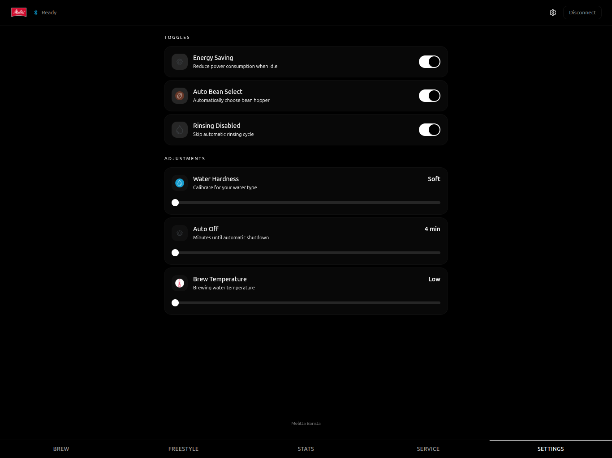

# Melitta Barista & Nivona for Home Assistant

[](https://my.home-assistant.io/redirect/hacs_repository/?owner=dzerik&repository=melitta-barista-ha&category=integration)

[](https://github.com/dzerik/melitta-barista-ha/releases)
[](https://github.com/dzerik/melitta-barista-ha/releases)
[](https://github.com/dzerik/melitta-barista-ha/actions/workflows/tests.yml)
[](https://github.com/dzerik/melitta-barista-ha/actions)
[](LICENSE)
[](https://hacs.xyz)
[](https://www.home-assistant.io/)
[](#)
[](#supported-brands-and-models)
[](#localization)

A custom Home Assistant integration for controlling **Melitta Barista T/TS Smart** and **Nivona NICR 6xx / 7xx / 79x / 9xx / 1030 / 1040** plus **NIVO 8xxx / 9101** coffee machines over Bluetooth Low Energy (BLE). Both brands are built on the shared Eugster/Frismag OEM stack, so a single integration drives either. Monitor machine status, brew recipes, adjust settings, trigger maintenance — all from your Home Assistant dashboard.

**This release ships an alpha version of the in-HA admin SPA panel + AI Coffee Sommelier — recipe generation goes through any HA conversation agent (OpenAI / Anthropic / Gemini / GigaChat / SmartChain / Ollama), the result is brewable in one tap. See [AI Coffee Sommelier (alpha)](#ai-coffee-sommelier-alpha) below.**

> 📖 **Documentation site**: [dzerik.github.io/melitta-barista-ha](https://dzerik.github.io/melitta-barista-ha/) — BLE architecture, wire protocol, ADRs and changelog with navigation, search, and rendered Mermaid diagrams.

> **⚠️ Nivona testers wanted.** Nivona support (v0.41.0) is shipped as **alpha** — cryptography and handshake are validated against upstream RE vectors, but the code path has not been live-tested on real Nivona hardware by the maintainer. If you own a **NICR 6xx / 7xx / 79x / 9xx / 1030 / 1040** or **NIVO 8xxx / 9101** machine, please try this release and [open a GitHub issue](https://github.com/dzerik/melitta-barista-ha/issues/new) with your results (handshake / status / brew / prompts). See [Nivona support](#nivona-alpha-testers-wanted) below for details.

---

## Supported brands and models

### Melitta (stable)

| Model | Type ID | BLE Prefixes | Recipes | Bean Hoppers |
|-------|---------|--------------|---------|--------------|
| **Barista T Smart** | 258 | 8301, 8311, 8401 | 21 | 1 (single) |
| **Barista TS Smart** | 259 | 8501, 8601, 8604 | 24 | 2 (dual) |

### Nivona (alpha — testers wanted)

| Family | Representative models | MyCoffee | Strength | Notes |
|---|---|---|---|---|
| **600** | NICR 660 / 670 / 675 / 680 | 1 | 3 | — |
| **700** | NICR 756 / 758 / 759 / 768 / 769 / 778 / 779 / 788 / 789 | 4 | 3 | aroma balance |
| **79x** | NICR 790–797, 799 | 4 | 5 | aroma balance |
| **900** | NICR 920 / 930 | 4 | 5 | fluid ml×10 quirk |
| **900-light** | NICR 960 / 965 / 970 | 4 | 3 | — |
| **1030** / **1040** | NICR 1030 / 1040 | 4 | 5 | — |
| **8000** | NIVO 8101 / 8103 / 8107 | 4 | 5 | different brew opcode |
| **9000** (2025) | NIVO 9101 | 4 | 5 | alpha — mapped to the 8000 profile, untested |

The brand and machine model are automatically detected from the BLE advertisement (Melitta prefixes `8xxx…` or Nivona, which advertises as either the legacy `NIVONA-NNNNNNNNNN-----` form, the bare `NNNNNNNNNN-----` form, or — on newer firmware like NICR 930 — a 15-digit serial without dashes such as `930254000000000`) and confirmed via the BLE protocol. Nivona firmware does not expose recipe-editing opcodes, so recipe/freestyle/profile entities are suppressed for Nivona entries.

## Nivona (alpha) — testers wanted

**Status**: the Nivona `BrandProfile` shipped in v0.41.0 is **code-complete and cryptographically validated** against the upstream protocol vectors published by [mpapierski/esp-coffee-bridge](https://github.com/mpapierski/esp-coffee-bridge), but the maintainer does **not own a Nivona machine** and cannot verify live BLE interop. The release is marked pre-release on GitHub.

**What's validated in software**:

- HU handshake verifier against the published vector `FA 48 D1 7B → 7E 6E` (upstream NICR 756)
- RC4 runtime key `NIV_060616_V10_1*9#3!4$6+4res-?3` (the fixed per-brand runtime key, identical across the Nivona range)
- 7 family capability entries with per-family brew opcode / strength levels / fluid scaling
- Serial-prefix tokenisation for all known model codes (4-char for NIVO 8xxx, 3-char for NICR 6xx/7xx/79x/9xx)

**What live-testing should confirm**:

- [ ] BLE pairing + D-Bus bonding completes
- [ ] `HU` session setup succeeds on real hardware
- [ ] `HX` status polling returns sensible `process`/`manipulation`/`progress` values
- [ ] `HZ` cancel-brew works on an active brew
- [ ] `HY` prompt confirmation works (flush / move cup)
- [ ] `HD` register reset returns ACK
- [ ] `HI` feature bits either return a payload or time out gracefully (both OK)

**How to help**:

1. Enable HACS **Pre-releases** (in HACS settings), install this repo, update to **v0.41.0**.
2. Pair your Nivona via the normal config-flow — it should be auto-discovered.
3. [Open an issue](https://github.com/dzerik/melitta-barista-ha/issues/new) with the model, firmware version, and a log snippet filtered on `melitta_barista`.

Crypto and handshake are identical in structure to Melitta; the risk is primarily per-firmware-family quirks in brew payload bytes and stats register IDs.

## Features

- **Multi-brand, multi-model** — Melitta Barista T/TS Smart + Nivona NICR 6xx / 7xx / 79x / 9xx / 1030 / 1040 + NIVO 8xxx (alpha, NICR 930 validated on real hardware) auto-detected from BLE advertisement; model-specific entity filtering per capability
- **Real-time status monitoring** — machine state, brewing activity, progress percentage, required user actions, and machine prompts via BLE push notifications
- **21 or 24 built-in recipes** (Melitta) — select from dropdown and brew with one tap (3 extra recipes on TS model)
- **Freestyle recipes** (Melitta) — build custom drinks with two configurable components (coffee/milk/water), adjustable intensity, aroma, temperature, shots, and portion sizes
- **Reset recipe to factory defaults** (Melitta, v0.33.0+) — HD opcode button with auto-refresh of cached recipe attributes
- **Confirm machine prompts** (v0.34.0+) — dedicated `Confirm Prompt` button + `awaiting_confirmation` binary sensor + optional **global auto-confirm** for soft prompts (move cup, flush); hardware-blocking prompts (fill water, empty trays) remain manual
- **Maintenance operations** — easy clean, intensive clean, descaling, filter insert/replace/remove, evaporating, power off
- **Cancel in-flight brew** — HZ opcode, one-click cancel during any running process
- **Machine settings control** — water hardness, brew temperature, auto-off timer, energy saving, auto-bean-select (TS)
- **Feature capability read** (HI, v0.32.0+) — diagnostic sensor exposes machine capability bits (e.g. `IMAGE_TRANSFER`), graceful on firmwares that don't answer
- **User profiles** (Melitta) — read and edit user profile names on the machine
- **Cup counters** (Melitta) — total + per-recipe statistics, refreshed after each brew completion
- **Machine lifecycle events** (v0.95.0+) — a `Machine event` entity plus six device triggers (brew started / finished / cancelled, prompt raised / cleared, maintenance finished) you can pick straight from the automation editor, each carrying a machine-readable token payload
- **Spoken narration, rendered on the server** (v0.95.0+) — every lifecycle event arrives with a ready-made `description` sentence (*«Ready: Cappuccino — 40 ml of coffee, 160 ml of hot milk, strong.»*, *«Сварено: капучино — 40 мл кофе, 160 мл горячего молока, высокой интенсивности.»*) in all 29 languages, so a TTS or notification automation is a one-liner
- **Sommelier backup & restore** (v0.95.0+) — export the whole Sommelier configuration as one JSON file and import it back here or onto another installation, with an automatic pre-import snapshot as the undo path
- **BLE auto-discovery** — integration detects your Melitta or Nivona machine automatically
- **Encrypted BLE protocol** — full Eugster EFLibrary stack (AES customer-key bootstrap + RC4 stream cipher), per-brand HU verifier tables
- **🤖 AI Coffee Sommelier (alpha)** — full in-HA admin panel with a Sommelier tab: pick allowed syrups / toppings / milk, mood (multi-select), cup size, dietary, time-of-day-aware occasion, then generate recipes via your chosen conversation agent (OpenAI / Anthropic / Gemini / GigaChat / SmartChain / Ollama). Each recipe arrives with the full step-by-step preparation, dosages and machine-action — all in your HA UI language — and a single ★ to favourite or "Brew this" to run on the machine. See [AI Coffee Sommelier (alpha)](#ai-coffee-sommelier-alpha).
- **Custom Lovelace card** *(Melitta only — Nivona not yet supported)* — dedicated card available separately: [melitta-barista-card](https://github.com/dzerik/melitta-barista-card)
- **Standalone PWA** *(Melitta only — Nivona not yet supported)* — full-screen React app for tablets and kiosks: [melitta-barista-app](https://github.com/dzerik/melitta-barista-app)
- **29 languages** — full localization for all European and Slavic languages
- **🧪 ESP32 BLE emulator** (unique) — a companion ESP-IDF firmware that impersonates a real Nivona machine at the BLE layer (ADV, AD00 service, encrypted frames, HU handshake, HX status, HE brew). Lets you develop, pair, and brew against Home Assistant **and** the official Nivona Android app without any physical machine. Lives in its own repo: [dzerik/nivona-ble-emulator](https://github.com/dzerik/nivona-ble-emulator).

## Supported Recipes

| # | Recipe | T | TS | # | Recipe | T | TS |
|---|--------|---|-----|---|--------|---|-----|
| 1 | Espresso | + | + | 13 | Dead Eye | -- | + |
| 2 | Ristretto | + | + | 14 | Cappuccino | + | + |
| 3 | Lungo | + | + | 15 | Espresso Macchiato | + | + |
| 4 | Espresso Doppio | + | + | 16 | Caffe Latte | + | + |
| 5 | Ristretto Doppio | + | + | 17 | Cafe au Lait | + | + |
| 6 | Cafe Creme | + | + | 18 | Flat White | + | + |
| 7 | Cafe Creme Doppio | + | + | 19 | Latte Macchiato | + | + |
| 8 | Americano | + | + | 20 | Latte Macchiato Extra | + | + |
| 9 | Americano Extra | + | + | 21 | Latte Macchiato Triple | + | + |
| 10 | Long Black | + | + | 22 | Milk | + | + |
| 11 | Red Eye | -- | + | 23 | Milk Froth | + | + |
| 12 | Black Eye | -- | + | 24 | Hot Water | + | + |

> Red Eye, Black Eye, and Dead Eye are only available on the Barista TS Smart (dual bean hopper model).

### Nivona recipes per family (alpha)

Nivona machines ship with a **fixed** set of recipes per family (no recipe editing). Selector IDs below are the machine-side byte values used in the brew command.

| Family | Recipes |
|---|---|
| **600** | Espresso, Coffee, Americano, Cappuccino, Frothy Milk, Hot Water |
| **700** | Espresso, Cream, Lungo, Americano, Cappuccino, Latte Macchiato, Milk, Hot Water |
| **79x** | Espresso, Coffee, Americano, Cappuccino, Latte Macchiato, Milk, Hot Water |
| **900** / **900-light** | Espresso, Coffee, Americano, Cappuccino, Caffè Latte, Latte Macchiato, Hot Milk, Hot Water |
| **1030** | Espresso, Coffee, Americano, Cappuccino, Caffè Latte, Latte Macchiato, Hot Water, Warm Milk, Hot Milk, Frothy Milk |
| **1040** | Espresso, Coffee, Americano, Cappuccino, Caffè Latte, Latte Macchiato, Hot Water, Warm Milk, Frothy Milk |
| **8000** | Espresso, Coffee, Americano, Cappuccino, Caffè Latte, Latte Macchiato, Milk, Hot Water |

Source: per-family recipe tables in [`brands/nivona.py`](custom_components/melitta_barista/brands/nivona.py), ported from the upstream [mpapierski/esp-coffee-bridge](https://github.com/mpapierski/esp-coffee-bridge/blob/main/src/nivona.cpp) RE effort.

## BLE topology — strongly prefer an ESPHome proxy

> 🟢 **The recommended and primary-tested BLE transport for this integration is
> an [ESPHome `bluetooth_proxy`](https://esphome.io/projects/?type=bluetooth)
> on a $10 ESP32 board placed near the machine.** That's the path the
> maintainer develops and tests on; pair / reconnect / handshake / brew
> protocol logic accumulate test-hours against it day-to-day. The ESP's BLE
> stack handles `pair=True` natively, sidestepping every BlueZ quirk
> (D-Bus `Agent1`, `No agent available`, `Authentication failed`,
> headless-Linux `bluetoothd` crashes) that a host-side BLE adapter can run
> into.

A bare local Bluetooth adapter (Pi onboard BLE, USB dongle, host chipset)
**also works** and is fully supported — but the local-adapter / BlueZ path
has fewer accumulated test-hours, so quirks land there first. If you're
starting from scratch, the proxy route trades ~$10 of hardware for
noticeably more predictable behaviour. See [`HCL.md`](HCL.md) for confirmed
adapter / board combinations and known quirks.

The repo ships three ready-to-flash ESPHome configs:

- [`esphome/ble-proxy-xiao-s3.yaml`](esphome/ble-proxy-xiao-s3.yaml) —
  **Seeed XIAO ESP32-S3, the maintainer's reference board** (dual-core:
  Wi-Fi and BLE don't compete for CPU; every release is dogfooded on it);
- [`esphome/ble-proxy-xiao-c6.yaml`](esphome/ble-proxy-xiao-c6.yaml) —
  Seeed XIAO ESP32-C6;
- [`esphome/ble-proxy-c6-devkit.yaml`](esphome/ble-proxy-c6-devkit.yaml) —
  generic ESP32-C6 DevKitC-1 boards and clones.

**Board choice matters more than it looks**: classic ESP32-WROOM-32 boards
are *not recommended* as the machine's active proxy — a field-verified case
showed constant connection-establish failures at under a meter (weak
antenna + one shared 2.4 GHz radio) that vanished the moment the same spot
got a XIAO ESP32-S3. See [`HCL.md`](HCL.md) for the full board table, the
required config knobs (`power_save_mode: NONE` is the most-missed one), and
the **multi-proxy notes** (these machines bond to exactly one proxy; since
integration 0.91.0 bonded-source affinity handles this automatically and
all proxies may stay `active: true` — on older versions keep `active: true`
only on the nearest proxy, `active: false` everywhere else).

### Running HA in a Docker container? Three host-side prerequisites

If you run **Home Assistant Container** (Docker) and want to use the host's
local Bluetooth adapter (not an ESPHome proxy), three prerequisites are
often missed and surface as confusing `HU handshake timeout` /
`Authentication failed` errors:

1. **Install `bluez` on the host** (the full daemon, not just `bluez-obexd`):
   ```bash
   sudo apt update && sudo apt install -y bluez
   sudo systemctl enable --now bluetooth
   ```
   Without `bluetoothd` running on the host, GATT pairing never completes.

2. **Mount the D-Bus socket into the container.** Add to `docker run` or
   `docker-compose.yml`:
   ```yaml
   volumes:
     - /run/dbus:/run/dbus:ro
   ```

3. **Use `--privileged` or grant `NET_ADMIN` capability**, and run with
   `--net=host`. These match HA's expected discovery behaviour and let the
   integration scan + connect over the host BLE stack.

If a previously-attempted machine is stuck, reset its BlueZ cache from the
host:
```bash
bluetoothctl disconnect <MAC>
bluetoothctl remove <MAC>
# then put the machine in pair mode and re-add the integration
```

Verified working: NICR 779 on Mac mini (Apple Broadcom BCM2046B1) /
Ubuntu 24.04 / BlueZ 5.72 / HA Container — see [`HCL.md`](HCL.md) for the
full hardware list.

---

## Requirements

- **Home Assistant** 2024.7 or newer — the integration needs a core new enough
  for `ConfigEntry.runtime_data` (2024.6) and the async static-path API
  (`StaticPathConfig`, 2024.7). The automation examples below are written in
  the modern `triggers:` / `actions:` schema, which needs 2024.10; on an older
  core rename the blocks as noted there — the integration itself runs fine
- **BLE transport** — one of:
  - **ESPHome BLE proxy on an ESP32** *(recommended; primary tested path —
    see above)*. The proxy sits in the machine's RF neighbourhood and
    bridges BLE traffic over Wi-Fi into HA's `bluetooth` integration.
  - **Local Bluetooth adapter** — Pi onboard BLE / USB dongle / host
    chipset. Supported but less-tested. See [`HCL.md`](HCL.md) for
    adapter-specific notes.
- **Supported machine** — one of:
  - **Melitta Barista T Smart** or **Melitta Barista TS Smart** (stable)
  - **Nivona NICR 6xx / 7xx / 79x / 9xx / 1030 / 1040** or **NIVO 8xxx** (alpha)
- **BLE range** — for ESPHome proxy: keep the proxy within ~5 m of the
  machine; for a local adapter: keep the Home Assistant host within ~10 m
  of the machine, line of sight where possible.

## Installation

### Via HACS (recommended)

1. Open HACS in your Home Assistant instance.
2. Go to **Integrations** and select the three-dot menu in the top right corner.
3. Choose **Custom repositories**.
4. Add the repository URL: `https://github.com/dzerik/melitta-barista-ha`
5. Select category **Integration** and click **Add**.
6. Search for "Melitta Barista Smart & Nivona" in HACS and install it.
7. Restart Home Assistant.

### Manual Installation

1. Download the latest release from the [GitHub releases page](https://github.com/dzerik/melitta-barista-ha/releases).
2. Copy the `custom_components/melitta_barista` directory into your Home Assistant `config/custom_components/` directory.
3. Restart Home Assistant.

## Custom Lovelace Card

> **⚠️ Melitta only.** The card currently expects Melitta-only entities (recipe/profile/freestyle selects, named cup counters) and does not yet handle the Nivona entity layout (per-family stats sensors, Nivona recipe select, brew override numbers). Nivona support is on the roadmap for the card project — track via its issue tracker.

A dedicated Lovelace card with recipe buttons, status display, and progress bar is available as a separate repository:

**[melitta-barista-card](https://github.com/dzerik/melitta-barista-card)** -- install via HACS (Frontend > Custom repositories) or manually.

## Standalone PWA (Tablet / Kiosk)

> **⚠️ Melitta only.** Same caveat as the card — the PWA assumes Melitta-shaped entities (Brew / Freestyle / Stats / Service / Settings tabs all wired against Melitta extensions `HC` / `HJ`). Nivona machines will pair via Home Assistant and entities will appear there, but the PWA UI does not yet render them.

A standalone React PWA for controlling the coffee machine is available as a separate project:

**[melitta-barista-app](https://github.com/dzerik/melitta-barista-app)** -- a full-screen progressive web app designed for wall-mounted tablets and kiosk displays.

- Connects to Home Assistant via WebSocket API using a long-lived access token
- Auto-detects the Melitta machine from HA entities
- Five tabs: **Brew**, **Freestyle**, **Stats**, **Service**, **Settings**
- Real-time brewing progress with cancel support
- Installable as a PWA on any device (Android, iOS, desktop)
- Dark coffee-themed UI optimized for touch

### Brew

Browse all available recipes in a grid, list, or carousel view. Quick-access buttons for favorite recipes and user profiles at the top. Select a recipe and tap **Brew** to start.



### Freestyle

Build a custom drink from scratch with two configurable components. Adjust process type, portion size, intensity, aroma, temperature, and shots for each component. A live glass preview updates as you tweak the parameters.



### Stats

Cup counter dashboard showing total brewed cups and per-recipe statistics with progress bars.



### Service

Maintenance operations: easy clean, intensive clean, descaling, evaporating, water filter management, and power off.



### Settings

Machine configuration: energy saving, auto bean select, rinsing toggle, water hardness, auto-off timer, and brew temperature.



## ESP32 BLE Emulator (companion project)

A companion firmware that impersonates a real Nivona coffee machine at the BLE layer — useful for developing, pairing, brewing, and stress-testing without any physical machine. To the best of the maintainer's knowledge, no other open-source Home Assistant coffee-machine integration ships a paired emulator of the hardware it drives.

**Repository:** [dzerik/nivona-ble-emulator](https://github.com/dzerik/nivona-ble-emulator) (split out of this repo in v0.51.x for independent release cadence; tags `emu-v0.2.0` through `emu-v0.7.0` carry forward).

**What it emulates**

- Advertisement: byte-exact ADV + scan response (company ID `0x0319`, customer ID `0xFFFF`, Eugster manufacturer payload, DIS in SR) — discovered by HA *and* by the official **Nivona Android app** just like a real machine
- GATT: AD00 service with AD01 (write), AD02 (notify), DIS (0x180A) with manufacturer / model / serial
- Protocol: full Eugster/EFLibrary stack — frame parser, RC4 stream cipher, AES customer-key bootstrap, HU handshake with per-brand verifier, HR/HW/HX/HE/HA/HB opcodes
- State: a small FSM ramps `process`/`progress` during HE brew (3 → 4 → 3 for NIVO 8000, 8 → 11 → 8 for other Nivona families) and emits unsolicited HX notifications

**What you get**

- End-to-end pair → discover → brew flow against HA with no hardware
- Regression harness for the BLE client, config flow, and brand-aware HX parser
- Ground truth for the multi-brand architecture: because the emulator speaks Nivona on a bench next to a real Melitta, protocol differences cannot silently regress

Supported targets: **ESP32-C6** (primary) and **ESP32-S3**. See the [emulator README](https://github.com/dzerik/nivona-ble-emulator#readme) for build / flash / troubleshooting.

## Configuration

### Step 1: Enable Bluetooth on the machine

Make sure Bluetooth is enabled on your coffee machine (refer to the machine manual).

### Step 2: Add the integration

1. In Home Assistant, go to **Settings** > **Devices & Services** > **Add Integration**.
2. Search for **Melitta Barista Smart & Nivona**.
3. If BLE discovery has found your machine, it will appear automatically. Otherwise, you can enter the MAC address manually.

### Step 3: Pair the device

The integration requires BLE pairing (bonding) with your coffee machine. **The machine only accepts SMP from a new BLE central when it is explicitly in pairing mode** — this is a one-time step per central.

1. On the machine, open the **Settings** menu and navigate to **Bluetooth** / **Connectivity** / **App connection**.
2. Enable **pairing mode** — the BLE icon on the machine should start blinking (path varies by firmware: look for "Pair new device" / "App-Verbindung" / "Reset connection").
3. Press **Submit** in the Home Assistant setup dialog.
4. The integration will connect and pair automatically. If the machine shows a confirmation prompt, accept it.

> **Note:** The machine supports only one active BLE connection at a time. Make sure any official manufacturer app (Melitta Connect / Nivona App) is disconnected before pairing with Home Assistant.

If the device is already paired (e.g., via `bluetoothctl`), the integration detects this and skips the pairing step. Subsequent reconnects do not require pairing mode — only the very first bond does.

### Manual pairing via bluetoothctl

If automatic pairing does not work, you can pair manually via SSH on the Home Assistant host:

```bash
bluetoothctl
remove F1:2C:72:3F:75:ED        # Replace with your machine's MAC address
scan on                          # Wait for the machine to appear
pair F1:2C:72:3F:75:ED
trust F1:2C:72:3F:75:ED
info F1:2C:72:3F:75:ED           # Verify: Paired: yes, Bonded: yes, Trusted: yes
exit
```

Then add the integration in Home Assistant as described above.

Once configured, the integration creates a device with all available entities filtered for your machine model.

## Entities Reference

### Sensors

| Entity | Description |
|--------|-------------|
| State | Current machine state: Ready, Brewing, Cleaning, Descaling, Off, etc. |
| Activity | Current sub-process: Grinding, Extracting, Steaming, Dispensing Water, Preparing |
| Progress | Brewing or cleaning progress as a percentage |
| Action Required | Required user action: Fill Water, Empty Trays, Brew Unit Removed, Move Cup to Frother, Flush Required |
| Connection | BLE connection status: Connected or Disconnected (diagnostic) |
| Firmware | Firmware version reported by the machine (diagnostic) |
| Features | Machine capability bits from HI response, plus raw byte in attributes (diagnostic, disabled by default) |
| Total Cups | Total brewed count, per-recipe breakdown in attributes (Melitta only) |

### Binary Sensors

| Entity | Description |
|--------|-------------|
| Awaiting Confirmation | `on` when the machine is showing a user-confirmable prompt (fill water, move cup, flush, etc.) — pairs with the `Confirm Prompt` button (PROBLEM device class) |

### Select

| Entity | Description |
|--------|-------------|
| Recipe | Dropdown selector for all available recipes (21 on T, 24 on TS). |
| Profile | Active user profile selector. |
| Freestyle Process 1 | Component 1 process: coffee, milk, or water. |
| Freestyle Intensity 1 | Component 1 brew intensity. |
| Freestyle Temperature 1 | Component 1 temperature level. |
| Freestyle Shots 1 | Component 1 number of shots. |
| Freestyle Process 2 | Component 2 process: none, coffee, milk, or water. |
| Freestyle Intensity 2 | Component 2 brew intensity. |
| Freestyle Temperature 2 | Component 2 temperature level. |
| Freestyle Shots 2 | Component 2 number of shots. |

### Buttons

| Entity | Brand | Description |
|--------|-------|-------------|
| Brew | Melitta | Brew the recipe selected in the Recipe dropdown. Available when machine is Ready and a recipe is selected. |
| Brew Freestyle | Melitta | Brew the custom freestyle recipe using current freestyle parameters. |
| Cancel | both | Cancel the currently running operation (HZ). |
| Confirm Prompt | both | Acknowledge an active machine prompt (move cup, flush, fill water, etc.) via HY. Available only when `awaiting_confirmation` binary sensor is on. |
| Reset Recipe | Melitta | Reset the currently selected recipe to factory defaults (HD). Available when machine is Ready and a recipe is selected. Recipe cache auto-refreshes. |
| Easy Clean | both | Start the easy clean cycle (configuration). |
| Intensive Clean | both | Start the intensive clean cycle (configuration). |
| Descaling | both | Start the descaling process (configuration). |
| Filter Insert / Replace / Remove | both | Water filter operations (configuration). |
| Evaporating | both | Steam evaporating cycle (configuration). |
| Switch Off | both | Power off the machine (configuration). |

### Numbers

| Entity | Range | Description |
|--------|-------|-------------|
| Water Hardness | 1 -- 4 | Water hardness level for descaling schedule (configuration). |
| Auto Off After | 15 -- 240 min | Idle time before automatic power off (configuration). |
| Brew Temperature | 0 -- 2 | Brew temperature level: 0 = Cold, 1 = Normal, 2 = High (configuration). |
| Freestyle Portion 1 | 5 -- 250 ml | Component 1 portion size in milliliters. |
| Freestyle Portion 2 | 0 -- 250 ml | Component 2 portion size in milliliters (0 = disabled). |

### Switches

| Entity | Model | Description |
|--------|-------|-------------|
| Energy Saving | T, TS | Enable or disable energy saving mode (configuration). |
| Auto Bean Select | TS only | Enable or disable automatic bean blend selection (configuration). |
| Rinsing Disabled | T, TS | Enable or disable the automatic rinsing cycle (configuration). |

### Text

| Entity | Model | Description |
|--------|-------|-------------|
| Profile 1-4 Name | T | User profile names (read/write, configuration). |
| Profile 1-8 Name | TS | User profile names (read/write, configuration). |
| Freestyle Name | T, TS | Custom name for the freestyle recipe. |

### Events

| Entity | Model | Description |
|--------|-------|-------------|
| Machine event | T, TS, Nivona | Fires on brew start / finish / cancel, on a machine prompt appearing or clearing, and when a maintenance cycle finishes. Carries a localized `description` sentence plus a machine-readable token payload. The same six types are pickable as **device triggers** in the automation editor. |

One `Machine event` entity per machine — `event.melitta_machine_event` in the
examples below; the real id follows your device's name. Its state is the
timestamp of the last event; `event_type` says which one it was. The
entity deliberately stays *available* while the machine is off, so "what did it
last do" survives a power cycle.

| Event type | Fires when |
|---|---|
| `brew_started` | the machine enters its brewing process |
| `brew_finished` | brewing ends and nothing reported a cancellation |
| `brew_cancelled` | brewing ends after a cancel (`cancel_source` says by whom) |
| `prompt_raised` | the machine asks for something (fill water, empty trays, move cup, …) |
| `prompt_cleared` | that request goes away |
| `maintenance_finished` | a cleaning / descaling / filter / venting cycle ends |

**Payload** — every field is *optional*: an absent fact is an absent key, never a
fabricated default. The same payload is available on the entity's attributes and,
for a device trigger, as `trigger.event.data`.

| Key | Events | Value |
|---|---|---|
| `description` | all | The narrated sentence, in Home Assistant's own language. |
| `description_key` | all | The narration string key the sentence came from. |
| `description_language` | all | The language it is actually in (`en` when a locale is incomplete). |
| `source` | brew_* | `ha` when Home Assistant started the brew, `machine` when someone pressed a button on the machine. |
| `recipe_source` | brew_* | `base`, `directkey`, `mycoffee`, `freestyle`, `nivona` or `sommelier`. |
| `recipe_key` | brew_* | Stable token for a built-in drink (`cappuccino`, …). |
| `recipe_name` | brew_* | Display name as Home Assistant knew it. |
| `profile` / `profile_name` | brew_* | DirectKey brews started from Home Assistant only. |
| `two_cups` | brew_* | Double-cup brew. |
| `slot` | brew_* | My-Coffee slot number. |
| `components` | brew_* | List of `{process, intensity, aroma, temperature, shots, portion_ml, blend?}` dicts. `process` ∈ `coffee` / `milk` / `water`. |
| `total_ml` | brew_* | Sum of the component volumes. |
| `shape` | brew_finished | What the machine actually made, from the preparation legs it ran: `coffee`, `coffee_with_milk`, `milk` or `water`. Absent when nothing classifiable was observed. Present even when the drink's name is known — but *spoken* only when it is not, which is exactly the front-panel case (see below). |
| `phase_index` / `phase_total` | brew_* | Which pour of a multi-phase Sommelier drink this was. |
| `final` | brew_finished, brew_cancelled | `false` while a multi-phase Sommelier drink still has pours left. |
| `duration_s` | brew_finished, brew_cancelled, prompt_cleared, maintenance_finished | Whole seconds. |
| `cancel_source` | brew_cancelled | `ha`, `machine` or `power_off`. |
| `cancel_detection` | brew_finished, brew_cancelled | `false` when the brand's firmware cannot report a machine-side cancel at all — i.e. "not cancelled" cannot be distinguished from "cannot tell". |
| `prompt` | prompt_raised, prompt_cleared | `FILL_WATER`, `EMPTY_TRAYS`, `MOVE_CUP_TO_FROTHER`, `FLUSH_REQUIRED`, `BU_REMOVED`, `TRAYS_MISSING`, `CLOSE_POWDER_LID`, `FILL_POWDER`. |
| `soft` | prompt_raised | The prompt is auto-confirmable (move cup, flush). |
| `auto_confirm` | prompt_raised | The integration is about to confirm it for you — guard your announcements on `not auto_confirm`. |
| `during_brew` | prompt_raised | The prompt appeared while a brew was running. |
| `process` | maintenance_finished | `CLEANING`, `INTENSIVE_CLEAN`, `EASY_CLEAN`, `DESCALING`, `FILTER_INSERT`, `FILTER_REPLACE`, `FILTER_REMOVE`, `EVAPORATING`. |
| `restored` | all (entity attributes only) | `true` only on the copy Home Assistant restored at startup; never present on the bus event — see the warning under [Entity State Trigger](#entity-state-trigger-only-if-you-need-it). |

Each entity event is mirrored on the Home Assistant bus as
`melitta_barista_event`, with `device_id`, `entity_id` and `type` added to the
payload above. The device triggers are built on that bus event; the template
sensor example below listens to it directly.

**Recorder:** `description`, `event_type`, `source`, `recipe_source`,
`recipe_name`, `two_cups`, `duration_s`, `final`, `cancel_source`, `prompt`,
`process` and `shape` are recorded, so the logbook and long-term history keep
the readable story. The bulky or purely machine-facing keys (`components`,
`total_ml`, `description_key`, `description_language`, `recipe_key`, `profile`,
`profile_name`, `slot`, `phase_index`, `phase_total`, `restored`, `soft`,
`auto_confirm`, `during_brew`, `cancel_detection`) are **not** recorded — they
are always present live, and deliberately absent from the database.

**Things that are by design, not bugs:**

- The `description` sentence is rendered in **Home Assistant's own server-wide
  language** (`hass.config.language`), not per user. `description_language`
  tells you which language it actually came out in — it falls back to English
  as a whole sentence when a locale is incomplete, never half-and-half.
- **On Nivona**, `maintenance_finished` never fires and `cancel_source:
  "power_off"` never occurs: that firmware reports only two process codes
  (ready / preparing) to this integration. `cancel_detection` is `false` there,
  so a cancelled Nivona brew is reported as `brew_finished`.
- A prompt that is replaced by a different prompt emits `prompt_cleared` and
  then `prompt_raised`, in that order — one event per prompt.
- A brew shorter than the 5 s status poll interval can be missed entirely.
- A brew still "running" after 30 minutes is dropped silently — no finish event
  is emitted for it, because an hours-old start has no honest finish time.
- Brews that complete while Home Assistant is disconnected from the machine
  produce no event at all.
- A brew started on the machine's **front panel** carries no recipe identity at
  all: the machine reports what it is *doing*, never what it is *making*, and
  Home Assistant staged no intent it could be correlated with. Such a brew is
  reported as `source: "machine"` with no `recipe_name`, and the narrated
  sentence is the one the `shape` token produces — "Your milk coffee is ready."
  rather than the bare "Your drink is ready." A brew Home Assistant started
  still carries `shape` in its payload, but its sentence names the drink and
  leaves the shape unsaid.
- `profile` / `profile_name` appear only for DirectKey brews started from Home
  Assistant.
- `PRODUCT → SWITCH_OFF ⇒ cancel_source: "power_off"` is a heuristic on Melitta,
  not something verified against hardware.

## Services

The integration provides five custom services.

### `melitta_barista.reset_recipe` (Melitta)

Reset a recipe to factory defaults via the HD opcode. Recipe cache is auto-refreshed so the UI / PWA show factory values immediately.

| Parameter | Type | Required | Description |
|-----------|------|:--------:|-------------|
| `entity_id` | string | Yes | Any button entity of the target machine |
| `recipe_id` | int (200–223) | No | Target recipe; defaults to currently selected |

### `melitta_barista.confirm_prompt`

Acknowledge an active machine prompt via HY (e.g. "move cup to frother", "flush required"). Fails with a `ServiceValidationError` if no prompt is active.

| Parameter | Type | Required | Description |
|-----------|------|:--------:|-------------|
| `entity_id` | string | Yes | Any button entity of the target machine |

### `melitta_barista.brew_freestyle`

Brew a custom recipe with fully configurable parameters.

| Parameter | Type | Required | Description |
|-----------|------|:--------:|-------------|
| `entity_id` | string | Yes | Any entity from the Melitta device |
| `name` | string | Yes | Display name for the recipe |
| `process1` | string | Yes | Primary process: `coffee`, `milk`, `water` |
| `intensity1` | string | No | Intensity: `very_mild`, `mild`, `medium`, `strong`, `very_strong` |
| `aroma1` | string | No | Aroma: `standard`, `intense` |
| `temperature1` | string | No | Temperature: `cold`, `normal`, `high` |
| `shots1` | string | No | Shots: `none`, `one`, `two`, `three` |
| `portion1_ml` | int | No | Portion size in ml (20-300) |
| `process2` | string | No | Secondary process (same options + `none`) |
| `two_cups` | bool | No | Brew two cups (default: false) |

### `melitta_barista.brew_directkey`

Brew from a DirectKey profile slot (uses the active profile's personalized recipe).

| Parameter | Type | Required | Description |
|-----------|------|:--------:|-------------|
| `entity_id` | string | Yes | Any entity from the Melitta device |
| `category` | string | Yes | `espresso`, `cafe_creme`, `cappuccino`, `latte_macchiato`, `milk`, `milk_froth`, `water` |
| `two_cups` | bool | No | Brew two cups (default: false) |

### `melitta_barista.save_directkey`

Save a recipe to a DirectKey profile slot.

| Parameter | Type | Required | Description |
|-----------|------|:--------:|-------------|
| `entity_id` | string | Yes | Any entity from the Melitta device |
| `category` | string | Yes | Recipe category (same as brew_directkey) |
| `profile_id` | int | No | Profile ID (default: active profile) |
| (recipe params) | — | — | Same as brew_freestyle |

### `melitta_barista.repair_connection`

Manual one-tap recovery for a wedged BLE pairing (see [BLE pairing recovery](#ble-pairing-recovery)). Walks every Melitta entry, finds the ESPHome proxy that owns each scanner, and reloads it to evict HA-side BLEDevice cache. No parameters. Equivalent to Configure → Repair connection in Options Flow.

## Options

Configure the integration via **Settings → Devices & Services → Melitta Barista Smart & Nivona → Configure**.

### Basic Settings

| Parameter | Default | Range | Description |
|-----------|:-------:|:-----:|-------------|
| Poll interval | 5s | 1-60s | How often to poll machine status |
| Reconnect delay | 5s | 1-60s | Initial delay before reconnect attempt |
| Reconnect max delay | 300s | 30-3600s | Maximum backoff between reconnects |
| Poll errors before disconnect | 3 | 1-20 | Consecutive errors before forcing disconnect |
| Frame timeout | 5s | 2-30s | BLE command response timeout |
| **Auto-confirm soft prompts** | off | bool | When on, the integration automatically sends HY for soft prompts (move cup, flush). Hardware prompts (fill water, empty trays) stay manual. |

### Advanced Settings

| Parameter | Default | Range | Description |
|-----------|:-------:|:-----:|-------------|
| BLE connect timeout | 15s | 5-60s | Timeout for BLE connection establishment |
| Pairing timeout | 30s | 10-120s | Timeout for BLE pairing during setup |
| Recipe retries | 3 | 1-10 | Retry attempts for recipe read/write operations |
| Initial connect delay | 3s | 0-30s | Wait before first connection after setup |

## How Data is Updated

| Data | Method | Frequency |
|------|--------|-----------|
| Machine status | BLE push notifications | Every ~5 seconds |
| Cup counters | Read after each brew completes | On brew finish |
| Profile data | Read once on connect | On connection |
| Settings | Read on entity setup | On demand |

## AI Coffee Sommelier (alpha)

> **🧪 Alpha — end-to-end works, expect rough edges.**
>
> The whole pipeline is now in place: an in-HA admin SPA panel with a Sommelier tab generates recipes via any HA conversation agent and turns them into a Freestyle brew on the machine with one tap. We're flagging it alpha because (a) the result quality depends heavily on the chosen LLM and the producer page it grounds against, (b) the favourites browser / history view aren't built yet (the backend is — `/sommelier/favorites/*`, `/sommelier/history/list`), and (c) the WebSocket schemas may still tighten before 1.0. Please report issues with the `sommelier` label.

**End-to-end flow that works today**:

1. Open the **Melitta** sidebar entry → **Beans** tab → add producers, add beans (use **Заполнить через LLM** for autofill from brand + product + producer URL).
2. **Additives** tab → add syrups / toppings / milk you actually keep.
3. **Settings** tab → pick your LLM model from the dropdown (OpenAI, Anthropic, Gemini, GigaChat, SmartChain, Ollama — anything registered as an HA conversation agent). Edit the prompt template if you like; the JSON Schema for the response is auto-appended.
4. **Sommelier** tab → narrow allowed syrups / toppings / milk via chips, set mood (multi-select), cup size, occasion (suggested by local clock), temperature, caffeine, dietary — hit **Generate**.
5. Each recipe card shows the **machine portion** (`Machine: coffee 30 ml strong …`) plus a **numbered step list with dosages** (`1. Brew espresso — 30 ml`, `2. Add Vanilla syrup — 15 ml`, `3. Pour foamed milk — Oat — 120 ml`) — in your HA UI language. ★ to favourite, "Brew this" to send the freestyle payload to the machine.

**Highlights**:

- **Hybrid structured output**: when SmartChain (or a similar provider) is selected, the request goes through that integration's native JSON Schema mode (OpenAI Structured Outputs / Gemini responseSchema / Anthropic tool-use / Ollama 0.5+ format=schema). For everything else we append the JSON Schema to the prompt and run a Pydantic-validated text-with-retry path.
- **Locale-aware**: HA's UI language is forwarded so names / descriptions / step instructions come back in Russian / German / French / etc., while enum values stay English so the schema validates regardless.
- **Free-form vocabularies**: flavor tags, milk types, syrups, toppings — all open strings. Add «Ультрапастеризованное 3%» or «дрип-кофе» — it just works.
- **Diagnostics → Recent LLM calls**: the panel surfaces every LLM round-trip with the full assembled prompt, raw response, validation errors, and the path that handled it (`smartchain_structured` vs `text_with_validation`).

**Requirements**: at least one `conversation` integration configured in HA. We recommend [SmartChain](https://github.com/dzerik/ha-smartchain) (multi-provider through LangChain) when you want native structured-output mode; any single-provider HA Conversation agent works through the text+validation fallback.

**Tracking**: see open issues tagged `sommelier` in the [issue tracker](https://github.com/dzerik/melitta-barista-ha/issues).

### Backup & restore

**Melitta** sidebar → **System** tab → **Settings** subtab → **Backup & restore**
(v0.95.0+). Everything below is admin-only.

**Export** downloads the whole Sommelier configuration as a single JSON file:
beans and producers, hopper assignments, milk types, syrups and toppings, flavor
tags, profiles, favorites, your own presets, prompt templates and the Sommelier
settings. Tick **Include generation history** to add every generation session
and its recipes as well.

Not in the file, ever: the machine's own capabilities (they are re-probed on the
next connect), the database schema-version row, and anything the integration
does not recognise as a Sommelier setting. **No credentials are stored in this
database, so none can leak through the file** — but it *does* contain household
names (profiles, favorites), dietary preferences, your prompt templates and,
with history, the weather recorded at generation time. Review it before sharing
it with anyone.

**Import replaces everything.** It is not a merge: the Sommelier configuration
in the file becomes the Sommelier configuration on this install, and any bean,
favorite or profile you have here that is not in the file is gone. Two flags
shape it:

| Flag | Effect |
|---|---|
| **Include generation history** | Whether the file's history is written back. Your **local history is cleared either way** — a foreign configuration sitting on top of the previous install's history is not a state anyone asked for. |
| **Take LLM agent and weather entity from the backup** | **On by default** — untick it before importing someone else's file. Off: this installation keeps its **own** LLM agent and weather entity, and the file's values are ignored; it protects the receiving install and never clears those settings. On: the file's values are taken too — and if one of them names an entity that does not exist here, it is reported and **your own value stays**, so an import never leaves the Sommelier without an agent. |

Everything happens in one database transaction: an import either lands whole or
leaves the database exactly as it was.

**Snapshots** are the undo path. Before every import — and before every restore —
the server writes a full snapshot of the *current* configuration (history and
all) to `<config>/melitta_barista_sommelier_backups/pre-import-<timestamp>.json`
and lists it under **Snapshots**, where you can download, restore or delete it.
If the snapshot cannot be written — or would be too large to restore, in which
case it is written without the generation history — the import is aborted before
the database is touched. The five newest automatic snapshots are kept, plus the
one you are restoring from, which is never pruned out from under you; ones you
drop into that folder yourself or rename are never pruned at all, and are
removed with the **Delete** button.

That folder is also the way in for a file too large to travel through the
browser: the panel refuses an import above 3 MB (the WebSocket frame ceiling),
but a bundle placed in the backups folder by hand is read **server-side** by
**Restore** with no such limit.

A successful import fires `melitta_barista_sommelier_imported` on the Home
Assistant bus. Reload the panel afterwards to see the new configuration.

## Architecture

The integration is built on a **three-layer abstraction** (v0.40.0+) that cleanly separates:

1. **BLE transport** (shared) — pairing, reconnect, write/notify GATT characteristics.
2. **Eugster/EFLibrary core** (shared) — frame format `0x53…0x45`, one's-complement checksum, RC4 stream cipher, `HU/HV/HR/HW/HX/HE/HZ/HY/HD/HI/HA/HB` opcodes.
3. **Brand profile** (pluggable) — RC4 runtime key, HU verifier table, advertisement regex, supported opcode extensions (`HC`/`HJ` for Melitta only), per-family machine capabilities.

Adding a third Eugster OEM brand (e.g. if public RE emerges for Koenig, KitchenAid, etc.) is a matter of dropping a new file into `brands/`. See [`docs/adr/001-brand-profile-abstraction.md`](docs/adr/001-brand-profile-abstraction.md).

## UI Contract (for client authors)

Since v0.93.0 the integration publishes a **versioned, machine-agnostic UI
contract**: capabilities, machine-status tokens, parameter ranges, a brew and
maintenance action catalog, settings descriptors, the DirectKey/profile model,
procedurally derived drink-icon specifications, and machine-domain display
strings in all 29 languages. Clients render this data instead of hardcoding
what a given coffee machine can do, so they work on machine families they were
never built for.

- Contract document: WebSocket `melitta_barista/ui_contract/get` (per config
  entry, non-admin), with detection attributes on the connection sensor.
- Machine-domain strings: `melitta_barista/i18n/get`; sommelier vocabulary:
  `melitta_barista/vocab/get`.
- The contract evolves additively — clients gate features on field presence
  and fall back gracefully to older behaviour.

The normative specification is [`docs/UI_CONTRACT.md`](docs/UI_CONTRACT.md).
The Lovelace card and the PWA below are both full contract clients and are
worth reading as reference implementations.

## Use Cases

- **Smart Home Dashboard** — monitor coffee machine status, cup counters, and maintenance needs on your HA dashboard
- **Morning Routine** — automated brewing at a scheduled time via HA automations
- **Family Profiles** — switch between user profiles for personalized drinks
- **Maintenance Alerts** — get notified when descaling, filter change, or other maintenance is needed
- **Kiosk Mode** *(Melitta only)* — use the [standalone PWA](https://github.com/dzerik/melitta-barista-app) on a wall-mounted tablet

## Automation Examples

### Before you copy anything

**Where the YAML goes.** The examples are written for `configuration.yaml`, so
each one opens with `automation:` and a list item. The automation editor's YAML
mode expects *one automation's body* instead: drop the `automation:` key and the
leading `-`, and start at `alias:`. Pasting a whole block into the editor fails
with `extra keys not allowed @ data['automation']`.

**Finding your machine's device id.** `!secret coffee_device_id` below stands in
for a 32-character id. Two ways to get yours: open **Settings → Devices &
services → Melitta Barista** and click your machine — the id is the tail of the
URL, `/config/devices/device/<id>` — or build the trigger in the automation
editor (**Add trigger → Device**), then switch that automation to YAML mode and
read the id the editor filled in.

**Or skip the device id entirely.** Every lifecycle event also lands on the Home
Assistant bus as `melitta_barista_event`, carrying `device_id`, `entity_id`,
`type` and the rest of the payload. With one machine in the house an event
trigger is shorter, and it survives replacing the machine:

```yaml
triggers:
  - trigger: event
    event_type: melitta_barista_event
    event_data:
      type: brew_finished
```

The `event_data` match is a subset match, so you can filter on any payload key
and still read everything else as `trigger.event.data.*` — exactly as with the
device trigger.

**Which of the two, then?** The **device trigger** is the recommended route when
you have more than one machine or want the trigger pickable in the editor. Both
fire exactly once per occurrence — including two identical brews in a row — and
neither replays a stale event when Home Assistant restarts or the integration
reloads. See [Events](#events) for every type and payload key.

**Testing without brewing a cup.** Developer tools → **Events** → *Fire event*,
event type `melitta_barista_event`, with:

```yaml
type: brew_finished
device_id: <your device id>
final: true
description: "Test sentence"
```

Both trigger styles fire on that, so the notification path can be checked before
the machine is involved. If the manual event works and a real brew does not, the
problem is the `device_id` or the machine connection — not the automation.

**Core version.** Every example below uses the modern automation schema
(`triggers:` / `conditions:` / `actions:`, with `trigger:` and `action:` naming
the platform and the service), which Home Assistant accepts from **2024.10**
onwards. On an older core, rename the blocks to the classic `trigger:` /
`condition:` / `action:` keys with `platform:` and `service:` inside them.

### Morning Espresso

```yaml
automation:
  - alias: "Morning Espresso at 7:00"
    triggers:
      - trigger: time
        at: "07:00:00"
    conditions:
      - condition: state
        entity_id: sensor.melitta_state
        state: "Ready"
    actions:
      - action: button.press
        target:
          entity_id: button.melitta_brew_espresso
```

> The state sensor's value is the human label (`Ready`, capital R — a state
> condition compares case-sensitively). The machine-readable equivalent, stable
> across releases, is the sensor's `process_token` attribute:
> `{{ state_attr('sensor.melitta_state', 'process_token') == 'READY' }}`.

### Notify When Coffee is Ready

`description` is already a finished sentence in your Home Assistant language, so
there is nothing to build. The `final` guard keeps a multi-phase Sommelier drink
quiet until its last pour.

```yaml
automation:
  - alias: "Coffee Ready Notification"
    triggers:
      - trigger: device
        domain: melitta_barista
        device_id: !secret coffee_device_id
        type: brew_finished
    conditions:
      - "{{ trigger.event.data.final | default(true) }}"
    actions:
      - action: notify.mobile_app_pixel
        data:
          message: "{{ trigger.event.data.description }}"
```

### Maintenance Reminder

`prompt_raised` fires the moment the machine asks for something. Guarding on
`auto_confirm` keeps the integration's own soft prompts (move cup, flush) from
notifying you about something it is about to handle itself.

```yaml
automation:
  - alias: "Coffee Machine Needs Attention"
    triggers:
      - trigger: device
        domain: melitta_barista
        device_id: !secret coffee_device_id
        type: prompt_raised
    conditions:
      - "{{ not trigger.event.data.auto_confirm }}"
    actions:
      - action: notify.mobile_app_pixel
        data:
          message: "{{ trigger.event.data.description }}"
```

### Descaling Finished → Stamp a Reminder

`maintenance_finished` carries the procedure as a stable token in `process`, so
you can single one out without matching on prose.

```yaml
automation:
  - alias: "Remember the last descaling"
    triggers:
      - trigger: device
        domain: melitta_barista
        device_id: !secret coffee_device_id
        type: maintenance_finished
    conditions:
      - "{{ trigger.event.data.process == 'DESCALING' }}"
    actions:
      - action: input_datetime.set_datetime
        target:
          entity_id: input_datetime.last_descaling
        data:
          datetime: "{{ now().strftime('%Y-%m-%d %H:%M:%S') }}"
```

### Count Milk Drinks (tokens, no prose)

```yaml
automation:
  - alias: "Count milk drinks"
    triggers:
      - trigger: device
        domain: melitta_barista
        device_id: !secret coffee_device_id
        type: brew_finished
    conditions:
      - >-
        {{ trigger.event.data.components | default([])
           | selectattr('process', 'eq', 'milk') | list | count > 0 }}
    actions:
      - action: counter.increment
        target:
          entity_id: counter.milk_drinks
```

> ⚠ `components` is an **unrecorded** attribute. It is always there in
> `trigger.event.data`, but it is deliberately never written to the recorder
> database, so it cannot be queried from long-term history.

### Latch the Last Brew on a Dashboard

One event entity covers the whole machine, so if you want the last brew pinned
somewhere, latch it into a trigger-based template sensor:

```yaml
template:
  - trigger:
      - trigger: event
        event_type: melitta_barista_event
        event_data:
          type: brew_finished
    sensor:
      - name: "Last coffee"
        state: "{{ trigger.event.data.description | default('') | truncate(250, true) }}"
        attributes:
          recipe: "{{ trigger.event.data.recipe_name | default('') }}"
          seconds: "{{ trigger.event.data.duration_s | default(0) }}"
```

### Entity State Trigger (only if you need it)

If you must trigger on the entity instead of the device, guard on `restored` —
otherwise the event Home Assistant restores at startup announces yesterday's
cappuccino as it is re-added:

```yaml
triggers:
  - trigger: state
    entity_id: event.melitta_machine_event
    attribute: event_type
    to: "brew_finished"
conditions:
  - "{{ not trigger.to_state.attributes.restored | default(false) }}"
```

> ⚠ This variant also **misses two identical events in a row** (the state
> trigger returns early when the attribute's old and new value are equal), which
> is exactly the normal coffee-machine case. Prefer the device trigger.

## Voice assistants

> The examples here follow the same rules as the ones above — see
> [Before you copy anything](#before-you-copy-anything) for pasting them into
> the automation editor, finding your device id, or replacing the device trigger
> with a device-independent event trigger.

Every lifecycle event carries `description`: a finished sentence, rendered on
the server in Home Assistant's own language (`hass.config.language`) — «Ready:
Cappuccino — 40 ml of coffee, 160 ml of hot milk, strong.», «Сварено: капучино —
40 мл кофе, 160 мл горячего молока, высокой интенсивности.», «Cappuccino ist
fertig — 40 ml Kaffee, 160 ml heiße Milch, starke Intensität.» There is nothing
to translate and no string to assemble in your automation: pipe it into whatever
speaks in your kitchen.

The language is server-wide, not per user; `description_language` says which
language the sentence actually came out in. Drink names are spoken in the
locale's own script where a spoken form exists — Russian says «капучино» even
though every picker button in the UI keeps the Latin `Cappuccino` — so a
Cyrillic or Greek voice is never handed a Latin token to spell out.

### Generic — any TTS engine

Works with Piper, Google Translate TTS, Microsoft Edge TTS, ElevenLabs — anything
that registers a `tts` entity.

```yaml
automation:
  - alias: "Announce the coffee"
    triggers:
      - trigger: device
        domain: melitta_barista
        device_id: !secret coffee_device_id
        type: brew_finished
    conditions:
      - "{{ trigger.event.data.final | default(true) }}"
    actions:
      - action: tts.speak
        target:
          entity_id: tts.piper
        data:
          media_player_entity_id: media_player.kitchen
          message: "{{ trigger.event.data.description }}"
```

### Sber / Salut speakers (SberBoom, SberPortal)

Via [dzerik/ha-sberhome](https://github.com/dzerik/ha-sberhome) (domain
`sberhome`). `sberhome.tts_send` speaks the text verbatim; `message` is required
and supports templates, `device_ids` is an optional list of raw Sber speaker
UUIDs — omit it and every speaker in every one of your homes says it.

```yaml
automation:
  - alias: "Announce the coffee on Sber speakers"
    triggers:
      - trigger: device
        domain: melitta_barista
        device_id: !secret coffee_device_id
        type: brew_finished
    conditions:
      - "{{ trigger.event.data.final | default(true) }}"
    actions:
      - action: sberhome.tts_send
        data:
          message: "{{ trigger.event.data.description }}"
          device_ids:
            - "00000000-0000-0000-0000-000000000000"   # your Sber speaker UUID
```

The same integration also exposes `sberhome.ttc_send`, with exactly the same
fields, which hands the text to the assistant as a **command** instead of
reading it out — use that one when you want the speaker to *do* something
(`"поставь таймер на 5 минут"` after a descaling starts, say) rather than to
announce something.

### Yandex Alice (Yandex Station)

Via [AlexxIT/YandexStation](https://github.com/AlexxIT/YandexStation):

```yaml
automation:
  - alias: "Announce the coffee on Alice"
    triggers:
      - trigger: device
        domain: melitta_barista
        device_id: !secret coffee_device_id
        type: brew_finished
    conditions:
      - "{{ trigger.event.data.final | default(true) }}"
    actions:
      - action: media_player.play_media
        target:
          entity_id: media_player.yandex_station_kitchen
        data:
          media_content_type: text
          media_content_id: "{{ trigger.event.data.description }}"
```

That integration also provides `tts.yandex_station_say`, which is an equivalent
alternative if you prefer the `tts` surface.

### Speak the prompts too

The most useful announcement is usually not "your coffee is ready" but "the
machine needs you: fill water" — same sentence field, different trigger type,
plus a night guard and the `auto_confirm` filter:

```yaml
automation:
  - alias: "Announce machine prompts"
    triggers:
      - trigger: device
        domain: melitta_barista
        device_id: !secret coffee_device_id
        type: prompt_raised
    conditions:
      - "{{ not trigger.event.data.auto_confirm }}"
      - condition: time
        after: "07:00:00"
        before: "22:00:00"
    actions:
      - action: tts.speak
        target:
          entity_id: tts.piper
        data:
          media_player_entity_id: media_player.kitchen
          message: "{{ trigger.event.data.description }}"
```

## Removing the Integration

1. Go to **Settings → Devices & Services → Melitta Barista Smart & Nivona**
2. Click the three-dot menu (⋮) → **Delete**
3. The BLE connection will be closed and all entities removed automatically
4. If installed via HACS: go to **HACS → Integrations → Melitta Barista Smart & Nivona → Uninstall**

## Localization

The integration includes translations for 29 languages:

English, Russian, Ukrainian, German, Polish, Czech, Slovak, French, Italian, Spanish, Portuguese, Dutch, Swedish, Danish, Norwegian, Finnish, Hungarian, Romanian, Greek, Turkish, Bulgarian, Croatian, Serbian, Slovenian, Bosnian, Macedonian, Estonian, Latvian, Lithuanian.

## Known Limitations

- **BLE range**: Bluetooth Low Energy has a limited range (typically up to 10 meters). Walls and other obstacles reduce effective range. Consider placing a Bluetooth-capable device (e.g., an ESPHome BLE proxy) near the machine if your Home Assistant host is too far away.
- **Single connection**: The machine supports only one active BLE connection at a time. If the official Melitta app is connected, the integration will not be able to connect, and vice versa.
- **Single BLE client**: The integration operates as a single BLE client. User profile names can be read and edited, but per-profile recipe customizations are not yet exposed.
- **Polling interval**: Machine status is polled every 5 seconds while connected. There may be a brief delay between a physical action and the state update in Home Assistant.
- **Recipe parameters**: Built-in recipes use the machine's stored default parameters. For full customization, use the Freestyle recipe builder with adjustable process, intensity, temperature, shots, and portion for each component.

## ESPHome BLE proxy (recommended transport)

The integration supports two BLE transports:

- **Local BlueZ adapter** on the Home Assistant host (works out of the box on HA OS hardware with a Bluetooth radio).
- **ESPHome BLE proxy** — a small ESP32 board flashed with our reference config, placed near the machine. Strongly recommended if you have any range or interference issues. Significantly more stable on long-running setups.

### Reference firmware (in this repo)

`esphome/` contains two production-tested configs:

| File | Hardware | Notes |
|---|---|---|
| `ble-proxy-xiao-c6.yaml` | Seeed Studio XIAO ESP32-C6 | Single-core RISC-V, RF switch for external antenna |
| `ble-proxy-xiao-s3.yaml` | Seeed Studio XIAO ESP32-S3 | Dual-core LX7 with 8MB PSRAM, more connection slots |

Both ship with the following recovery-related extras on top of the upstream ESPHome reference:

- **Custom action `clear_ble_bonds`** — wipes the ESP NVS bond table (`esp_ble_remove_bond_device` for every stored peer). Surfaces in HA as `esphome.<proxy_name>_clear_ble_bonds`.
- **Custom action `disconnect_ble_peer`** — surgical GAP disconnect of a stuck connection slot. Surfaces as `esphome.<proxy_name>_disconnect_ble_peer` with a `peer_mac` parameter.
- **`factory_reset` button** — nuke option for the entire NVS (last-resort recovery; WiFi creds + OTA password are baked into firmware, so they survive).
- **`safe_mode` button** — boots into recovery mode (API + OTA only) for fixing bad configs.
- **`BLE bonds` text sensor** — live count from `esp_ble_get_bond_device_num()` updated every 30 s. Lets you confirm `clear_ble_bonds` actually emptied NVS.

After flashing one of these to your proxy, all four buttons + the bond-count sensor appear in HA under the proxy's device card, and the two custom services become callable from Developer Tools or automations.

> **Important:** if you used an earlier release of these YAML files, **reflash via the ESPHome dashboard (OTA)** to pick up `clear_ble_bonds`, `disconnect_ble_peer`, and the `factory_reset` button. Without these the recovery flow below falls back to a partial path.

## BLE pairing recovery

Long quiet periods, ESP-proxy restarts, machine factory resets, and certain Home Assistant restart sequences can leave the pairing wedged on either side. The symptom is one or more of:

- The machine displays a **red** Bluetooth indicator (it's actively rejecting our handshake).
- Logs show `HU handshake timeout` from the integration.
- ESPHome proxy logs show `auth fail reason=82` (SMP rejection) and/or `Connection request ignored, state: ESTABLISHED`.

The integration ships three escalating recovery paths, all of which used to require deleting and re-adding the entry. They now work without removing the integration.

### 1. Soft repair (automatic, plus manual button)

After **5 consecutive failed connects** the reconnect loop automatically reloads the ESPHome proxy ConfigEntry. This evicts the cached BLEDevice from `habluetooth._previous_service_info`; the next advertisement rebuilds it with a fresh `source` and `address_type`. Manual trigger: **Settings → Devices & Services → your Melitta entry → Configure → Repair connection**.

A Repair Issue surfaces in the UI the moment auto-trigger fires, with a link to issue #10 and a 3-step recovery list.

### 2. Force re-pair (hard)

When the soft path isn't enough, **Configure → Force re-pair (hard)**:

1. Disconnects our client.
2. Calls `esphome.<proxy>_clear_ble_bonds` — ESP NVS bond table wiped.
3. Calls `esphome.<proxy>_disconnect_ble_peer` — surgical GAP disconnect, releases the stuck `state: ESTABLISHED` connection slot.
4. Reloads the ESPHome ConfigEntry — evicts HA-side cached BLEDevice.
5. Re-arms our reconnect loop.

**Before pressing Submit, put the machine into pairing mode** (Settings → Bluetooth → Pair new device / App-Verbindung — path varies by firmware). Without pairing mode the machine refuses the fresh SMP exchange with `auth fail reason=82`. Once the bond is created, subsequent reconnects do not need pairing mode.

### 3. Nuke (the ESP factory reset button)

If even Force re-pair doesn't work, press the **Factory reset** button on the proxy device card. It wipes the entire ESP NVS — bond table, every cached preference. WiFi and OTA password survive (they're baked into the firmware). After the device reboots, run Force re-pair from HA with the machine in pairing mode.

### Manual service / automation

The service `melitta_barista.repair_connection` runs the same soft-repair routine across every Melitta entry. Useful as a one-tap button or scheduled automation. The two ESPHome services (`clear_ble_bonds`, `disconnect_ble_peer`) are also exposed for granular control.

## Troubleshooting

**The machine is not discovered during setup**
- Verify that Bluetooth is enabled on the machine (check the machine display or manual).
- Ensure the Home Assistant host has a working Bluetooth adapter. Run `bluetoothctl scan on` on the host to verify BLE scanning works.
- Move the Home Assistant host closer to the machine.
- Make sure no other device (e.g., the Melitta app on your phone) is currently connected to the machine.

**Connection fails with "D-Bus connection lost"**
- The device is not paired with the Home Assistant host. Follow the pairing instructions in the Configuration section above.
- If already paired, try removing and re-pairing: `bluetoothctl remove <MAC> && bluetoothctl pair <MAC>`.

**Connection drops frequently**
- BLE connections are sensitive to distance and interference. Reduce the distance between the host and the machine.
- Consider using an ESPHome Bluetooth proxy placed near the machine.
- Check Home Assistant logs for BLE-related errors: **Settings** > **System** > **Logs**, then filter for `melitta_barista`.

**Buttons show as unavailable**
- Recipe and maintenance buttons are only available when the machine state is "Ready". Check the State sensor.
- If the State sensor shows "unavailable", the BLE connection may be lost. Check the Connection sensor.

**Settings do not update**
- Number and switch entities read values from the machine. If the machine is disconnected, the last known value is displayed. Reconnect and trigger a manual refresh if needed.

**Enable debug logging**

Add the following to your `configuration.yaml`:

```yaml
logger:
  default: info
  logs:
    melitta_barista: debug
```

Restart Home Assistant and reproduce the issue, then check the logs.

## Disclaimer

This project is an independent, open-source, non-commercial integration created for personal and home automation purposes. It is **not affiliated with, endorsed by, or connected to Melitta Group Management GmbH & Co. KG, Nivona Apparate GmbH, Eugster/Frismag AG**, or any of their subsidiaries or affiliates.

"Melitta", "Barista T Smart", "Barista TS Smart", "Caffeo", and the Melitta logo are registered trademarks of Melitta Group Management GmbH & Co. KG. "Nivona", "NICR", "NIVO", "NIVO 8000", and the Nivona logo are registered trademarks of Nivona Apparate GmbH. "Eugster", "Frismag", and associated product names are trademarks of Eugster/Frismag AG. All product names, logos, brands, and graphical assets are the property of their respective owners and are used here solely for identification and interoperability purposes.

This software is not intended for commercial use or the generation of revenue. See [NOTICE](NOTICE) for full legal details.

## Contributing

Contributions are welcome. Please open an issue or submit a pull request on [GitHub](https://github.com/dzerik/melitta-barista-ha).

1. Fork the repository.
2. Create a feature branch.
3. Make your changes and add tests where applicable.
4. Submit a pull request with a clear description of the changes.

## License

This project is licensed under the [MIT License](LICENSE).
