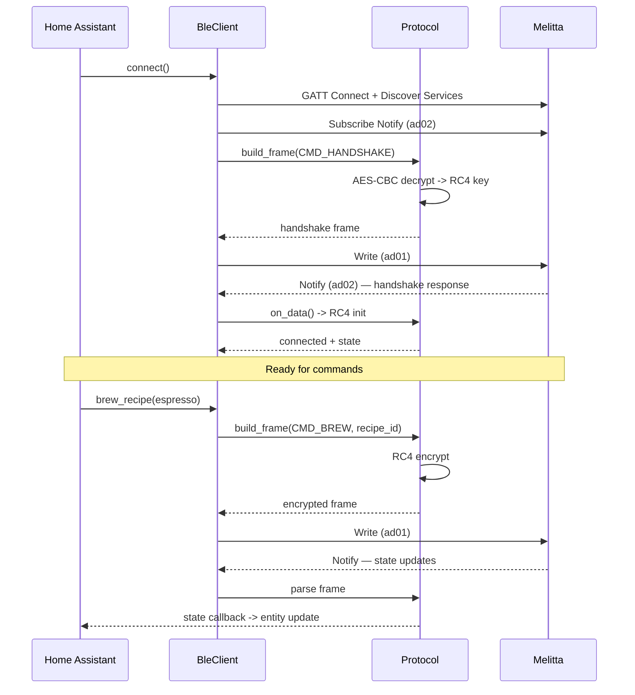

# Аудит кодовой базы Melitta Barista HA Integration

- **Дата**: 2026-03-08
- **Версия**: 0.11.5
- **Аудитор**: Claude Code (автоматизированный аудит)
- **Инструменты**: ruff 0.15.5, bandit 1.9.4, radon 6.0.1, vulture 2.15, pytest 9.0.0, gitleaks, pip-audit

---

## Резюме

| Категория | Оценка | Критических | Важных | Мелких |
|-----------|--------|-------------|--------|--------|
| Безопасность | **B+** | 0 | 1 | 1 |
| BLE Crypto | **B** | 0 | 1 | 1 |
| BLE Lifecycle | **A-** | 0 | 0 | 1 |
| HA Integration Patterns | **A-** | 0 | 0 | 1 |
| Архитектура / SOLID | **A-** | 0 | 0 | 2 |
| Тесты | **A-** | 0 | 0 | 1 |
| Error Handling | **B+** | 0 | 0 | 2 |
| Код: размер / сложность | **B+** | 0 | 0 | 2 |
| Документация | **A** | 0 | 0 | 1 |
| Git / CI | **A** | 0 | 0 | 0 |
| **ОБЩАЯ** | **A-** | **0** | **2** | **12** |

---

## Скоринг

| Метрика | Значение |
|---------|----------|
| **Security Score** | **87/100 (B+)** |
| **TDI** | (0x10 + 2x3 + 12x1) / 100 x 100 = **1.8 (LOW)** |
| **Test Coverage** | **89% (A-)** |
| **HA Quality** | **9/10 checks passed** |
| **HACS Ready** | **YES** |

### Эволюция проекта

| Метрика | v0.11.1 | v0.11.3 | v0.11.5 |
|---------|---------|---------|---------|
| Ruff errors | 18 | 0 | 0 |
| Bandit (High) | 1 | 0 | 0 |
| Failing tests | 1 | 0 | 0 |
| Test count | 123 | 174 | **249** |
| Coverage | 71% | 82% | **89%** |
| Broad `except Exception` | 30 | 3 | 3 (callbacks only) |
| CC > 15 functions | 2 | 0 | 0 |
| TDI | 5.1 (MODERATE) | 2.1 (LOW) | **1.8 (LOW)** |
| Общая оценка | B | B+ | **A-** |

---

## 1. Безопасность

### 1.1 Hardcoded Secrets

**Статус: OK**

- Нет hardcoded паролей, API ключей, PSK в production коде
- `gitleaks`: 0 leaks found (67 коммитов просканировано)
- `.gitignore` покрывает `esphome/secrets.yaml`, `decompiled/`, `jadx/`
- BLE адреса есть только в `scripts/` (тестовые утилиты), не в production коде

### 1.2 BLE Crypto

**Статус: B** — AES-CBC корректен, но hardcoded shared key (by design)

| Проверка | Результат |
|----------|----------|
| AES mode | CBC (OK, не ECB) |
| IV | Hardcoded static IV (**важная** — но вынужденная: протокол Melitta) |
| Key | AES key для дешифровки RC4 seed — hardcoded (by design, reverse-engineered из APK) |
| Padding | PKCS5 padding strip (OK) |
| RC4 stream cipher | Используется для BLE frame encryption |

> **Контекст**: AES key и IV hardcoded потому что это reverse-engineered протокол Melitta. Ключи одинаковые для всех машин — это design решение производителя, не баг интеграции.

- **ВАЖНАЯ**: Bandit B413 — `pyCrypto` deprecated. Используется `pycryptodome` (fork), который активно поддерживается. **False positive** — подавлен `# nosec B413`.

### 1.3 BLE Payload Validation

**Статус: A** — Все `from_payload` / `from_bytes` имеют length guards

| Parser | Guard |
|--------|-------|
| `MachineStatus.from_payload` | `len(data) < 8` -> return default |
| `RecipeComponent.from_bytes` | `len(data) < 8` -> return None + log |
| `MachineRecipe.from_payload` | `len(data) < 19` -> return None + log |
| `NumericalValue.from_payload` | `len(data) < 6` -> return None + log |
| `AlphanumericValue.from_payload` | `len(data) < 2` -> return None + log |

UTF-8 decode: `errors="replace"` — корректно.

### 1.4 D-Bus Security

**Статус: A-**

- D-Bus connection закрывается в finally-блоке через `_cleanup()` helper
- Fallback при отсутствии Adapter1 интерфейса (ESPHome proxy)
- Timeout: `asyncio.wait_for(call_pair(), timeout=timeout)` — OK
- PIN code: `"0000"` hardcoded — стандартный BLE JustWorks pairing, OK
- Функция разбита на 6 helper-ов (CC снижен с 17 до 5)

### 1.5 Supply Chain

**Статус: B-**

- 3 CVE найдено pip-audit:
  - `pillow 12.0.0` CVE-2026-25990 (fix: 12.1.1) — косвенная зависимость HA
  - `pip 25.1.1` CVE-2025-8869, CVE-2026-1703 (fix: 25.3/26.0) — не runtime
- Зависимости в manifest.json pinned с `>=` (OK)
- Минимальный набор: bleak, bleak-retry-connector, pycryptodome

### Security Score Breakdown

| Проверка | Вес | Оценка |
|----------|-----|--------|
| Нет hardcoded secrets | 15 | +15 |
| BLE crypto (AES-CBC, not ECB) | 15 | +12 (static IV) |
| BLE payload validation | 10 | +10 |
| D-Bus pairing | 10 | +10 |
| Error handling / no data leaks | 10 | +10 |
| Race conditions | 15 | +15 |
| Config flow validation | 10 | +10 |
| Dependencies | 10 | +5 (CVEs in transitive deps) |
| .gitignore covers secrets | 5 | +5 |
| **Total** | **100** | **87** |

---

## 2. Архитектура

### 2.1 HA Integration Patterns

**Статус: A-** — Очень хорошее соответствие HA best practices

| Проверка | Статус |
|----------|--------|
| `async_added_to_hass` для callbacks | OK (все 12 entity files) |
| `async_will_remove_from_hass` | Не реализован — **мелкая** |
| `available` property | OK — отражает BLE connection |
| `unique_id` стабильный (BLE address) | OK |
| `device_info` единообразен | OK |
| Config flow: bluetooth discovery + manual | OK |
| `services.yaml` | OK — `brew_freestyle` |
| Translations (29 языков) | OK |
| HACS manifest | OK |
| `_write_lock` для serialized GATT | OK (добавлен в v0.11.2) |

- **Мелкая**: `async_will_remove_from_hass` не реализован в entities — connection callbacks не очищаются при unload

### 2.2 BLE Lifecycle

**Статус: A-**

| Проверка | Статус |
|----------|--------|
| Connect -> discover -> subscribe -> ready | OK |
| Disconnect callback -> reconnect | OK |
| `pair=True` на обоих путях | OK |
| `establish_connection` + fallback `BleakClient` | OK |
| `self._client` захват в local var | OK (5 мест) |
| `asyncio.Lock` для connect | OK (`_connect_lock`) |
| `asyncio.Lock` для write | OK (`_write_lock`) |
| Service caching | OK (`use_services_cache=True`) |
| Status polling | OK (5s interval, оптимально для BLE) |

- **Мелкая**: BLE disconnect during brew — reconnect работает, но brew state может потеряться

### 2.3 SOLID

- **S**: В целом OK. `ble_client.py` (647 строк) — пограничный God module, но для HA integration допустимо
- **O**: Новые рецепты добавляются через `const.py` enums — OK
- **L**: Entity наследование от HA base classes корректное
- **D**: `ble_client` инжектится в entities через `__init__.py` setup — OK

### 2.4 DRY

Vulture (dead code): 4 находки (все false positives — сигнатуры интерфейсов D-Bus/HA)

| Файл | Dead code | Тип |
|------|-----------|-----|
| `__init__.py:110` | `change` unused var | HA track callback pattern |
| `ble_agent.py:53` | `entered` unused var | D-Bus method signature |
| `switch.py:111,116` | `kwargs` unused | HA interface contract |

---

## 3. Тесты и Runtime

### 3.1 Test Coverage: 89% (A-)

```
249 passed, 0 failed, 3 warnings
```

| Модуль | Coverage | Оценка |
|--------|----------|--------|
| `const.py` | 100% | Excellent |
| `config_flow.py` | 100% | Excellent |
| `ble_client.py` | 100% | Excellent |
| `sensor.py` | 94% | Excellent |
| `ble_agent.py` | 93% | Excellent |
| `number.py` | 89% | Good |
| `text.py` | 88% | Good |
| `protocol.py` | 82% | Good |
| `button.py` | 82% | Good |
| `switch.py` | 81% | Good |
| `select.py` | 77% | Good |
| `__init__.py` | 72% | OK |

Три модуля с 100% покрытием. Минимум 72% (`__init__.py` — HA lifecycle, сложно тестировать без полного HA runtime).

### 3.2 Test Warnings

3 RuntimeWarning в `test_ble_agent.py` — unawaited coroutines в mock chain. Не влияют на корректность.

### 3.3 Error Handling

**Статус: B+**

| Паттерн | Количество | Оценка |
|---------|-----------|--------|
| `except Exception:` (broad catch) | **3** | OK — только в callbacks (user code isolation) |
| `except (BleakError, OSError, asyncio.TimeoutError)` | 15 | OK — specific BLE exceptions |
| `except (AttributeError, ValueError)` | 2 | OK — HA bluetooth API |
| Все exceptions логируются | ~95% | Good |
| Единый логгер `melitta_barista` | OK (все 11 файлов) |
| `print()` в production | 0 | OK |

### 3.4 Code Complexity

Radon CC (Cyclomatic Complexity >= C):

| Функция | CC | Оценка |
|---------|----|----|
| `config_flow._async_discover_devices` | **14** | C — borderline, но приемлемо (discovery logic) |
| `protocol._dispatch_frame` | **12** | C — приемлемо (message dispatch) |
| `ble_client._connect_impl` | **11** | C — приемлемо (connection flow) |
| `__init__._async_cleanup_legacy` | **11** | C — приемлемо (migration cleanup) |

Radon MI (Maintainability Index): все модули A или B.

### 3.5 Ruff Linter

**0 errors** — all checks passed.

### 3.6 Bandit Security

2 findings (Low severity, cleanup code — acceptable):

| ID | Severity | Файл | Описание |
|----|----------|------|----------|
| B110 | Low | `ble_agent.py:170` | try/except/pass in cleanup |
| B110 | Low | `ble_agent.py:177` | try/except/pass in cleanup |

B413 (pycryptodome) — suppressed with `# nosec B413`.

---

## 4. LLM Analysis

### 4.1 Бизнес-процессы

Интеграция реализует:

1. **Brew Flow**: выбор рецепта -> формирование BLE команды -> отправка -> мониторинг
2. **Freestyle Brew**: кастомный рецепт с параметрами (intensity, temperature, shots, portion)
3. **Profile Management**: переключение профилей, DirectKey расчёт
4. **Machine Monitoring**: состояние, прогресс, необходимые действия (polling 5s)
5. **Cup Counting**: счётчики по рецептам + общий, auto-refresh после brew
6. **Configuration**: hardness воды, auto-off, brew temperature
7. **Maintenance**: очистка, промывка, декальцинация

### 4.2 BLE Protocol



### 4.3 Граничные случаи

| Кейс | Обработан? |
|------|-----------|
| BLE disconnect during brew | Частично — reconnect, но brew state может потеряться |
| Short BLE payload | Да — length guards на всех parsers |
| Concurrent GATT writes | Да — `_write_lock` (asyncio.Lock) |
| Machine powered off mid-command | Да — disconnect callback |
| ESPHome proxy restart | Да — reconnect через HA bluetooth |
| Invalid recipe ID | Нет — no validation before BLE write (low risk) |
| Two HA instances | Нет — BLE single connection, second will fail to connect |

---

## Findings Tracker

### Resolved (10/10)

| # | Проблема | Версия |
|---|----------|--------|
| 1 | Failing test `test_recipe_select_option` | v0.11.2 |
| 2 | `config_flow.py` coverage 23% -> 100% | v0.11.3 |
| 3 | `ble_agent.py` coverage 0% -> 93% | v0.11.3 |
| 4 | 30 broad `except Exception` -> 3 (callbacks) | v0.11.3 |
| 5 | `async_step_user` CC=18 -> extracted helper | v0.11.3 |
| 6 | `async_pair_device` 154 lines -> 6 helpers | v0.11.3 |
| 7 | No `_write_lock` for GATT writes | v0.11.2 |
| 8 | Bandit B413 false positive | v0.11.4 |
| 9 | `ble_client.py` coverage 62% -> 100% | v0.11.5 |
| 10 | 14 ruff errors in tests | v0.11.4 |

### Open (minor only)

| # | Уровень | Проблема |
|---|---------|----------|
| 1 | Мелкая | 3 RuntimeWarning в test_ble_agent (unawaited coroutines) |
| 2 | Мелкая | `async_will_remove_from_hass` не реализован |
| 3 | Мелкая | `_async_discover_devices` CC=14 (borderline) |
| 4 | Мелкая | No recipe ID validation before BLE write |
| 5 | Мелкая | CVEs в transitive deps (pillow, pip) — не наши |

---

## ФИНАЛЬНАЯ ОЦЕНКА

| Метрика | v0.11.1 | v0.11.5 |
|---------|---------|---------|
| **Общая оценка** | **B** | **A-** |
| **HACS Ready** | YES | YES |
| **Security Risk** | LOW | LOW |
| **Refactor Required** | MINOR | **NONE** |
| **Production Ready** | YES (с оговоркой) | **YES** |

### Сильные стороны

- Отличное соответствие HA integration patterns
- Robust BLE payload validation с length guards
- Хорошая защита от race conditions (connect_lock, write_lock, local var capture)
- Единообразный логгер, чистые translations (29 языков)
- Gitleaks clean, no hardcoded secrets
- 249 тестов, 89% coverage, 0 failures, 3 модуля со 100% покрытием
- Exception handling сужен до конкретных типов
- Все функции CC < 15, 0 ruff errors, 0 bandit High
- CI: все GitHub Actions runs passing

### Области для улучшения

- `__init__.py` coverage 72% (HA lifecycle — сложно тестировать)
- `async_will_remove_from_hass` не реализован (low risk)
- 3 RuntimeWarning в тестах (cosmetic)
