# Melitta Barista & Nivona — BLE Architecture & Protocol

> Подробная техническая документация по BLE-стеку интеграции (общий Eugster/Frismag OEM-стек, используемый Melitta Barista T/TS Smart и Nivona NICR/NIVO 8xxx): от Bluetooth-слоя до HA-сущностей.

## Содержание

1. [Общая архитектура](#1-общая-архитектура)
2. [BLE-транспорт: Bleak → ESPHome Proxy → Машина](#2-ble-транспорт)
3. [Жизненный цикл соединения](#3-жизненный-цикл-соединения)
4. [Протокол Melitta BLE](#4-протокол-melitta-ble)
5. [Криптография](#5-криптография)
6. [Команды протокола](#6-команды-протокола)
7. [Реконнект и отказоустойчивость](#7-реконнект-и-отказоустойчивость)
8. [HA Entity-архитектура](#8-ha-entity-архитектура)
9. [Потоки данных](#9-потоки-данных)
10. [Найденные и исправленные проблемы](#10-найденные-и-исправленные-проблемы-v0232--v0233)
11. [Ссылки на HA API](#11-ссылки-на-ha-api)

---

## 1. Общая архитектура

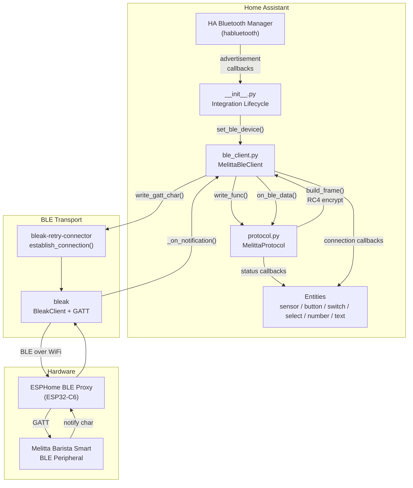

### Слои абстракции

| Слой | Модуль | Ответственность |
|------|--------|-----------------|
| **HA Integration** | `__init__.py` | Lifecycle, BLE advertisement callback, сервисы |
| **BLE Client** | `ble_client.py` | Управление соединением, reconnect, polling, locks |
| **Protocol** | `protocol.py` | Framing, шифрование, command/response, parsing |
| **Transport** | `bleak` + `bleak-retry-connector` | GATT read/write/notify, retry logic |
| **Proxy** | ESPHome BLE Proxy | WiFi↔BLE bridge (опционально) |
| **Entities** | `sensor.py`, `button.py`, ... | HA UI, состояние, actions |

---

## 2. BLE-транспорт

### BLE-характеристики машины

| Параметр | Значение |
|----------|----------|
| Service UUID | `0000ad00-b35c-11e4-9813-0002a5d5c51b` |
| Write Characteristic | `0000ad01-...` (write without response) |
| Notify Characteristic | `0000ad02-...` (notifications) |
| Address type | Static Random (`F1:xx:xx`) |
| MTU | 20 bytes (стандартный BLE) |

### Два режима подключения

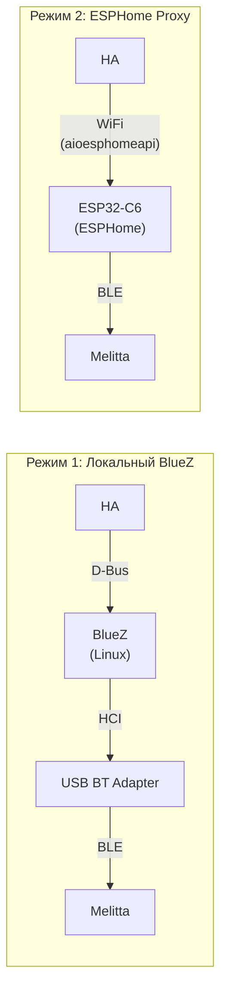

**Локальный BlueZ:**
- D-Bus Agent1 pairing через `ble_agent.py`
- `establish_connection(pair=True)` для bonding
- Прямой HCI доступ

**ESPHome BLE Proxy** (рекомендуемый):
- ESP32 как WiFi→BLE мост
- `ble_agent.py` детектирует отсутствие `Adapter1` D-Bus интерфейса, пропускает D-Bus pairing
- `pair=True` обрабатывается на стороне ESP32
- `address_type=1` (random) передаётся через `BLEDevice` из HA bluetooth cache
- Конфиг: `esphome/ble-proxy-xiao-c6.yaml`

### Интеграция с HA Bluetooth API

```python
# __init__.py: регистрация callback на BLE advertisements
bluetooth.async_register_callback(
    hass,
    _async_update_ble,       # вызывается при каждом advertisement
    {"address": address},    # фильтр по MAC-адресу
    bluetooth.BluetoothScanningMode.ACTIVE,
)
```

Когда машина включается и начинает advertising, HA Bluetooth Manager детектирует advertisement через ESPHome proxy и вызывает `_async_update_ble` → `set_ble_device()`, что обновляет `BLEDevice` и будит reconnect loop.

> **Документация HA:** [Bluetooth API — async_register_callback](https://developers.home-assistant.io/docs/core/bluetooth/api/)

### establish_connection и ble_device_callback

```python
# ble_client.py: _establish_connection()
client = await establish_connection(
    BleakClientWithServiceCache,    # кэширование GATT-сервисов
    self._ble_device,               # текущий BLEDevice
    self._device_name or self._address,
    disconnected_callback=self._on_disconnect,
    use_services_cache=True,
    ble_device_callback=lambda: self._ble_device,  # ВСЕГДА свежий reference
    max_attempts=3,
    pair=pair,
)
```

**Зачем `ble_device_callback`?** При retry `establish_connection` вызывает эту lambda для получения актуального `BLEDevice`. Между попытками мог прийти новый advertisement, обновивший `self._ble_device` через `set_ble_device()`.

> **Документация:** [bleak-retry-connector](https://github.com/Bluetooth-Devices/bleak-retry-connector)

---

## 3. Жизненный цикл соединения

### Полная state machine

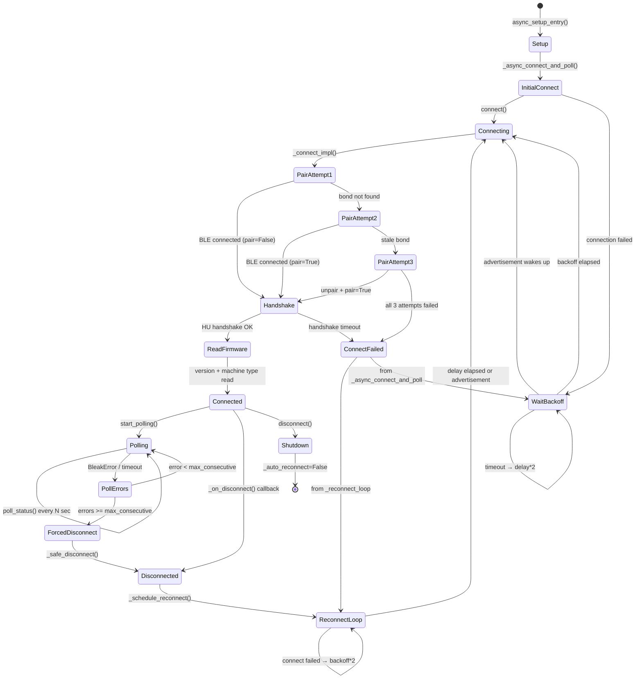

### Последовательность подключения (happy path)

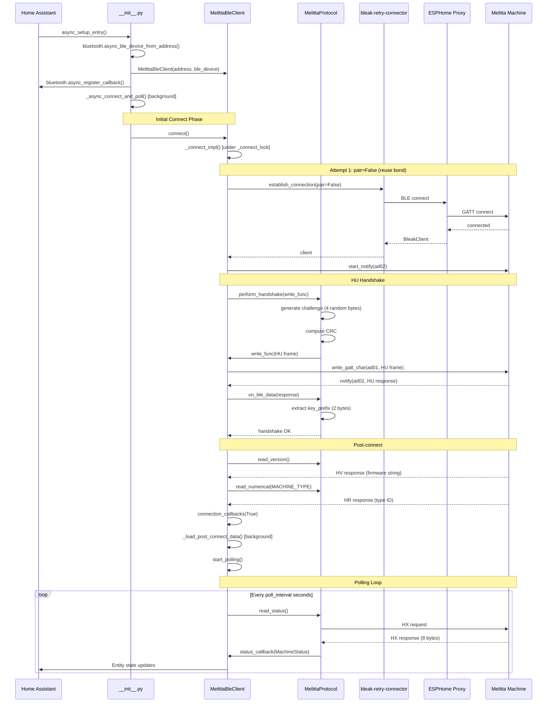

### 3-ступенчатая стратегия pairing

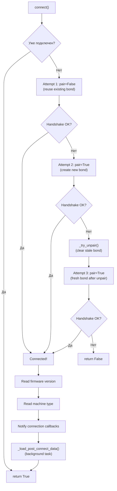

**Зачем 3 попытки?**
1. **pair=False** — быстрый путь: bond уже есть на ESP32/BlueZ, повторный pairing не нужен
2. **pair=True** — первый pairing или bond был потерян (e.g. ESP32 перезагрузился)
3. **unpair + pair=True** — stale bond: машина забыла нас, но ESP32/BlueZ ещё помнит старый bond

---

## 4. Протокол Melitta BLE

### Формат фрейма

```
┌─────┬──────────┬────────────┬─────────────┬──────────┬─────┐
│  S  │ Command  │ Key Prefix │   Payload   │ Checksum │  E  │
│0x53 │ 1-2 char │  2 bytes   │  N bytes    │  1 byte  │0x45 │
└─────┴──────────┴────────────┴─────────────┴──────────┴─────┘
          │              │                         │
          │              └─── RC4 encrypted ───────┘
          │                   (key_prefix + payload + checksum)
          └── plaintext (command bytes)
```

- **S** (`0x53`) — маркер начала фрейма
- **Command** — 1-2 ASCII символа (`HU`, `HX`, `HC`, `HJ`, `HE`, `HB`, `HR`, `HA`, `HV`, `HW`, `A`, `N`)
- **Key Prefix** — 2 байта, получены при handshake, включаются во все фреймы после handshake
- **Payload** — данные команды (переменная длина)
- **Checksum** — `~(sum(cmd_bytes + payload)) & 0xFF`
- **E** (`0x45`) — маркер конца фрейма
- Всё после command bytes и до E **шифруется RC4** (кроме A/N — ACK/NACK)

### Приём фрейма (_process_byte)

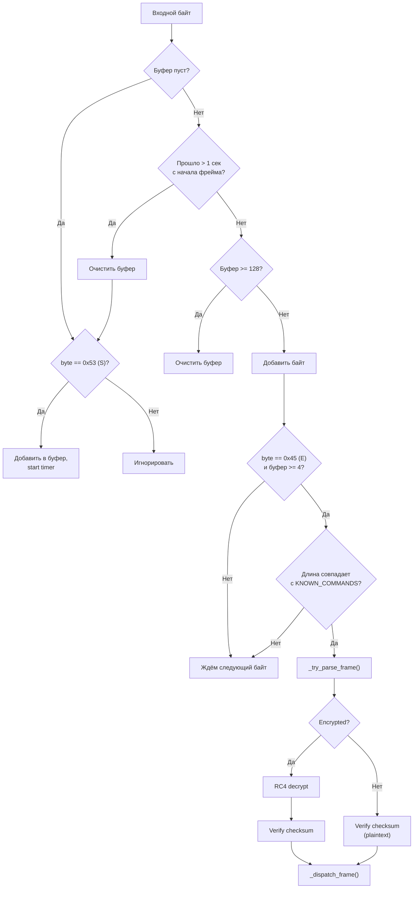

**Ключевые особенности парсера:**

1. **S (0x53) внутри фрейма — это данные**, не новый фрейм. RC4-шифрование может генерировать байт 0x53 в ciphertext. Оригинальная реализация в Java (`Q3/q.java`) делает то же самое.

2. **E (0x45) как маркер конца проверяется через длину.** Поскольку 0x45 тоже может появиться в ciphertext, парсер сравнивает текущую длину буфера с ожидаемой длиной для каждой известной команды. Если длина не совпадает — байт считается данными.

3. **1-секундный таймаут** сбрасывает буфер при фрагментации (MTU = 20 байт, фрейм до ~70 байт = 4 BLE-пакета).

### Чанкинг для BLE

```python
def chunk_for_ble(self, frame: bytes) -> list[bytes]:
    """Split frame into 20-byte BLE MTU chunks."""
    return [frame[i:i+20] for i in range(0, len(frame), 20)]
```

Один фрейм (например, HJ write recipe = 73 байта) разбивается на 4 чанка по 20 + остаток:
```
Chunk 1: [20 bytes] → write_gatt_char(ad01)
Chunk 2: [20 bytes] → write_gatt_char(ad01)
Chunk 3: [20 bytes] → write_gatt_char(ad01)
Chunk 4: [13 bytes] → write_gatt_char(ad01)
```

---

## 5. Криптография

### Инициализация шифрования

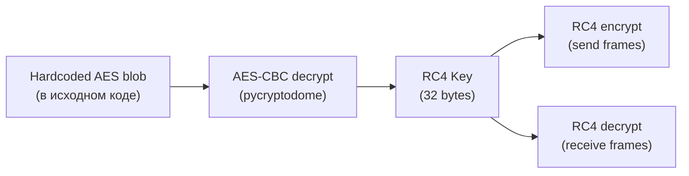

1. **AES-CBC** расшифровывает захардкоженный blob → получаем RC4-ключ (32 байта)
2. **RC4** (симметричный потоковый шифр) используется для шифрования/дешифрования всех фреймов
3. Каждый фрейм шифруется **независимо** (RC4 state сбрасывается для каждого фрейма)

### Handshake (HU command)

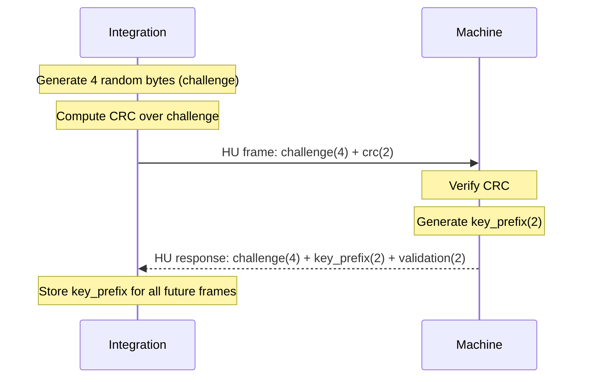

**Key Prefix** — 2 байта, которые машина присваивает сессии. Включаются во **все** последующие фреймы (команды и ответы). Без key_prefix машина отклоняет команды.

---

## 6. Команды протокола

### Таблица команд

| Команда | Направление | Encrypted | Payload size | Описание |
|---------|-------------|-----------|-------------|----------|
| `HU` | ↔ | Нет* | 6/8 bytes | Handshake challenge-response |
| `HX` | ← | Да | 8 bytes | Status (процесс, прогресс, alerts) |
| `HC` | ← | Да | 66 bytes | Read recipe response |
| `HJ` | → | Да | 66 bytes | Write recipe |
| `HE` | → | Да | 18 bytes | Start process (brew, clean, etc.) |
| `HB` | → | Да | 4 bytes | Cancel process |
| `HR` | ← | Да | 6 bytes | Read numerical value |
| `HW` | → | Да | 6 bytes | Write numerical value |
| `HA` | ↔ | Да | 66 bytes | Read/write alphanumeric value |
| `HV` | ← | Да | 11 bytes | Read firmware version |
| `A` | ← | Нет | 0 bytes | ACK |
| `N` | ← | Нет | 0 bytes | NACK |

*HU использует RC4 для key_prefix exchange, но сам challenge не шифруется.

### HX — Machine Status (push, каждые ~5 сек)

```
Payload (8 bytes):
  ┌──────────────┬──────────────┬───────────────┬──────────────┬──────────────┐
  │ process (2B) │sub_process(2)│info_messages(1)│manipulation(1)│ progress(2B)│
  │  big-endian  │  big-endian  │   bitmask     │    enum      │  big-endian  │
  └──────────────┴──────────────┴───────────────┴──────────────┴──────────────┘
```

- **process**: `MachineProcess` enum (STANDBY=0, READY=2, PRODUCT=3, CLEANING=4, ...)
- **sub_process**: `SubProcess` enum (IDLE=0, GRINDING=1, BREWING=2, MILK_FOAMING=3, ...)
- **info_messages**: bitmask (WATER_EMPTY=0x01, TRAY_FULL=0x02, BEAN_EMPTY=0x04, ...)
- **manipulation**: `Manipulation` enum (NONE=0, INSERT_TRAY=1, EMPTY_GROUNDS=2, ...)
- **progress**: 0-100 (процент завершения текущего процесса)

### HC — Read Recipe (response)

```
Payload (66 bytes, значимые 19):
  ┌─────────────┬─────────────┬──────────────────┬──────────────────┬──────────┐
  │recipe_id (2)│recipe_type(1)│  component1 (8)  │  component2 (8)  │padding(47)│
  │ big-endian  │    enum     │  RecipeComponent │  RecipeComponent │   zeros   │
  └─────────────┴─────────────┴──────────────────┴──────────────────┴──────────┘
```

**ВАЖНО:** В HC response **НЕТ recipe_key** (в отличие от HJ write)!

### HJ — Write Recipe (request)

```
Payload (66 bytes):
  ┌─────────────┬─────────────┬────────────┬──────────────────┬──────────────────┬──────────┐
  │recipe_id (2)│recipe_type(1)│recipe_key(1)│  component1 (8)  │  component2 (8)  │padding(46)│
  │ big-endian  │    enum     │    enum    │  RecipeComponent │  RecipeComponent │   zeros   │
  └─────────────┴─────────────┴────────────┴──────────────────┴──────────────────┴──────────┘
```

**recipe_key обязателен** и определяется по recipe_type через маппинг.

### RecipeComponent (8 bytes)

```
  ┌─────────┬───────┬───────┬───────────┬───────┬─────────────┬─────────┬─────────┐
  │process  │ shots │ blend │ intensity │ aroma │ temperature │portion  │reserve  │
  │ (1 byte)│(1)    │(1)    │ (1)       │(1)    │ (1)         │(1, ×5ml)│(1)      │
  └─────────┴───────┴───────┴───────────┴───────┴─────────────┴─────────┴─────────┘
```

### Brew Flow (полный цикл заваривания)

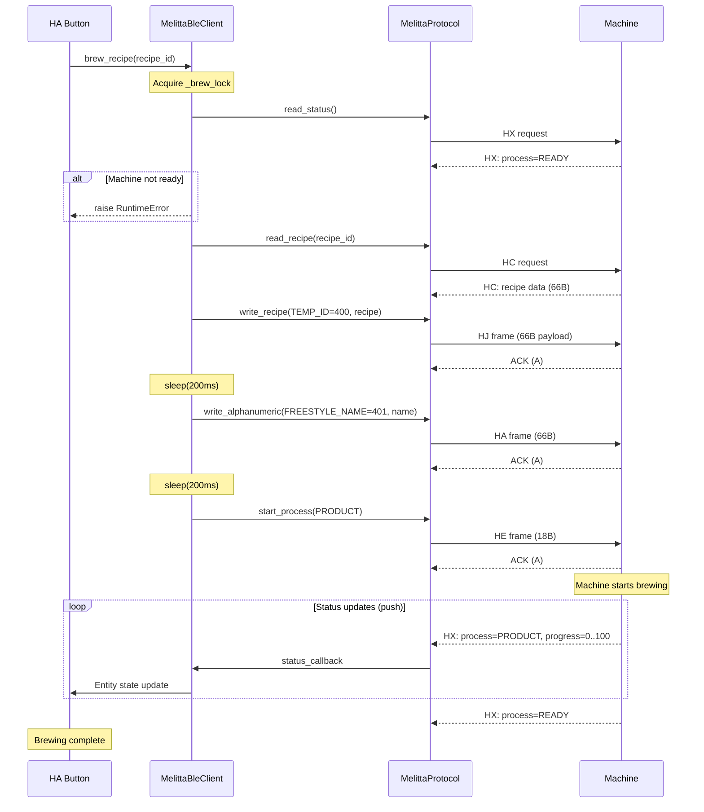

---

## 7. Реконнект и отказоустойчивость

### Обнаружение отключения (два пути)

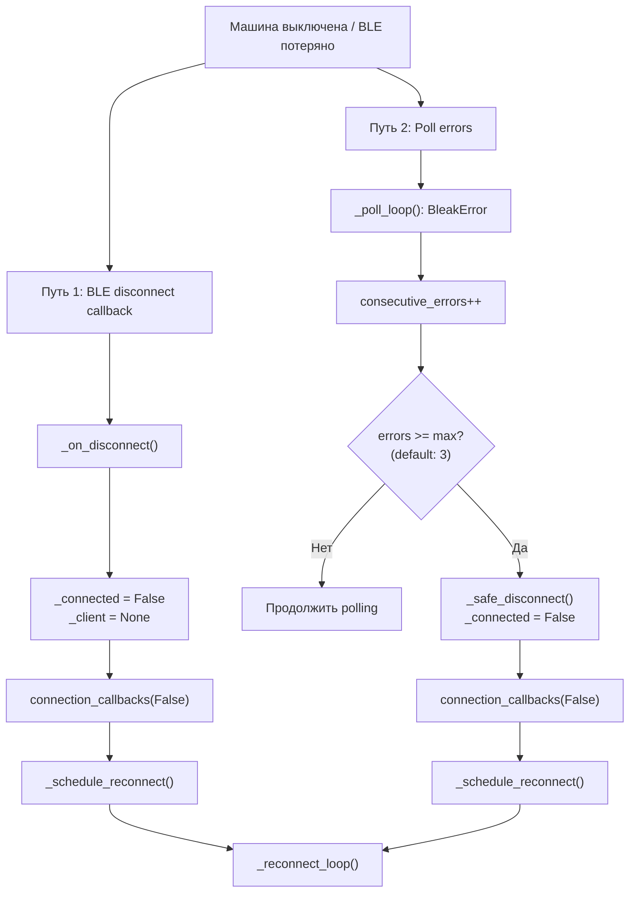

**Путь 1** — быстрый: BLE-стек (через ESPHome proxy или BlueZ) детектирует разрыв соединения по BLE supervision timeout и вызывает `disconnected_callback`. Задержка: обычно 2-10 секунд.

**Путь 2** — fallback: если disconnect callback не сработал (например, при silent disconnect), poll loop накапливает ошибки и через `max_consecutive_errors` (по умолчанию 3) принудительно отключается.

### Reconnect Loop с exponential backoff

```mermaid
sequenceDiagram
    participant LOOP as _reconnect_loop
    participant EVENT as _reconnect_event
    participant BT as HA Bluetooth
    participant CLIENT as connect()

    Note over LOOP: delay = reconnect_delay (default: 5s)

    loop while _auto_reconnect and not connected
        LOOP->>EVENT: wait(timeout=delay)

        alt Advertisement arrives
            BT->>EVENT: set() [via set_ble_device()]
            EVENT-->>LOOP: woken up early!
            Note over LOOP: delay = reconnect_delay (reset)
        else Timeout
            Note over LOOP: normal backoff elapsed
        end

        LOOP->>CLIENT: connect()

        alt Success
            CLIENT-->>LOOP: True
            LOOP->>LOOP: start_polling()
            Note over LOOP: return (loop ends)
        else Failure
            CLIENT-->>LOOP: False / exception
            Note over LOOP: delay = min(delay×2, max_delay)
        end
    end
```

**Backoff progression:** 5s → 10s → 20s → 40s → 80s → 160s → 300s (max)

**Мгновенный reconnect по advertisement:** Когда машина включается и начинает BLE advertising, ESPHome proxy форвардит advertisement → HA вызывает `set_ble_device()` → `_reconnect_event.set()` будит reconnect loop → попытка подключения с минимальной задержкой.

> **HA API:** [`bluetooth.async_register_callback`](https://developers.home-assistant.io/docs/core/bluetooth/api/) — регистрирует callback на каждый BLE advertisement от устройства с указанным MAC-адресом.

### Защита от race conditions (locks)

| Lock | Защищает | Используется в |
|------|----------|----------------|
| `_connect_lock` | Одновременные попытки подключения | `connect()` |
| `_write_lock` | Параллельные BLE write | `_write_ble()` |
| `_brew_lock` | Параллельные brew commands | `brew_recipe()`, `brew_directkey()`, `brew_freestyle()` |
| `_lock` (protocol) | Параллельные send_and_wait | `send_and_wait_ack()`, `send_and_wait_response()` |

---

## 8. HA Entity-архитектура

### Entity-дерево

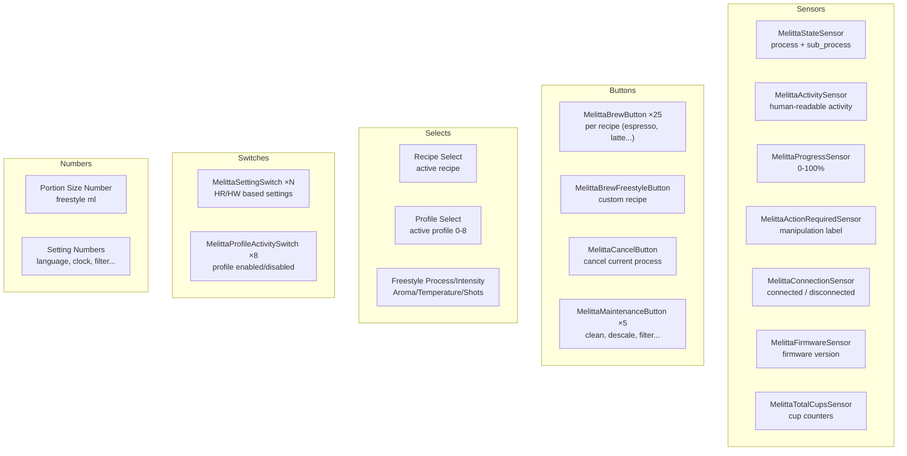

### Подписка на обновления

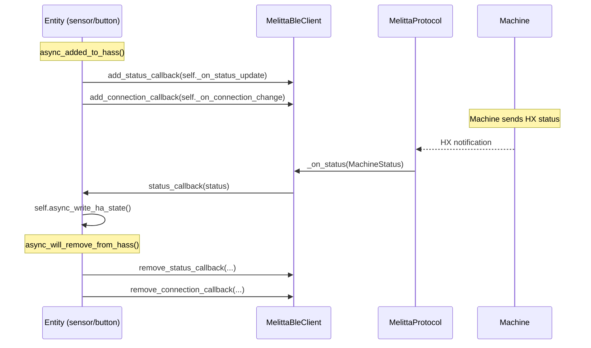

**Все entity используют push-модель** — не polling. Машина отправляет HX status каждые ~5 секунд через BLE notification. Entity подписываются на callbacks и обновляют своё состояние реактивно.

---

## 9. Потоки данных

### Полный цикл: от BLE notification до HA UI

```mermaid
flowchart LR
    MACH["Machine<br/>BLE notify"] -->|"raw bytes<br/>(20B chunks)"| ESP["ESPHome<br/>Proxy"]
    ESP -->|"aioesphomeapi"| BLEAK["BleakClient<br/>notification callback"]
    BLEAK -->|"bytearray"| ON_NOTIF["_on_notification()"]
    ON_NOTIF -->|"bytes"| ON_BLE["protocol.on_ble_data()"]
    ON_BLE -->|"per byte"| PROCESS["_process_byte()"]
    PROCESS -->|"complete frame"| PARSE["_try_parse_frame()"]
    PARSE -->|"RC4 decrypt<br/>+ checksum verify"| DISPATCH["_dispatch_frame()"]

    DISPATCH -->|"HX payload"| STATUS["MachineStatus.from_payload()"]
    STATUS -->|"callback"| SENSOR["Sensor entity"]
    SENSOR -->|"async_write_ha_state()"| HA_UI["HA Frontend"]

    DISPATCH -->|"A/N"| ACK["_ack_future.set_result()"]
    ACK -->|"unblock"| SEND_WAIT["send_and_wait_ack()"]

    DISPATCH -->|"HC/HR/HA/HV"| FUTURE["_frame_futures[cmd].set_result()"]
    FUTURE -->|"unblock"| SEND_RESP["send_and_wait_response()"]
```

### Параллельность и асинхронность

```mermaid
gantt
    title Async Task Lifecycle
    dateFormat X
    axisFormat %s

    section Background Tasks
    _async_connect_and_poll    :0, 5
    _load_post_connect_data    :5, 8
    _poll_loop                 :8, 100
    _reconnect_loop (if needed):50, 60

    section Locks
    _connect_lock held         :0, 5
    _write_lock (per BLE write):active, 8, 9
    _brew_lock (during brew)   :active, 20, 25
```

---

## 10. Найденные и исправленные проблемы (v0.23.2 — v0.23.3)

### Критические баги

#### Bug 1: Reconnect loop отменяет сам себя (v0.23.2)

```mermaid
sequenceDiagram
    participant LOOP as _reconnect_loop
    participant CONNECT as connect()
    participant IMPL as _connect_impl()

    Note over LOOP: _reconnect_task = this task
    LOOP->>CONNECT: await self.connect()
    CONNECT->>IMPL: await self._connect_impl()

    Note over IMPL: self._reconnect_task.cancel()
    Note over IMPL: ⚠️ Cancels ITSELF!

    IMPL-->>CONNECT: CancelledError at next await
    Note over LOOP: Task silently dies
    Note over LOOP: ❌ No reconnection ever happens
```

**Причина:** `_connect_impl()` содержал `self._reconnect_task.cancel()` для предотвращения дублирования. Но когда вызывался из `_reconnect_loop`, `_reconnect_task` указывал на текущий task.

**Исправление:** `asyncio.current_task() is not self._reconnect_task` guard.

#### Bug 2: Shared `_reconnect_event` race condition (v0.23.3)

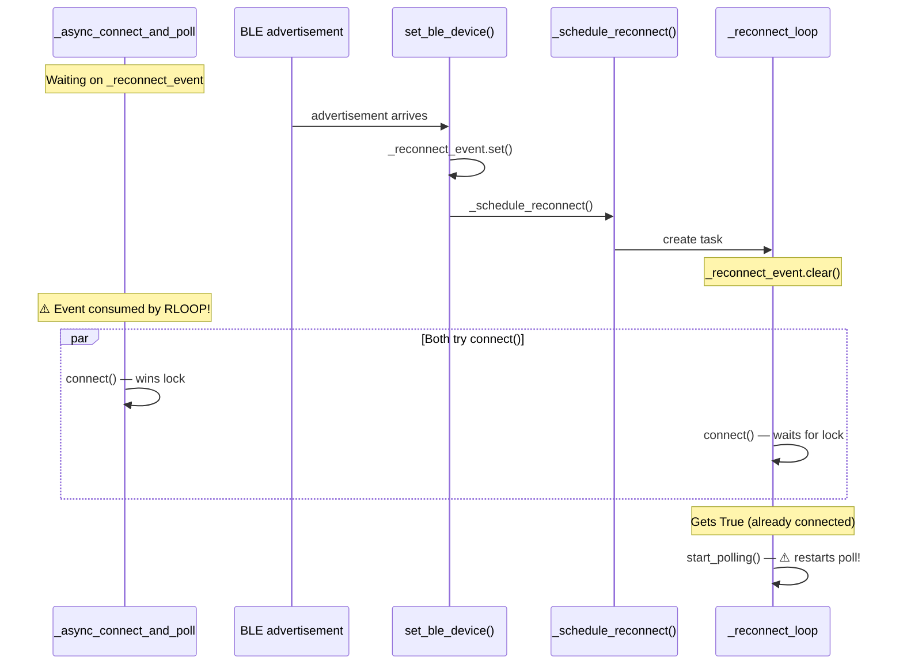

**Причина:** Два цикла (`_async_connect_and_poll` и `_reconnect_loop`) слушали один `_reconnect_event`. `set_ble_device()` создавал дубликат reconnect loop.

**Исправление:** `set_ble_device()` не вызывает `_schedule_reconnect()` если reconnect task уже существует.

### Проблемы надёжности (v0.23.3)

| # | Проблема | Исправление |
|---|----------|-------------|
| 3 | `_load_post_connect_data` — fire-and-forget task, не отменяется при disconnect | Сохраняется в `_post_connect_task`, отменяется в `disconnect()` |
| 4 | `MelittaProtocol()` создавалась без `frame_timeout` (Options Flow игнорировался) | Передаём `frame_timeout=self._frame_timeout` |
| 5 | `write_alpha()` безусловно перезапускала polling | Добавлен `was_polling` guard |
| 6 | `send_and_wait_response()` — stale future при ошибке write | `finally: self._frame_futures.pop(command, None)` |
| 7 | Cup counter refresh конфликтовал с brew sequence | Проверка `self._brew_lock.locked()` перед запуском |

---

## 11. Ссылки на HA API

### Используемые HA Bluetooth API

| API | Где | Для чего |
|-----|-----|----------|
| [`bluetooth.async_register_callback`](https://developers.home-assistant.io/docs/core/bluetooth/api/) | `__init__.py:139` | Получение fresh `BLEDevice` при каждом advertisement |
| [`bluetooth.async_ble_device_from_address`](https://developers.home-assistant.io/docs/core/bluetooth/api/) | `__init__.py:107` | Initial `BLEDevice` из кэша при setup |
| [`bluetooth.BluetoothScanningMode.ACTIVE`](https://developers.home-assistant.io/docs/core/bluetooth/api/) | `__init__.py:148` | Активное BLE сканирование через proxy |
| [`entry.async_on_unload`](https://developers.home-assistant.io/docs/config_entries_index/) | `__init__.py:150` | Автоматическая отмена callback при unload |
| [`hass.async_create_task`](https://developers.home-assistant.io/docs/asyncio_index/) | `__init__.py:170` | Background connect без блокировки setup |
| [`ConfigEntry.runtime_data`](https://developers.home-assistant.io/docs/config_entries_index/) | `__init__.py:160` | Хранение клиента в runtime данных entry |

### Используемые библиотеки

| Библиотека | Версия | Для чего |
|-----------|--------|----------|
| [`bleak`](https://bleak.readthedocs.io/) | ≥ 0.21.0 | GATT read/write/notify, BLE connection |
| [`bleak-retry-connector`](https://github.com/Bluetooth-Devices/bleak-retry-connector) | ≥ 3.0.0 | `establish_connection()`, service cache, retry |
| [`pycryptodome`](https://www.pycryptodome.org/) | ≥ 3.0.0 | AES-CBC для derivation RC4-ключа |

### Конфигурируемые параметры (Options Flow)

| Параметр | Default | Описание |
|----------|---------|----------|
| `poll_interval` | 5.0s | Интервал polling HX status |
| `reconnect_delay` | 5.0s | Начальная задержка reconnect |
| `reconnect_max_delay` | 300s | Максимальная задержка reconnect |
| `max_consecutive_errors` | 3 | Poll errors до forced disconnect |
| `ble_connect_timeout` | 30s | Таймаут BLE connect |
| `frame_timeout` | 5s | Таймаут ожидания ответа на команду |
| `initial_connect_delay` | 2.0s | Задержка перед первым connect |
| `recipe_retries` | 2 | Retry для read/write recipe |

---

*Документация актуальна для версии v0.23.3. Последнее обновление: 2026-03-19.*
