# ТЗ: AI-Сомелье — снимок текущего состояния (драфт)

**Версия документа:** 0.3 (draft, 2026-05-25)
**Источник:** обратная инженерия кода на ветке `main` после релиза `v0.53.4` + требования пользователя + ответы Q&A.
**Назначение:** baseline текущего состояния + требования к доработке + зафиксированные решения по open questions. Разделы §1–§12 описывают «как есть», §13 — «как должно стать», §14 (новый) — журнал решений Q&A.

**Changelog документа:**
- `0.5` (2026-05-25) — Q&A раунды 3–5: закрыты O10.1, O10.2, O10.3, O1.2, O6.1, B1+X2. Все 22/22 O*-вопроса закрыты, B*/F*/X* проблемы сопоставлены с требованиями.
- `0.4` (2026-05-25) — Q&A раунд 2: закрыты O4а.2, O3.3, O5.1, O5.2, O7.1, O8.1, O8.2, O11.1, O9.1 (16/22).
- `0.3` (2026-05-25) — добавлен §14 «Журнал решений Q&A», закрыты O4.1, O1.1, O2.1, O2.2, O3.1, O3.2, O4а.1.
- `0.2` (2026-05-25) — добавлен §13 «Требования к изменениям» (R1..R11).
- `0.1` (2026-05-24) — снимок текущего состояния.

---

## 1. Назначение функционала

AI-Сомелье — это встроенный в HA-панель интеграции `melitta_barista` модуль, который:

1. собирает справочники продуктов (зёрна, сиропы, топпинги, типы молока, профили предпочтений);
2. отслеживает текущее содержимое двух бункеров машины и реального запаса молока/аддитивов;
3. по запросу пользователя обращается к LLM (через `conversation` integration HA) и генерирует **freestyle-рецепты** кофе с учётом контекста (погода, время суток, настроение, диета, кофе-счётчик за день);
4. позволяет сразу заварить сгенерированный рецепт на машине через BLE-протокол (freestyle, `recipe_type=24`);
5. сохраняет историю сессий генерации и избранные рецепты.

Сомелье не использует базовые DirectKey-рецепты машины — это собственный набор пресетов и команд варки.

---

## 2. Целевые сценарии (актуальные user journeys)

### Сценарий A — «Удиви меня»
1. Пользователь открывает таб **Sommelier** в HA-панели интеграции.
2. По умолчанию режим `surprise_me`, count=3, occasion подставлен по локальному времени (5–11 → morning, 12–16 → after_lunch, 17–21 → work, 22–4 → guests).
3. Нажимает **Generate** → backend собирает контекст (бункеры, молоко, аддитивы, погода/присутствие/счётчик чашек, активный профиль), формирует промпт, дёргает LLM.
4. На экране появляются 1–5 карточек рецептов: название, описание, машинная конфигурация (process / intensity / aroma / temperature / shots / portion_ml), пошаговый рецепт, бейджи extras, метаданные (cup_type, кофеин, калории), сворачиваемый блок «Why?».
5. Нажатие **Brew this** → backend рендерит RecipeComponent в коды протокола и вызывает `client.brew_freestyle(recipe_type=24)`; рецепт помечается `brewed=true`.

### Сценарий B — «Свой запрос»
1. Пользователь переключает режим в `custom`, появляется текстовое поле, вводит свободный запрос («хочу что-то лёгкое с миндалём»).
2. Опционально раскрывает блок **Constraints and mood** (cup_size, mood-чипы, occasion, temperature, caffeine, dietary).
3. Опционально раскрывает **Available add-ins**: чипы по сиропам / топпингам / молоку — изначально все «галочки» проставлены, пользователь может снимать ненужные.
4. Generate → дальше как в сценарии A.

### Сценарий C — Управление справочниками
- **Producers**: добавить производителя (name, country, website, notes) — в табе **Beans**.
- **Beans**: добавить зерно с привязкой к производителю; кнопка **Fill from LLM** автозаполняет roast/bean_type/origin/origin_country/flavor_notes/composition (LLM возвращает структурированный объект, валидируется pydantic-моделью).
- **Hoppers**: на той же странице, под таблицей зёрен — два `<select>`-а (`hopper1`, `hopper2`) для привязки зерна к слоту; после изменения фронт делает read-back и показывает зелёное подтверждение / красную ошибку при mismatch.
- **Additives**: в табе **Add-ins** — три секции (Syrups / Toppings / Milk types). Modal с переключателем типа; для syrup/topping есть brand+notes, для milk — только name.

### Сценарий D — Избранное
- На карточке сгенерированного рецепта есть кнопка ★/☆. Клик добавляет в favorites (`/sommelier/favorites/add`). **Просмотра / удаления / варки** избранного из текущего UI **нет** (см. §9).

### Сценарий E — Конфигурация LLM
- В табе **Settings** выставляется `llm_agent_id` — какой `conversation`-агент HA использовать (включая дефолтный Assist или внешнюю интеграцию `smartchain`).
- Шаблоны промптов (`beans_autofill`, `sommelier_intro`) редактируются через `prompts/save` с preview, fallback на `DEFAULT_PROMPTS`.

---

## 3. Архитектура

```mermaid
flowchart LR
  subgraph Panel["HA panel (Lit elements)"]
    Panel0[melitta-panel.js]
    Som[melitta-sommelier.js]
    Bea[melitta-beans.js]
    Add[melitta-additives.js]
    Rec[melitta-recipes.js]
    Set[melitta-settings.js]
    Panel0 --> Som & Bea & Add & Rec & Set
  end

  subgraph Backend["custom_components/melitta_barista"]
    InitPy[__init__.py]
    SomApi[sommelier_api.py]
    PanApi[panel_api.py]
    AiRec[ai_recipes.py]
    SomDb[sommelier_db.py]
    BleCli[ble_client.py]
  end

  subgraph Storage
    SqliteDb[(melitta_barista_sommelier.db)]
    Presets[(coffee_presets.json)]
  end

  subgraph HA["Home Assistant"]
    Conv[conversation.async_converse]
    Weather[weather.* / person.*]
  end

  Panel0 -- WS --> SomApi
  Panel0 -- WS --> PanApi
  SomApi --> SomDb
  PanApi --> SomDb
  SomApi --> AiRec
  PanApi --> AiRec
  AiRec --> Conv
  SomDb --> SqliteDb
  SomApi --> Presets
  SomApi --> BleCli
  AiRec --> Weather
  InitPy -- async_setup_entry --> SomApi
  InitPy -- async_setup_entry --> PanApi
```



**Слои:**
- **Frontend** — Lit-компоненты в `custom_components/melitta_barista/www/`. Корневой `melitta-panel.js`, табы — `TAB_IDS = ["status", "diagnostics", "recipes", "beans", "additives", "sommelier", "settings"]`. Каждый таб самостоятельно делает WS-вызовы к HA.
- **WebSocket API** — два модуля: `sommelier_api.py` (domain `melitta_barista/sommelier/...`) и `panel_api.py` (domain `melitta_barista/...`). Регистрируются идемпотентно из `async_setup_entry` (`__init__.py`).
- **БД** — SQLite-файл `melitta_barista_sommelier.db` в `hass.config.path()`. Один на инсталляцию. Schema_version=3, миграции в-памяти при загрузке.
- **AI** — `ai_recipes.py` + `panel_api._structured_call`. Использует `conversation.async_converse` HA, опционально nat-structured интеграцию `smartchain`.
- **Машина** — варка через `BleClient.brew_freestyle()`. Multi-machine не учитывается (`_find_client` берёт первую config-entry).

---

## 4. Модель данных (SQLite, `SCHEMA_VERSION=3`)

PRAGMA: `journal_mode=WAL`, `foreign_keys=ON`.

### 4.1 Справочники

| Таблица | Назначение | Ключевые поля |
|---|---|---|
| `coffee_beans` | каталог зёрен | `id` (uuid), `brand`, `product`, `roast`, `bean_type`, `origin`, `origin_country`, `flavor_notes` (JSON), `composition`, `preset_id` |
| `hoppers` | привязка зерна к слоту 1/2 | `hopper_id` PK, `bean_id → coffee_beans.id` (SET NULL), `assigned_at` |
| `milk_config` | доступные типы молока | `milk_type` PK, `available` bool |
| `user_extras` | доступные аддитивы | `(category, item)` PK; category ∈ `{syrups, toppings, liqueurs, misc}`; `available` |
| `producers` | производители зерна | `id`, `name`, `country`, `website`, `notes` |
| `syrups`, `toppings` | нормализованные справочники аддитивов | `id`, `name`, `brand`, `notes` |
| `flavor_tags` | пул тегов для зёрен | `id`, `name` |
| `panel_prompts` | пользовательские overrides шаблонов LLM-промптов | `slot` PK, `template`, `updated_at` |

> `producers / syrups / toppings / flavor_tags / panel_prompts` создаются `_ensure_panel_schema` отдельно от основного `SCHEMA_SQL`, потому что они появились после старта проекта.

### 4.2 Пользовательские данные

| Таблица | Назначение |
|---|---|
| `sommelier_profiles` | профили предпочтений (cup_size, temperature_pref, dietary[], caffeine_pref, machine_profile, is_active). Активен только один. |
| `generation_sessions` | сессия генерации: profile_id, mode, preference, mood, occasion, temperature, servings, hopper1/2_bean_id, milk_types[], extras_context, weather_context, llm_agent |
| `generated_recipes` | сгенерированные рецепты (CASCADE от session): name, description, blend, component1, component2 (RecipeComponent JSON), extras, steps, cup_type, calories, brewed, brewed_at |
| `favorites` | избранные рецепты (без CASCADE на источник): копия полей рецепта + brew_count, last_brewed_at |
| `user_preferences` | key-value preference (default_cup_size, default_temperature, default_caffeine, default_dietary) |

### 4.3 Настройки

| Таблица | Назначение |
|---|---|
| `settings` | глобальные key-value (`schema_version`, `llm_agent_id`). Allowlist на запись через WS — только `llm_agent_id`. |

---

## 5. WebSocket API

Все команды требуют авторизованного WS-соединения HA. Мутации помечены `@websocket_api.require_admin`.

### 5.1 Sommelier (`melitta_barista/sommelier/...`)

| Команда | Что делает | Поля |
|---|---|---|
| `beans/list` | список зёрен | — |
| `beans/add` | добавить зерно | brand, product, roast, bean_type, origin, origin_country?, flavor_notes[]?, composition?, preset_id? |
| `beans/update` | обновить | bean_id + optional поля |
| `beans/delete` | удалить | bean_id |
| `hoppers/get` | состояние двух бункеров | — |
| `hoppers/assign` | привязать зерно к слоту | hopper_id ∈ {1,2}, bean_id\|null |
| `milk/get` / `milk/set` | список доступных типов молока | milk_types[] (свободные строки) |
| `extras/get` / `extras/set` | доступные аддитивы | category ∈ {syrups, toppings, liqueurs}, items[] |
| `generate` | сгенерировать рецепт(ы) | mode, preference, count 1–5, mood, moods[], occasion, temperature, servings 1–4, dietary[], caffeine_pref, cup_size, allow_syrups[], allow_toppings[], allow_milk[] |
| `brew` | заварить | recipe_id |
| `favorites/list` / `add` / `remove` / `brew` | избранное | recipe_id или favorite_id |
| `history/list` | прошлые сессии | limit 1–100, offset |
| `presets/list` | встроенный каталог `coffee_presets.json` | — |
| `settings/get` / `settings/set` | `llm_agent_id` | key, value |
| `preferences/get` / `preferences/set` | default_* | key, value |
| `profiles/list` / `add` / `update` / `delete` / `activate` | профили предпочтений | name, nested prefs |

### 5.2 Panel (`melitta_barista/...`)

| Команда | Назначение |
|---|---|
| `status`, `recipes/list`, `diagnostics`, `diagnostics/clear`, `diagnostics/llm_calls` | состояние машины / DirectKey-рецепты / диагностика |
| `producers/list,add,update,delete` | CRUD producers (адресация — `producer_id`, потому что `id` конфликтует с WS message id) |
| `beans/autofill` | LLM-обогащение зерна (brand, product, optional website, optional agent_id) |
| `syrups/*` и `toppings/*` (фабрика `_make_additive_handlers`) | CRUD (адресация — `additive_id`) |
| `tags/list,add,delete` | пул flavor tags |
| `prompts/list,save,reset,preview` | шаблоны LLM-промптов |
| `llm/agents` | список доступных `conversation`-агентов |

---

## 6. UI-описание (deep-dive по `melitta-sommelier.js`)

### 6.1 Header-форма
Grid 3 колонки: `<select>` mode (`surprise_me` / `custom`), `<input number>` count [1..5], кнопка **Generate**. В `custom` режиме появляется свободный textbox с Enter-триггером.

### 6.2 Constraints (`<details open>`)
- `cup_size` dropdown: espresso_cup / cup / mug / tall_glass / travel
- `mood` чипы мульти-выбор: energizing / relaxing / dessert / classic
- `occasion` dropdown: morning / after_lunch / guests / romantic / work — **автоподставляется по часу дня**
- `temperature` чипы: auto / hot / iced
- `caffeine_pref` dropdown: regular / low / decaf_evening
- `dietary` чипы мульти: no_sugar / lactose_free / low_calorie / vegan

### 6.3 Available add-ins
Чипы по `allow_syrups / allow_toppings / allow_milk`. Источник — `_loadAvailable()` через 3 WS-вызова. Изначально все доступные предметы выбраны (**opt-out**, не opt-in). Если категория пустая — hint «not configured under Add-ins». При load-failure — баннер `sommelier.addins_load_failed`.

### 6.4 Карточки результата
Grid `auto-fit, minmax(280px, 1fr)`. На карточке:
- Title (`h3`), кнопки ★/☆ и **Brew this**.
- Description.
- «Machine»: один или два component-блока (process + ml + бейджи intensity/aroma/temperature).
- `<ol class="steps">`: action + ingredient + amount/unit + notes.
- Бейджи extras: ice / syrup / topping / liqueur + freeform `extras.instruction`.
- Meta-бейджи: cup_type, estimated_caffeine, calories_approx.
- Сворачиваемый блок «Why?» с `r.reasoning`.

### 6.5 Beans-экран (data-layer сомелье)
Одна карточка, три секции:
- **Producers table** (Name | Origin/website | actions) + modal CRUD.
- **Beans table** (Producer | Name | Roast | Origin | Tags | actions) + modal с **Fill from LLM** (показывает «via:», validation_errors, raw response в сворачиваемом блоке).
- **Hopper assignment**: два `<select>`-а, after-write read-back, зелёное подтверждение или красная ошибка mismatch (тексты хардкод на русском — единственное место без i18n).

### 6.6 Additives-экран
Одна карточка, три секции (Syrups / Toppings / Milk types). Единый «Add» modal с переключателем type. Milk хранится как `list[str]`, save = реконструкция всего списка; syrups/toppings — нормализованные таблицы.

---

## 7. AI-pipeline

### 7.1 Сбор контекста (`sommelier_api.ws_generate`)
1. `db.async_get_hoppers()` → `hopper1_bean`, `hopper2_bean`.
2. `db.async_get_milk()` (опционально перезаписано `allow_milk`).
3. `db.async_get_extras()` + overlay из `allow_syrups`/`allow_toppings`/`allow_milk`; флаг `ice_available` если `ice` в `misc`.
4. `db.async_get_active_profile()` → cup_size, temperature_pref (mapping `hot_only→hot`, `cold_ok→auto`, `prefer_cold→iced`), dietary, caffeine_pref. Per-request поля перекрывают профиль.
5. Погода (если `user_prefs["use_weather"]=="true"`) из `weather_entity` (default `weather.home`).
6. `cups_today` — из `runtime_data.total_cups` найденной интеграции.
7. `people_home` — счёт `person.*` в `home` (если `use_presence=true`).
8. `intro` — шаблон из `panel_prompts.sommelier_intro` или `DEFAULT_PROMPTS`.
9. `language = hass.config.language` — инструкция LLM выдавать `name/description/step.*/extras.instruction` на языке UI, но enum-значения оставлять английскими.

### 7.2 Промпт (`ai_recipes._build_prompt`)
Секции: Machine Capabilities, Available Beans, Milk, Context, Cup Size, Extras, Temperature, Weather, Mood(s), Occasion, Dietary, Caffeine, Servings, Cups today, Language, Preparation steps, Rules. Параметр `omit_output_format=True` — JSON Schema добавляется автоматически в `_structured_call`.

### 7.3 Вызов LLM (`panel_api._structured_call`)
- **Path A — SmartChain**: если найден `custom_components.smartchain.async_generate_structured` и `agent_id` содержит `"smartchain"` → строго типизированный объект напрямую.
- **Path B — generic HA agent**: prompt + auto-appended JSON Schema → `conversation.async_converse` → `_parse_llm_json` (markdown fences и regex `{…}` fallback) → pydantic-валидация `SommelierGenerateResult`. При неудаче — одна повторная попытка с приклеенным списком validation errors.

### 7.4 Pydantic-модели
- `RecipeComponent`: process, intensity, aroma, temperature, shots, portion_ml ∈ [0..250].
- `RecipeExtras`: ice, syrup, topping, liqueur, instruction.
- `RecipeStep`: order, action, ingredient, amount, unit, notes.
- `GeneratedRecipe`: name, description, blend ∈ {0,1}, component1, component2, **steps (required)**, extras, cup_type, estimated_caffeine, calories_approx ≤ 2000.
- `SommelierGenerateResult`: `recipes: list[GeneratedRecipe]` (1..5).

### 7.5 Пост-валидация (`ai_recipes._validate_recipes`)
- portion_ml clamp в [0..250] с шагом 5.
- Нормализация enum-значений с дефолтами при невалидных.
- Очистка extras: lowercase, strip, ≤ 64 символа.
- Calories ≥ 0.
- Steps копируются как есть.

### 7.6 Диагностика
Кольцевой буфер `recent_llm_calls` (maxlen=20) с обрезкой prompt/raw до 8000 символов. Читается через `melitta_barista/diagnostics/llm_calls`.

### 7.7 Варка (`_brew_recipe_components`)
- `_find_client(hass)` → **первая** config-entry (multi-machine не поддерживается).
- Маппинги `PROCESS_MAP / SHOTS_MAP / INTENSITY_MAP / AROMA_MAP / TEMPERATURE_MAP` из `const.py` переводят строки в коды протокола.
- `portion_ml // 5` → portion в единицах протокола.
- Зашитый `recipe_type=24` (freestyle).

---

## 8. Жизненный цикл и интеграция с HA

- **Регистрация хэндлеров**: `__init__.py` при первой настройке config-entry вызывает `_async_register_sommelier(hass)` и `_register_panel_api(hass)` — идемпотентно через `hass.data[DOMAIN]["sommelier_registered"]` / `["panel_api_registered"]`.
- **БД**: создаётся лениво (`sommelier_api._async_get_db`) при первом WS-вызове. Хранится в `hass.data[DOMAIN]["sommelier_db"]`. Закрывается при unload последнего entry.
- **Миграции**: SCHEMA_SQL для нового файла; иначе MIGRATE_V1_TO_V2 / V2_TO_V3 (ALTER TABLE с swallowed exceptions). После миграции — апсёрт `schema_version`.
- **Связь с машиной**: через `_brew_recipe_components` + `_find_client`. В multi-machine-сетапе всегда первая машина.

---

## 9. Локализация

- Файл `www/i18n.js` (501 строка). Bundle всех UX-строк UI отдельно от HA-native `translations/*.json`.
- Поддерживаемые языки: **`en` (source of truth) и `ru`**. Fallback на `en`. Подстановки через `{name}`.
- Язык: `hass.locale.language || hass.language`.
- LLM-output language идёт отдельным каналом — через инструкцию в промпте, не через i18n.

**Хардкод-строки** (вне i18n) встречаются в `melitta-beans.js`:
- hopper-flash на русском («Бункер N: ...», «Сохранение не подтверждено: ...»);
- лейблы «website», «via:», «LLM raw response», «Validation errors», «JSON Schema» в settings.

---

## 10. Открытые вопросы / известные проблемы

> Этот раздел — снимок несовершенств, не план их устранения. Решения принимаются в отдельных тикетах.

### Backend

| # | Проблема | Где |
|---|---|---|
| B1 | `_find_client` берёт первую config-entry — multi-machine не поддерживается | `sommelier_api.py` |
| B2 | `ai_recipes.async_generate_recipes` не используется из WS — дублирует `_build_prompt` + `_structured_call` (legacy/test-only) | `ai_recipes.py` |
| B3 | `recipes/list` в panel всегда возвращает пустой `base_recipes` (комментарий «wired up in a follow-up commit») | `panel_api.py` |
| B4 | `VALID_FLAVOR_NOTES` / `VALID_MILK_TYPES` — legacy hints, фактическая валидация разрешает любые строки | `sommelier_api.py` |
| B5 | `MIGRATE_V1_TO_V2` использует ALTER TABLE без `IF NOT EXISTS` и полагается на swallowed exceptions | `sommelier_db.py` |
| B6 | `use_weather` / `use_presence` / `weather_entity` читаются из `user_preferences`, но не в `VALID_PREFERENCE_KEYS` (allowlist на запись) — задать через WS сейчас нельзя | `sommelier_db.py`, `sommelier_api.py` |
| B7 | `_resolve_agent_id` принимает override из msg, но `ws_generate` использует только `settings.llm_agent_id` | `sommelier_api.py` |
| B8 | Pydantic — soft-dependency: при `ImportError` весь structured-output путь деградирует (любой ответ принимается) | `panel_api.py` |

### Frontend / UX

| # | Проблема | Где |
|---|---|---|
| F1 | **Просмотр / удаление / варка избранного из текущей панели отсутствуют** — только добавление | `melitta-sommelier.js` |
| F2 | Кнопка ★ односторонняя (`?disabled=${fav}`) — отписаться нельзя | `melitta-sommelier.js` |
| F3 | Hopper-flash жёстко по-русски, обходит i18n | `melitta-beans.js` |
| F4 | `allow_syrups/toppings/milk` всегда шлются полностью, даже когда выбрано всё доступное (комментарий говорит «sent ONLY when narrowed», код — наоборот) | `melitta-sommelier.js` |
| F5 | В beans-modal `brewing_recommendation` LLM-а дописывается в `composition` — отдельной колонки нет (комментарий «no dedicated DB column yet») | `melitta-beans.js` |
| F6 | Sommelier не блокируется при offline-машине; ошибка показывается только после Brew | `melitta-sommelier.js` |
| F7 | Нет рейтингов / тейстинг-заметок после варки. Только бинарный favorite | n/a |
| F8 | `confirm()` (нативный) для delete-confirmation вместо custom modal — нарушает стиль HA | `melitta-beans.js`, `melitta-additives.js` |
| F9 | Recipes-таб помечен `recipes.coming_soon` («Recipe editor — coming in the next iteration») | `melitta-recipes.js` |
| F10 | `_autofillVia` («via:») — debug-info в production UI | `melitta-beans.js` |

### Расхождения backend ↔ frontend

| # | Проблема |
|---|---|
| X1 | Адресация в WS-командах — единый паттерн `<entity>_id` (producer_id, additive_id, profile_id, bean_id, favorite_id, recipe_id), но формальной документации нет — комментарий «See producers/update — "id" collides with the WS message id» повторяется в каждом handler'е |
| X2 | Sommelier WS не принимает `entry_id` для multi-machine, panel WS принимает |

---

## 11. Ключевые файлы

```
custom_components/melitta_barista/
  __init__.py              # регистрация (898, 905–908), cleanup (1450–1453)
  sommelier_db.py          # 840 — SQLite-схема, миграции, async-методы доступа
  sommelier_api.py         # 1040 — WS API сомелье
  panel_api.py             # 1362 — WS API панели (producers/syrups/toppings/prompts/llm)
  ai_recipes.py            # 668  — построение промпта, fallback-генерация, валидация
  coffee_presets.json      # встроенный каталог пресетов
  www/
    melitta-panel.js       # 243  — корневой компонент панели и табы
    i18n.js                # 501  — en/ru UI strings
    components/
      melitta-sommelier.js # 712  — главный экран сомелье
      melitta-beans.js     # 890  — producers + beans + hopper assignment
      melitta-additives.js # 344  — syrups + toppings + milk
      melitta-recipes.js   # read-only / coming soon
      melitta-settings.js  # llm_agent_id, prompts
```

---

## 12. Что в этом ТЗ намеренно НЕ описано

- **Эмулятор Nivona** и связанная QA-инфраструктура — `docs/NIVONA_EMULATOR_AUDIT*.md`.
- **BLE-протокол и handshake** — `docs/BLE_ARCHITECTURE.md`, `docs/PROTOCOL.md`.
- **Backlog / roadmap** — `docs/BACKLOG.md`.

---

## 13. Требования к изменениям

Сформулировано как набор требований `R<n>` с уровнем «**MUST** / **SHOULD** / **MAY**». На каждое требование зафиксированы затрагиваемые слои (`DB` / `WS API` / `UI panel` / `LLM prompt` / `BLE`) и открытые вопросы, требующие ответа до проектирования.

### R1 — Расширенные справочники аддитивов с LLM-обогащением (MUST)

**Описание.** Для каждой записи в `syrups`, `toppings`, `milk` (а также — кандидаты — `liqueurs`, `ice`) пользователь должен иметь возможность опционально указать **производителя, марку (brand), сорт (variant)** по аналогии с тем, как это устроено для `coffee_beans`. При заполнении хотя бы одного из этих полей UI должен предлагать кнопку «Fill from LLM», которая дёргает соответствующий `*/autofill`-эндпоинт и подставляет ключевые параметры (вкусовой профиль, тэги, состав / без сахара / лактозы и т.п.).

**Изменения в данных.**

- В `syrups`, `toppings`, `milk_config` добавить колонки `producer_id → producers.id (NULLABLE)`, `brand`, `variant`, `flavor_notes` (JSON), `composition`, `attributes` (JSON для произвольных тегов: lactose_free, vegan, sugar_free, ...).
- Миграция `v3 → v4` с `ALTER TABLE ... ADD COLUMN ...`.
- Расширить `producers` так, чтобы один производитель мог быть привязан к разным категориям (на стороне UI — фильтрация по «producer category»; на стороне DB — без изменений, у `producers` нет category-поля, фильтрация через присутствие в `syrups/toppings/milk/beans`).

**Изменения в API.**

- Расширить `/syrups/{add,update}` и `/toppings/{add,update}` новыми полями.
- Заменить `/sommelier/milk/{get,set}` (текущий plain `list[str]`) на полноценный CRUD `/milk/{list,add,update,delete}` с теми же полями. На переходный период — оставить старый WS-метод как deprecated read-only shim.
- Добавить `/syrups/autofill`, `/toppings/autofill`, `/milk/autofill` по модели существующего `/beans/autofill`. Шаблон промпта — слот в `panel_prompts` (`syrups_autofill`, `toppings_autofill`, `milk_autofill`), с дефолтами в `DEFAULT_PROMPTS`.

**Изменения в UI.**

- В `melitta-additives.js` modal Add/Edit получает блоки: Producer (dropdown из `producers/list`), Brand, Variant, Fill-from-LLM кнопку, чипы flavor_notes (как в beans), чипы attributes.
- Опциональность сохраняется — без производителя сущность валидна.

**Открытые вопросы.**

- O1.1: где LLM берёт информацию о коммерческих продуктах (Monin / Torani / Alpro и т.п.) — полагаемся на знание модели, или подсовываем web-поиск (если HA `conversation`-агент поддерживает)? Решение влияет на качество автозаполнения.
- O1.2: нужно ли мерджить `liqueurs` и `ice` в общую таблицу аддитивов или оставить отдельный pseudo-category `misc`?

---

### R2 — Явный выбор количества рецептов, варка и повторная генерация (MUST)

**Описание.**

1. Поле `count` уже есть, нужно сделать его более заметным (slider/segmented control 1–5 вместо `<input number>`).
2. На каждой карточке рецепта должна быть кнопка **Brew this** (есть) и **Open wizard** (новое, см. R3).
3. Внизу списка результатов — кнопка **Regenerate** («ничего не понравилось»). При нажатии в новый промпт **MUST** включаться секция `excluded_recipes` со списком имён + ключевых параметров отвергнутых рецептов, чтобы LLM не повторял их.

**Изменения в данных.**

- Расширить `generation_sessions` колонкой `parent_session_id → generation_sessions.id (NULLABLE)` для трассировки цепочки «не понравилось».
- Расширить `generated_recipes` флагом `rejected` (default 0, ставится в 1 при Regenerate).

**Изменения в API.**

- В payload `melitta_barista/sommelier/generate` добавить опциональное поле `excluded_recipes: list[{name, machine_phases, extras, temperature}]` (см. O2.1, O4а.2).
- В `_build_prompt` добавить секцию «Excluded (do not repeat)» с этим списком + явная инструкция LLM генерировать **значимо разные** рецепты.

**Изменения в UI.**

- `melitta-sommelier.js`: после успешной генерации показывать кнопку Regenerate, которая (а) помечает текущие рецепты `rejected=true`, (б) шлёт новый `/generate` с заполненным `excluded_recipes`.

**Открытые вопросы.**

- O2.1: какой минимальный набор полей рецепта достаточен для LLM, чтобы не повторяться? Имя + один component? Или нужны steps/extras?
- O2.2: что если LLM всё равно повторяется — ввести деduplication по similarity-хешу или довериться промпту?

---

### R3 — Brewing Wizard (MUST)

**Описание.** При нажатии **Brew this** или **Open wizard** на карточке открывается **пошаговый мастер приготовления**, который ведёт пользователя через:

- **Pre-brew (подготовка):** какую кружку взять (`cup_type` + рекомендуемый объём), какие аддитивы подготовить заранее (lay-out: «возьмите 15 мл сиропа Monin Vanilla, ложку какао, кубики льда»), какую температуру выставить если применимо.
- **During-brew (варка):** прогресс машины (если возможно — связь с BLE state машины), индикация текущего шага многоходового рецепта (см. R4а).
- **Post-brew (финализация):** что добавить вручную после варки (топпинги, инструкция размешать / посыпать / украсить), температурные требования, рекомендации по подаче.

**Источник шагов.** Wizard рендерит данные из `GeneratedRecipe.steps` (`RecipeStep`: order, action, ingredient, amount, unit, notes) + `extras.instruction` + новые поля `pre_brew_steps`, `post_brew_steps` (см. ниже).

**Изменения в данных.**

- Расширить `GeneratedRecipe` (pydantic) полями `pre_brew_steps: list[RecipeStep]`, `post_brew_steps: list[RecipeStep]`. Обратная совместимость: если LLM не вернул — UI генерирует дефолтные шаги «возьмите кружку cup_type объёмом X мл».
- В БД: `generated_recipes.steps` уже JSON — расширяется без миграции, но добавляем `pre_brew_steps_json`, `post_brew_steps_json` отдельно для индексируемости.

**Изменения в API.**

- Промпт LLM расширить: явно просить разделять шаги на pre/during/post.
- JSON-схема `RecipeStep` получает enum-поле `phase ∈ {pre, brew, post}` (опционально, дефолт `brew`).

**Изменения в UI.**

- Новый компонент `melitta-brew-wizard.js`: stepper с 3 фазами, прогресс-индикатор, кнопки **Next** / **Skip** / **Cancel**, в фазе `brew` — live-статус машины (опрос `melitta_barista/status` или подписка на state-events).
- Modal на весь экран на mobile, sidesheet на desktop.

**Открытые вопросы.**

- O3.1: нужно ли блокировать wizard при offline-машине, или показывать «manual mode» (пользователь делает всё сам)?
- O3.2: что показывать в фазе `brew`, если BLE-канал не отдаёт прогресс? Текущий протокол не имеет real-time индикации «варит сейчас», только пост-фактум события (см. `protocol.py`). Возможные варианты: spinner с таймером по среднему времени варки, или просто кнопка «I'm done».
- O3.3: вариант с TTS-озвучкой шагов («скажите Алиса, налить молока») — оставляем on/off в Settings.

---

### R4 — Машинно-точный промпт (MUST)

**Описание.** Сейчас секция «Machine Capabilities» в промпте формируется частично хардкодом, частично на основе `client.capabilities`. Требование — гарантировать, что **LLM никогда не предложит рецепт, который машина не умеет приготовить**:

- Все enum-значения (`process`, `intensity`, `aroma`, `temperature`, `shots`, `cup_type`) в промпте **MUST** перечисляться явно и однозначно, с примерами и контр-примерами.
- Список доступных процессов **MUST** вычисляться из реальных capabilities машины (через `client.capabilities`), а не из общего справочника. Для Melitta Barista TS Smart и Nivona NICR это разные множества.
- Ограничения по объёму (`portion_ml` для каждого `process`-типа) **MUST** приходить из таблицы capabilities профиля, а не быть глобальной константой `[0..250]`.
- Любые комбинации, не поддерживаемые машиной (например, ice + hot water на Melitta), должны быть в секции «Forbidden combinations» промпта.

**Изменения в данных.**

- Расширить `brands/base.py:MachineCapabilities` полями `supported_processes`, `supported_intensities`, `supported_aromas`, `portion_limits` (per-process), `forbidden_combinations`.
- Заполнить эти поля для существующих машин в `brands/melitta.py`, `brands/nivona.py` (для Nivona — через capability discovery, который уже частично есть, см. AUDIT).

**Изменения в API.**

- В `panel_api._structured_call` собирать capabilities из найденного `client`, а не из глобальных констант.
- Новый WS `melitta_barista/capabilities/get` (entry_id) — отдавать UI набор поддерживаемых параметров, чтобы фронт мог скрыть невозможные опции (например, чип `iced` неактивен для Melitta без cold-brew).

**Изменения в UI.**

- `melitta-sommelier.js`: до открытия экрана подгружать capabilities, дизейблить недоступные чипы/dropdown-значения с tooltip «не поддерживается этой машиной».

**Открытые вопросы.**

- O4.1: где proper источник истины по capabilities — реальный опрос машины при подключении (часть `HE`/`HV` ответа?) или статичная таблица в `brands/`? Сейчас используется комбинация — нужно зафиксировать.
- O4.2: multi-machine — wizard и промпт должны быть привязаны к конкретному `entry_id`, см. также §10.B1 и R10.

---

### R4а — Многоходовые рецепты (SHOULD)

**Описание.** LLM **MAY** возвращать рецепты, в которых машина выполняет варку в несколько подходов с человеческой интервенцией между ними (например: 1) машина варит espresso, 2) пользователю предлагается взбить молоко вручную / добавить лёд, 3) машина доливает hot water в ту же чашку). Каждая фаза — отдельный вызов BLE `brew_freestyle` с собственными параметрами.

**Изменения в данных.**

- Расширить `GeneratedRecipe` полем `machine_phases: list[MachinePhase]` (длина 1..2, см. O4а.1), где `MachinePhase` = `RecipeComponent` + `user_action_before: list[RecipeStep]`. **`component1` / `component2` убираются из новых схем** (см. O4а.2); миграция: `component1 → machine_phases[0]`, `component2 → machine_phases[1]` if present.
- В БД дублировать `machine_phases_json` для эффективного rebuild.

**Изменения в API.**

- В `_brew_recipe_components` поменять «один прогон» на цикл по `machine_phases`. Между фазами — ожидание `next`-сигнала от wizard (UI шлёт `/sommelier/brew/continue?phase_idx=N`).

**Изменения в UI.**

- Wizard в фазе `brew` показывает индикатор «Phase X of Y» и инструкции `user_action_before` перед каждой фазой.

**Открытые вопросы.**

- O4а.1: сколько фаз максимум разрешать? (предложение: ≤ 3, чтобы не плодить промежуточные клики).
- ✅ O4а.2 закрыт в §14: единый формат `machine_phases`, component1/2 убираются.

---

### R5 — История и фавориты (MUST)

**Описание.** Сейчас таблицы `generation_sessions`, `generated_recipes`, `favorites` есть, но в UI **просмотра нет**: только `/history/list` и `/favorites/list` в WS, фронт их не вызывает. Требование — полноценный UI для:

- **History**: лента сессий с фильтрами (по дате, по profile_id, по машине — см. R8), expanding-карточки с рецептами сессии, возможность «повторить генерацию с теми же параметрами», возможность пометить любой исторический рецепт как favorite.
- **Favorites**: сетка карточек, действия — варить (через wizard, R3), редактировать (название / описание / шаги), удалить, экспортировать (см. R10).
- Метрики per-recipe: `brew_count`, `last_brewed_at`, рейтинг (см. ниже).

**Дополнение — рейтинги и заметки.**

- На карточке рецепта (исторического или favorite) — поле 1–5 звёзд + текстовая `tasting_note`. Сохраняется в новой таблице `recipe_ratings (recipe_id, source ∈ {history, favorite}, score, note, created_at)`.

**Изменения в API.**

- `/sommelier/favorites/{remove,brew,update}` — добавить недостающие операции.
- `/sommelier/history/list` уже есть; добавить `/history/get?session_id=...`.
- `/sommelier/recipes/rate` (recipe_id, source, score, note?).

**Изменения в UI.**

- Новые табы или подэкраны: **History**, **Favorites**. Возможны два пути: (а) отдельные табы на верхнем уровне рядом с Sommelier, (б) под-табы внутри Sommelier-экрана. См. R9 — нужно соблюсти иерархию.

**Открытые вопросы.**

- O5.1: глубина истории — сколько хранить? Бесконечно или TTL (например, 365 дней)?
- O5.2: рейтинг 1–5 vs liked/disliked vs 10-балльная — финализировать.

---

### R6 — Текущая доступность ингредиентов (MUST)

**Описание.** Пользователь должен иметь возможность быстро отметить **«вот это сейчас есть, а вот это закончилось»**. Это влияет на `allow_*` фильтры генерации без необходимости каждый раз снимать чипы вручную.

- Хранить флаг `available` per item в нормализованных таблицах `syrups` / `toppings` / `milk_config` / `coffee_beans` (см. O1.2 — `user_extras` становится compatibility-shim'ом и затем удаляется).
- Добавить отдельный экран **Pantry** или toggle прямо в карточке аддитива.
- В Sommelier-экране опция «учитывать только то, что в наличии» включена по умолчанию; чипы `allow_*` подсасываются только из `available=true` записей.

**Изменения в данных.**

- В `syrups`, `toppings` добавить `available BOOL DEFAULT 1`.
- Возможен `last_seen_at` для UX «всё ещё в наличии?» спустя период.

**Изменения в API.**

- `/syrups/update`, `/toppings/update`, `/milk/update` принимают новый bool. Опциональный быстрый endpoint `/<category>/set_available` для toggles.

**Изменения в UI.**

- Toggle-кнопка («In stock») на карточках в `melitta-additives.js`.
- В Sommelier-экране — чекбокс «Show only in-stock items» (default ON).

**Открытые вопросы.**

- O6.1: автоматизировать через HA `input_boolean` / sensors? Возможно integration с inventory-tracker блогами. На первом этапе — manual toggle.

---

### R7 — Пользовательские пресеты (MUST)

**Описание.** Пресет = именованный шаблон запроса генерации, например «Утро» = `{mode: surprise, occasion: morning, temperature: hot, mood: [energizing], dietary: [lactose_free], cup_size: mug}`. Пользователь сохраняет, переименовывает, удаляет, применяет одним кликом.

**Изменения в данных.**

- Новая таблица `sommelier_presets`: `id`, `name`, `description`, `payload` (JSON со всеми полями `/generate`-запроса кроме `count`), `created_at`, `updated_at`, `is_shared` (см. R8), `machine_profile_id` (см. R8).
- Возможны системные дефолтные пресеты («Morning», «After lunch», «Evening») с `is_system=1` (read-only).

**Изменения в API.**

- `/sommelier/presets/{list,add,update,delete,apply}`. `apply` отдаёт payload, который фронт подкладывает в форму (не выполняет генерацию автоматически).

**Изменения в UI.**

- В заголовке Sommelier-экрана — dropdown «Preset: <none>», кнопки **Save as preset** и **Manage presets**.
- Manage-modal — список пресетов с edit/delete.

**Открытые вопросы.**

- O7.1: пресет — это «снимок параметров» или «динамическая привязка» (например, occasion=morning вычислять по времени, как в UI сейчас)? Предложение: пресет хранит **снимок**, но имеет флаг `dynamic_occasion: bool`.

---

### R8 — Привязка к профилю кофемашины и shared-режим (SHOULD)

**Описание.** Кофемашина имеет встроенные профили пользователей (`active_profile` switch entity, profile activity selects). Логично:

- Пресеты, история и фавориты **MAY** привязываться к `machine_profile` (1..n машины).
- Альтернативно — помечаться `is_shared = true` (доступны всем профилям).
- При активации профиля на машине фронт переключает контекст «своих» пресетов/фавориток.

**Изменения в данных.**

- `sommelier_presets.machine_profile` (NULL = shared, иначе ID профиля).
- `favorites.machine_profile`, `generation_sessions.machine_profile` — уже частично есть в `sommelier_profiles`, нужно унифицировать (см. также §10.B6 — рассинхрон preference-allowlist).
- Возможно — отдельная join-таблица `<entity>_machine_profiles` если хотим «много-ко-многим».

**Изменения в API.**

- WS-методы получают опциональный фильтр `machine_profile` в list-запросах.
- Активный профиль машины публикуется во фронт через расширение `melitta_barista/status` (entry_id).

**Изменения в UI.**

- Индикатор «Profile: 1» в заголовке. Фильтр пресетов/фавориток по текущему профилю + toggle «Show shared».

**Открытые вопросы.**

- O8.1: как сматчить `machine_profile` (число 1..n) с человеко-читаемым именем? Сейчас машина не отдаёт имена профилей. Возможно — alias-таблица `machine_profile_aliases (entry_id, profile_index, alias)`.
- O8.2: что делать со старыми сессиями без `machine_profile` — оставлять как shared?

---

### R9 — Единый UX/UI (MUST)

**Описание.** Текущая панель — смесь стилей: где-то нативный `confirm()`, где-то custom modal, где-то русский хардкод. Требование — **единый дизайн-язык** во всех табах:

- Все диалоги — через единый `<melitta-modal>` (уже есть, использовать везде).
- Все toggle-кнопки, чипы, dropdown-ы — общие стили в `lit-base.js` или новом `melitta-design.css`.
- Все confirmation-диалоги — через свой компонент, не нативный `confirm()`.
- Все строки UI — через `i18n.js`, никакого хардкода. Покрытие проверять линтером (например, simple grep в pre-commit).
- Соответствие HA theme tokens (`--primary-color`, `--secondary-background-color`, ...) — UI должен корректно работать с тёмной / светлой / кастомной HA-темой пользователя.

**Изменения в данных / API.** Нет.

**Изменения в UI.**

- Аудит всех `.js` в `www/components/` на: native confirm, hardcoded strings, inline styles.
- Создание (или расширение) `lit-base.js`: общие mixins / CSS custom-properties.
- F3 (русский hopper-flash), F8 (native confirm), F10 (debug «via:») из §10 — закрываются здесь.

**Открытые вопросы.**

- O9.1: переходить ли на `@material/web` (HA UI стек) или остаться на чистом Lit + кастомных компонентах? Влияет на bundle size.

---

### R10 — WS / REST API готов к множественным клиентам (MUST)

**Описание.** Сейчас WS-API проектировался под единственного клиента — встроенную панель. Требование — учесть, что им будут пользоваться:

- **Mobile App** (companion app или standalone) — нужна стабильная схема, опциональные поля, версионирование.
- **Lovelace Card** — будет встраиваться в обычные HA-дашборды, нужны легковесные endpoints (без тяжёлых JSON со всеми aliases / raw LLM responses).
- (опционально) внешние интеграции через REST.

**Требования по API:**

- Каждый endpoint **MUST** иметь стабильную schema-версию (`schema_version` в response).
- Введение «slim» вариантов list-эндпоинтов: `/sommelier/recipes/list?fields=id,name,brewed_at` (HA WS поддерживает только полные объекты — реализация через server-side projection).
- Описание API в формате `docs/SOMMELIER_API.md` (OpenAPI-подобное, но для WS — JSON-schema по каждому методу).
- **Backward compatibility**: deprecated-флаги, миграционный период минимум один minor-release.
- Для card-сценариев — REST-обёртка над WS (использовать существующий HA REST API через `view`-функции). Решение между WS-only и WS+REST вынесено в открытые вопросы.

**Изменения в данных.** Нет.

**Изменения в API.**

- Новый файл `docs/SOMMELIER_API.md` или extension OpenAPI-spec.
- Each handler — JSON-Schema через `vol.Schema` уже есть; нужно автогенерировать docs.
- Опционально — `/api/melitta_barista/...` REST views для card.

**Изменения в UI.** Нет (для встроенной панели).

**Открытые вопросы.**

- O10.1: REST или только WS? Mobile App обычно использует WS HA. Card — тоже. Возможно, REST не нужен.
- O10.2: версионирование — semver-style `schema_version` в каждом response, или header `X-API-Version`? Для HA WS — рекомендация в payload.
- O10.3: какие endpoints **должны** быть slim для card-use? (Минимум: status, current recipe, last brew.)

---

### R11 — Реорганизация табов: единый «System» (MUST)

**Описание.** Текущий `TAB_IDS = ["status", "diagnostics", "recipes", "beans", "additives", "sommelier", "settings"]` смешивает пользовательские (sommelier, beans, additives) и системные (status, diagnostics, settings) экраны. Требование:

- Объединить **Status + Diagnostics + Settings** в один таб `system` (или `machine`), организованный как sub-tabs или accordion-секции внутри одной страницы.
- Перенести этот таб в **самый конец** списка.
- Новый порядок предлагается: `sommelier` (primary), `beans`, `additives`, `recipes`, `history` (R5), `favorites` (R5), ..., `system` (последний).
- Внутри `system`: подразделы «Состояние машины», «Настройки» (включая LLM-агент, шаблоны промптов, language), «Диагностика» (включая `diagnostics/llm_calls`).

**Изменения в данных.** Нет.

**Изменения в API.** Нет (фронт сам решает группировку).

**Изменения в UI.**

- `melitta-panel.js`: новый `TAB_IDS`, новая мета-структура (главные табы + sub-tabs).
- Новый компонент `melitta-system.js` — обёртка над существующими `melitta-status.js`, `melitta-diagnostics.js`, `melitta-settings.js`.
- Linting check в pre-commit — порядок табов фиксированный.

**Открытые вопросы.**

- O11.1: куда деть таб `recipes` (DirectKey machine recipes, сейчас «coming soon»)? Логично оставить рядом с history/favorites, но семантически он про машинные пресеты, а не sommelier-рецепты. Возможно — внутри `system` подвкладкой «Machine recipes».

---

### Сводная таблица затрагиваемых слоёв

| Требование | DB | WS API | UI panel | LLM prompt | BLE | Multi-client |
|---|---|---|---|---|---|---|
| R1  Аддитивы с producer + autofill | + | + | + | + (autofill prompts) | — | — |
| R2  Count + Regenerate + exclude   | + | + | + | + (excluded section) | — | — |
| R3  Brewing Wizard                  | + (steps phase) | + | + (новый компонент) | + (phase enum) | + (status push) | — |
| R4  Machine-точный промпт           | + (capabilities) | + (capabilities endpoint) | + (gated controls) | + (полный rewrite) | + (capability probe) | — |
| R4а Многоходовые рецепты            | + | + (brew/continue) | + (wizard phases) | + (machine_phases) | + (sequential brew) | — |
| R5  History + Favorites + Ratings   | + (ratings) | + | + (новые экраны) | — | — | — |
| R6  Pantry / available              | + | + | + | — (косвенно через allow_*) | — | — |
| R7  Пресеты                          | + (новая таблица) | + | + | — | — | — |
| R8  Привязка к profile + shared     | + | + | + (filter) | — | + (active profile) | — |
| R9  Единый UX/UI                     | — | — | + (рефакторинг) | — | — | — |
| R10 API для APP + CARD               | — | + (versioning, slim) | — | — | — | + |
| R11 Реорг табов                      | — | — | + | — | — | — |

---

### Приоритизация (предложение)

> Согласовать с владельцем продукта. Сейчас — рабочая гипотеза.

**Фаза 1 — фундамент** (без неё остальное хрупко):

- R4 (точный промпт по capabilities)
- R9 (единый UX, без него каждый новый экран множит технический долг)
- R11 (реорг табов)

**Фаза 2 — основной value**:

- R3 (Brewing Wizard) — самый ощутимый user-facing impact
- R2 (явный выбор + regenerate)
- R5 (история + фавориты + рейтинги)

**Фаза 3 — расширение**:

- R1 (аддитивы с producer)
- R6 (pantry)
- R7 (пресеты)
- R4а (многоходовые рецепты — зависит от R3)

**Фаза 4 — масштабирование**:

- R8 (привязка к profile)
- R10 (API для App / Card)

---

## 14. Журнал решений Q&A

Зафиксированные ответы на open questions из §13. Дата — день фиксации. Каждое решение содержит ссылку на затронутые требования и краткое обоснование.

### Q&A раунд 1 — фундамент (2026-05-25)

**O4.1 ✅ Capabilities = гибрид (опрос + статичный fallback)** *(R4, R4а)*

При подключении машина опрашивается (существующие `HV`/`HE` кадры + новые целевые пробы). Что не удалось определить опросом — берётся из статичной таблицы в `brands/melitta.py` / `brands/nivona.py`. При конфликте — выигрывает live-опрос. Результат кэшируется в БД по `entry_id` и сохраняется между рестартами HA, чтобы UI и LLM могли отдавать корректные capabilities даже до первого re-connect-а.

> **Следствие для R4:** добавляется новая таблица `machine_capabilities (entry_id PK, json_payload, probed_at, schema_version)`. Endpoint `melitta_barista/capabilities/get?entry_id=` отдаёт join этого кэша + статичный fallback.

**O1.1 ✅ Autofill = гибрид (модель → опционально web-search)** *(R1)*

По умолчанию `*/autofill` использует только внутренние знания модели через `conversation.async_converse`. В Settings добавляется per-агент флажок `enable_web_search_for_autofill` (default off). Если флаг включён и agent поддерживает tools (SmartChain или совместимый) — в системный промпт добавляется инструкция «use web_search tool when available». UI всегда показывает `validation_errors` и raw response в сворачиваемом блоке (как уже сделано для `beans/autofill`).

> **Следствие для R1:** новая ключ в `settings` allowlist: `web_search_enabled`. Промпты `syrups_autofill`/`toppings_autofill`/`milk_autofill` в `DEFAULT_PROMPTS` явно упоминают «cite the source if web search is used».

**O2.1 ✅ Exclusion = name + key chars + явная инструкция «иной класс»** *(R2)*

В новый промпт Regenerate передаётся секция вида:
```
Excluded (do not repeat or paraphrase):
- "Iced Vanilla Latte" (process=latte_macchiato, milk=oat, syrup=vanilla, temp=iced, ml=240)
- "Caramel Frappe" (process=espresso+ice, milk=whole, topping=caramel, temp=iced, ml=320)
```
плюс инструкция: *«The next batch MUST be of a meaningfully different category — change at least one of: process, milk style, temperature, or main flavor profile. Do not produce minor variations of the excluded list.»*

**O2.2 ✅ Anti-duplication = только промпт, без backend dedup** *(R2)*

Никакого hash-based фильтра в коде. Полагаемся на инструкцию из O2.1. Если на проде окажется недостаточно — тюним промпт, не вводим runtime-сравнение. Это удерживает кодовую базу простой и снимает риск ложных срабатываний при жёстких constraints (когда мало возможных рецептов в принципе).

**O4а.1 ✅ Многоходовость = максимум 2 машинные фазы** *(R4а)*

Это перекрывает практически весь набор specialty drinks (espresso → ручной шаг → milk/water долив). В промпте — жёсткая инструкция *«By default use 1 machine phase; use 2 only when a single-phase brew cannot achieve the result (e.g. layered drinks, milk that must be added cold after espresso). NEVER use more than 2 machine phases.»*. Pydantic-валидатор отклоняет рецепты с `len(machine_phases) > 2`. См. O4а.2 для финального формата хранения (единый `machine_phases`, без `component1`/`component2`).

**O3.1 ✅ Offline-wizard = manual mode с «I'm done»** *(R3)*

Wizard открывается независимо от статуса BLE. Все pre/post-шаги, состав, инструкции — показываются. В фазе `brew`, если машина offline или вообще не привязана, вместо progress-bar — кнопка «I'm done». Это покрывает кейсы «изучаю рецепт без машины», «у меня сегодня вручную через турку», «делаю на другой машине».

**O3.2 ✅ Brew-прогресс online = таймер по ожидаемому времени + финиш по BLE-событию** *(R3)*

Progress-bar анимируется от 0% к 95% за оценочное время (формула — см. §15). Real-time-переход на следующую фазу триггерится BLE-событием «brew_complete» / «idle» (уже есть в `protocol._dispatch_frame`). Если событие не пришло за `estimated_time + 30s` — показывается кнопка «It's done, continue». Polling /status не используется.

> **Открытое подзадание:** добавить эвристику оценки времени варки в `brands/base.py` (`estimated_brew_seconds(component)`) и протестировать на реальной машине. Это не блокирует начало работы по R3.

---

### Q&A раунд 2 — wizard / data model / UI / профили (2026-05-25)

**O4а.2 ✅ Единый формат `machine_phases`** *(R4а)*

В БД, в API и в pydantic — единственное поле `machine_phases: list[MachinePhase]` длины 1–2. `component1` / `component2` убираются из новых схем. Миграция старых записей: `component1 → machine_phases[0]`, `component2 → machine_phases[1]` (если присутствует). Это позволяет однородно валидировать «не больше 2 фаз» и не дублировать состояние.

**O3.3 ✅ TTS — out of scope** *(R3 / BACKLOG)*

Озвучка инструкций wizard не входит в текущий scope R3. Wizard — чисто визуальный (текст + прогресс-бар + кнопки). TTS вносится отдельной записью в `docs/BACKLOG.md`. Это снимает зависимость от выбора `tts.*`-сервиса и инфраструктуры HA media-player на стадии MVP.

**O5.1 ✅ История = бесконечно + кнопка «Clear»** *(R5)*

Записи `generation_sessions` / `generated_recipes` не удаляются автоматически. В UI History — кнопка **Clear history** (с подтверждением через единый confirmation-компонент, см. R9), которая удаляет все записи без `favorite=true`. Favorites не страдают.

> **Следствие:** добавить `melitta_barista/sommelier/history/clear` (admin) — DELETE по всем сессиям, чей `id` не пристутствует в `favorites.source_recipe_id`.

**O5.2 ✅ Рейтинг = 5 звёзд** *(R5)*

Шкала 1..5, дробных значений нет. `recipe_ratings.score INTEGER CHECK (score BETWEEN 1 AND 5)`. UI — стандартный star-control (5 интерактивных звёзд), очистка тапом по выбранной звезде. В дальнейшем сигнал годится как input для LLM («prefer dimensions similar to your 4–5★ recipes»).

**O7.1 ✅ Пресет = snapshot + per-field `auto-detect`** *(R7)*

Структура пресета:
```json
{
  "name": "Утро",
  "payload": {
    "mode": "surprise_me",
    "mood": ["energizing"],
    "occasion": {"value": "morning", "dynamic": true},
    "temperature": {"value": "hot", "dynamic": false},
    "cup_size": "mug",
    "dietary": ["lactose_free"],
    "caffeine_pref": "regular"
  }
}
```
Поля с `dynamic: true` при apply перевычисляются (occasion — по часу, temperature — по погоде, если включена R6/R7 интеграция). Поля с `dynamic: false` берутся как есть. UI пресет-редактора рядом с каждым подходящим полем рисует тогл «🕓 auto».

**O8.1 ✅ Имена профилей = гибрид (опрос Melitta + alias-таблица fallback)** *(R8)*

Melitta T / TS Smart отдают имена профилей по протоколу (нужно сверить в `docs/PROTOCOL.md` / попробовать через диагностику — отдельное подзадание для R8). Nivona — имена обычно не доступны, используется новая таблица `machine_profile_aliases (entry_id, profile_index, alias, icon?)`, редактируется в новом `system`-табе (см. O11.1). UI унифицированно показывает alias (или `Profile N`, если не задан).

> **Открытое подзадание для R8:** проверить экспериментально, какие команды Melitta T/TS возвращают имена профилей; задокументировать в PROTOCOL.md.

**O8.2 ✅ Старые записи без profile = treated as shared** *(R8)*

Миграция оставляет `machine_profile = NULL` у всех существующих записей. NULL интерпретируется как «shared» и показывается под любым активным профилем. Пользователь может вручную в UI назначить запись конкретному профилю («Assign to Profile X»). Это минимизирует риск ложных привязок при multi-user семьях.

**O11.1 ✅ Recipes-таб = подвкладка в `system`** *(R11)*

В новой структуре `system`-таб содержит: **Status / Settings / Diagnostics / Machine recipes**. DirectKey-редактор «coming soon» перестаёт быть отдельным top-level табом. Это удерживает обещание R11 «всё машинно-системное — в одном месте, в конце».

**O9.1 ✅ UI stack = custom Lit + HA theme tokens** *(R9)*

Остаёмся на текущем стеке. `lit-base.js` расширяется общими mixins (theme-tokens, sizing scale, focus ring) и общими CSS custom properties. Свои `<melitta-modal>`, `<melitta-chip>`, `<melitta-dropdown>`, `<melitta-confirm>`, `<melitta-star-rating>` — собрать в `www/components/ui/`. Никаких `@material/web` / `ha-*` зависимостей.

---

### Q&A раунд 3 — API для множественных клиентов (2026-05-25)

**O10.1 ✅ Transport = WS-only** *(R10)*

Mobile App и Lovelace Card оба нативно работают с HA WebSocket. Дополнительные REST views не вводятся — это удваивает поверхность поддержки без реальной выгоды. Push-events (`signal_*` через `async_dispatcher_send`) уже доступны через WS subscribe.

**O10.2 ✅ Versioning = `schema_version` в payload** *(R10)*

Каждый list/get/generate response включает `schema_version: int`. Клиенты валидируют. При breaking-change вводится `<endpoint>/v2`-вариант (например `sommelier/generate/v2`), старый — deprecated на один minor-release с возвратом `deprecated: true` в payload. URL-versioning не применяется (WS HA оперирует command-types, не путями).

**O10.3 ✅ Slim варианты только для трёх endpoints** *(R10)*

В первый scope попадают:
- `melitta_barista/sommelier/status` (slim: id, machine_state, current_recipe_id, current_phase).
- `melitta_barista/sommelier/current_recipe` (slim: id, name, cup_type, brewed_at).
- `melitta_barista/sommelier/favorites/list?slim=true` (id, name, brew_count, last_brewed_at, optional thumbnail).

Без обобщённого `?fields=` projection-механизма. Остальные list-команды отдают полные объекты, как сейчас.

---

### Q&A раунд 4 — Pantry и аддитивы (2026-05-25)

**O1.2 ✅ Liqueurs и ice = в единых таблицах syrups/toppings с `category`** *(R1, R6)*

Структура:
- Таблица `syrups` расширяется полем `category ENUM('syrup', 'liqueur')`, таблица `toppings` — `category ENUM('topping', 'ice')`. Либо альтернативно — одна таблица `additives` со всеми категориями (на стадии writing-plans уточнить какой вариант).
- Старая `user_extras` (key-value c categories `syrups/toppings/liqueurs/misc`) деpriорированно становится compatibility-shim'ом, читающим из новых таблиц до завершения миграции, потом удаляется.
- Поля `brand`/`variant`/`producer_id`/`flavor_notes`/`attributes` опциональны во всех категориях; для `ice` обычно пусты.
- LLM-autofill (R1) работает на всех категориях через один endpoint `/additives/autofill?category=`.

**O6.1 ✅ Pantry = manual toggle, без HA-entity linkage в v1** *(R6)*

На карточке каждого ингредиента (syrup/topping/milk/bean) — toggle «In stock» (default ON для существующих записей при миграции). В Sommelier-экране — чекбокс «Show only in-stock items» (default ON). HA `input_boolean`-linkage записывается в `docs/BACKLOG.md` как nice-to-have. Inventory-tracker (граммы / мл / декремент после варки / low-stock alerts) — out of scope.

---

### Q&A раунд 5 — Архитектура и Multi-machine (2026-05-25)

**B1 + X2 ✅ Multi-machine = `entry_id` во всех sommelier-эндпоинтах** *(R8, R10)*

Все `melitta_barista/sommelier/*` команды получают опциональное поле `entry_id`. Default — первая config-entry (для обратной совместимости). Frontend `melitta-panel.js` берёт `entry_id` из текущего `<entry-picker>`-значения и подкладывает в каждый WS-call. `_find_client(hass, entry_id)` ищет конкретную машину или fallback first.

> **Следствие для R8**: пресеты/фавориты/история теперь связываются с `(entry_id, machine_profile)`. Это уже учтено в structure из R8.

---

### Закрытие backend / UX проблем из §10 (без отдельных раундов)

Большинство пунктов из §10 закрываются автоматически при реализации соответствующих требований из §13. Резюме сопоставления:

| Проблема | Закрывается требованием | Действие |
|---|---|---|
| B1 multi-machine sommelier | R8 + R10 | `entry_id` во все endpoints (см. выше) |
| B2 legacy `ai_recipes.async_generate_recipes` | — | Удалить функцию в рамках R4 (она не вызывается из ws_generate, дублирует логику) |
| B3 `base_recipes` всегда пустой | R11 / O11.1 | Реализовать DirectKey-список в подвкладке `Machine recipes` системного таба, либо явно удалить если редактор не приоритет |
| B4 `VALID_FLAVOR_NOTES` / `VALID_MILK_TYPES` legacy hints | R1 | Удалить — фактическая валидация уже разрешает любые строки, hints вводят в заблуждение |
| B5 ALTER TABLE без `IF NOT EXISTS` | R4а / R5 / R7 (любая миграция) | Переписать миграции через `PRAGMA table_info()` + condition-based ALTER, чтобы не полагаться на swallowed exceptions |
| B6 `use_weather`/`use_presence`/`weather_entity` не в allowlist | R7 (preferences UI) | Добавить в `VALID_PREFERENCE_KEYS`. Управление через UI preferences. |
| B7 `_resolve_agent_id` ignored в ws_generate | R4 / R10 | В payload `/generate` принять опциональный `agent_id`; передавать в `_resolve_agent_id` с приоритетом msg > settings > HA default |
| B8 Pydantic — soft-dependency | R4 / R5 | Сделать `pydantic` mandatory dep в `manifest.json`. Soft-degrade path удалить (он принимает любой ответ — это нарушает безопасность типов) |
| F1 нет просмотра favorites | R5 | Полноценный UI в новом favorites-экране |
| F2 кнопка ★ односторонняя | R5 | Bidirectional star toggle + state read-back |
| F3 русский hopper-flash | R9 | Перевод через `i18n.js` |
| F4 `allow_*` всегда полные | R1 + R6 | После perehoda на «in-stock by default»: frontend шлёт `allow_*` только когда user явно сузил выбор. Иначе backend применяет все `available=true` записи. |
| F5 `brewing_recommendation` хардкод в composition | R1 | Добавить колонку `brewing_recommendation` в `coffee_beans` |
| F6 нет offline gating | O3.1 | Закрыто: manual mode wizard |
| F7 нет рейтингов / заметок | R5 / O5.2 | 5★ + `tasting_note` |
| F8 native `confirm()` | R9 | `<melitta-confirm>` компонент |
| F9 recipes coming soon | R11 / O11.1 | Реализовать или удалить в рамках Machine recipes подвкладки |
| F10 debug «via:» в UI | R9 | Перенести в diagnostics, в production-карточке убрать |
| X1 WS-адресация (`producer_id`/`additive_id`/...) | R10 | Задокументировать паттерн в `docs/SOMMELIER_API.md` (плюс explanation `id` collides with WS message-id) |
| X2 multi-machine entry_id | R8 + R10 | См. B1 (закрыто `entry_id` argumentом) |

---

### Финальное состояние Q&A

**Закрыто:** все 22 open questions (O1.1, O1.2, O2.1, O2.2, O3.1, O3.2, O3.3, O4.1, O4а.1, O4а.2, O5.1, O5.2, O6.1, O7.1, O8.1, O8.2, O9.1, O10.1, O10.2, O10.3, O11.1) + ключевой B1+X2 + сопоставление всех B*/F*/X* с требованиями.

**Открытые подзадания** (не блокируют writing-plans, решаются по ходу):
- Эвристика `estimated_brew_seconds(component)` для R3 (O3.2).
- Проверить экспериментально, какие команды Melitta T/TS возвращают имена профилей (O8.1).
- Выбрать на стадии writing-plans: одна объединённая таблица `additives` vs расширение `syrups`/`toppings` полем `category` (O1.2).

---

## 15. Что в этом ТЗ намеренно НЕ описано

- **Эмулятор Nivona** и связанная QA-инфраструктура — `docs/NIVONA_EMULATOR_AUDIT*.md`.
- **BLE-протокол и handshake** — `docs/BLE_ARCHITECTURE.md`, `docs/PROTOCOL.md`.
- **Backlog / roadmap** — `docs/BACKLOG.md`.
- **Точные timeline / story-pointing** требований из §13 — это work-breakdown отдельной фазы планирования.
- **Эвристика `estimated_brew_seconds(component)`** для O3.2 — открытое подзадание для R3, не блокирует начало работы.

---

*Конец драфта v0.3. Следующий шаг — продолжение Q&A раундов до закрытия всех open questions, затем превращение в action-plan по фазам.*
